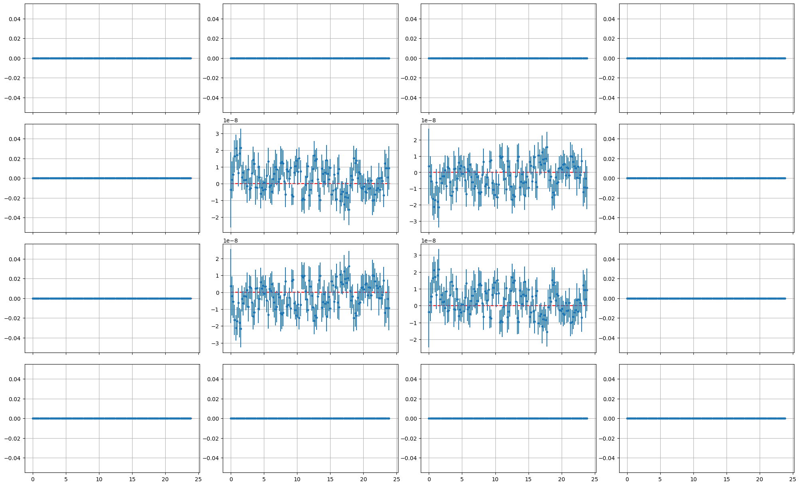
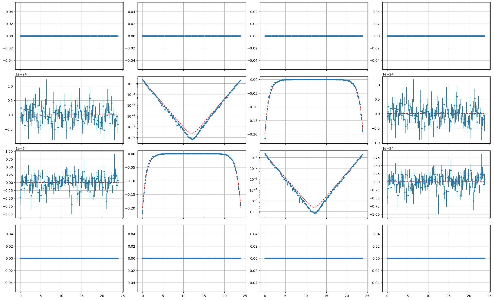
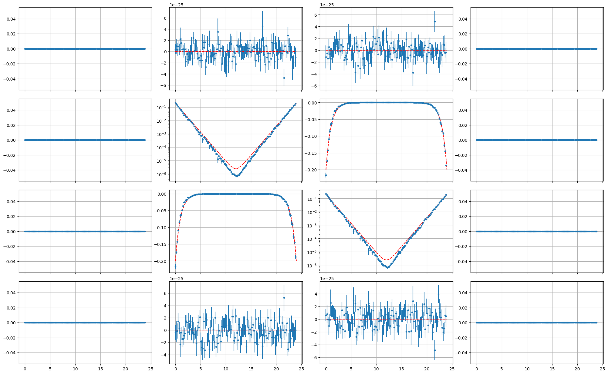
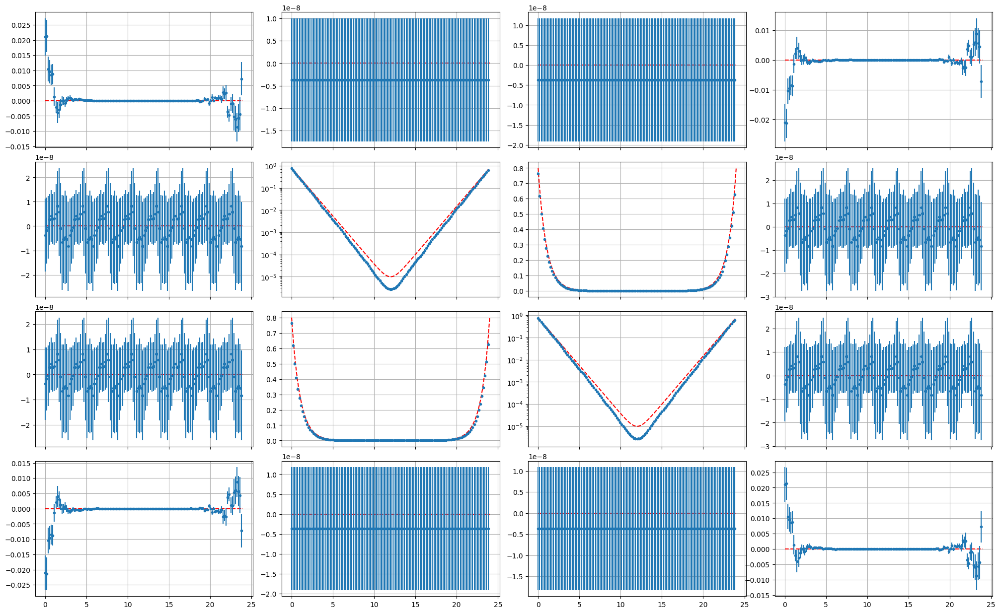
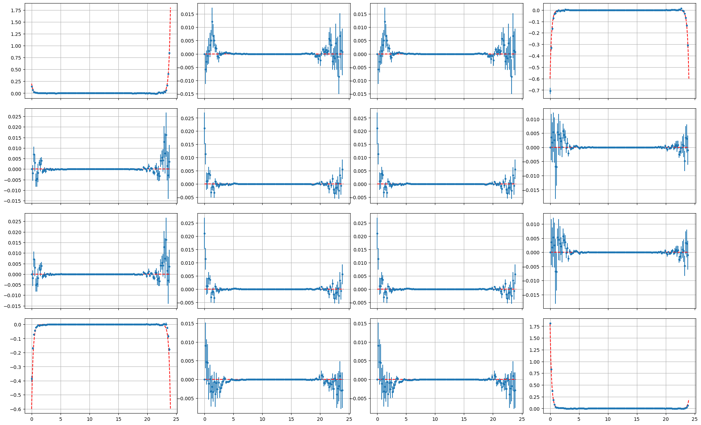
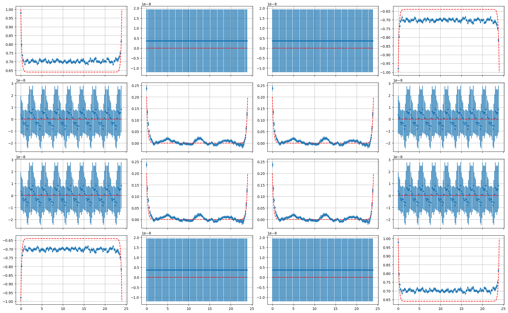
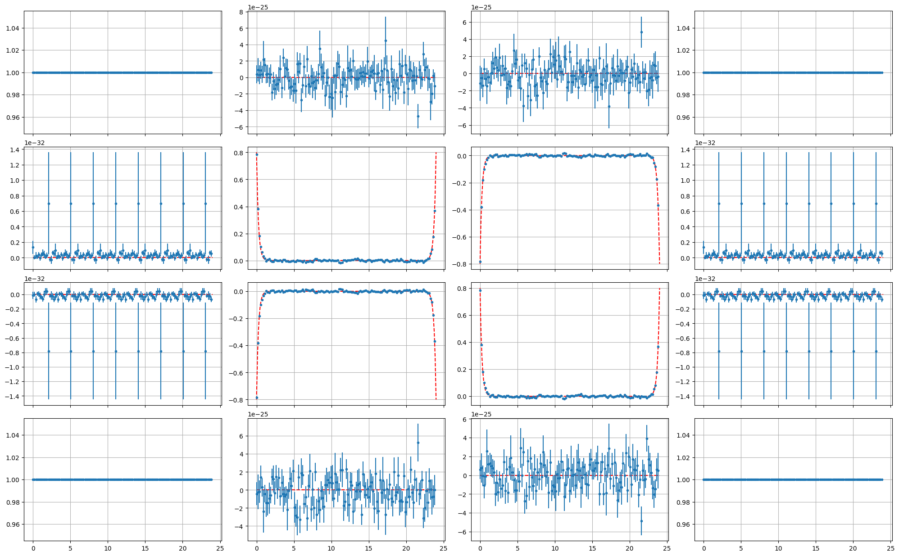

## Preliminaries

I define the single particle propagator as

\begin{align}
S_{ab}^p&\equiv \langle p_a^{}p_b^\dagger\rangle\\
S_{ab}^h&\equiv \langle h_a^{}h_b^\dagger\rangle
\end{align}

where $a,b$ label position (or momentum) as well as time coordinates.

All simulated data are obtained from a 2-site $\beta=24$ $U=3$ $N_t=128$ simulation.

## $I=1,S=1$ Interpolating Operators

:::{style='font-size:70%'}

| $I_z {\rm \backslash } S_z$ | $1$                                                                                | $0$                                                                                                 | $-1$                                                         |
|:---------------------------:|:----------------------------------------------------------------------------------:|:---------------------------------------------------------------------------------------------------:|:------------------------------------------------------------:|
| $1$                         | $p^\dagger_{k}p^\dagger_{l}$                                                       | $\frac{1}{\sqrt{2}}\left(p^\dagger_{k}h^{}_{l}+h^{}_kp^\dagger_l\right)$                            | $h^{}_{k}h^{}_{l}$                                           |
| $0$                         | $\frac{1}{\sqrt{2}}\left(p^\dagger_{k}h^\dagger_{l}+h^\dagger_kp^\dagger_l\right)$ | $\frac{1}{2}\left(p^{}_kp^\dagger_l+p^\dagger_kp^{}_{l}-h^{}_kh^\dagger_l-h^\dagger_kh^{}_l\right)$ | $\frac{1}{\sqrt{2}}\left(p^{}_kh^{}_{l}+h^{}_kp^{}_l\right)$ |
| $-1$                        | $h^\dagger_{k}h^\dagger_{l}$                                                       | $\frac{1}{\sqrt{2}}\left(p^{}_kh^\dagger_{l}+h^\dagger_kp^{}_l\right)$                              | $p^{}_kp^{}_{l}$                                             |

\begin{equation}
\langle\langle O^{}_{\alpha\beta} O^\dagger_{ab}\rangle\rangle_{I_z=1,S_z=1}=S_{\beta a}^{p} S_{\alpha b}^{p}-S_{\alpha a}^{p} S_{\beta b}^{p}
\end{equation}

\begin{equation}
\langle\langle O^{}_{\alpha\beta} O^\dagger_{ab}\rangle\rangle_{I_z=0,S_z=1}=\frac{1}{2}\left(-S_{\alpha a}^{p}S_{\beta b}^{h}+S_{\beta a}^{h} S_{\alpha b}^{p}+
S_{\beta a}^{p} S_{\alpha b}^{h}-S_{\alpha a}^{h} S_{\beta b}^{p}\right)
\end{equation}

\begin{equation}
\langle\langle O^{}_{\alpha\beta} O^\dagger_{ab}\rangle\rangle_{I_z=1,S_z=0}=\frac{1}{2}\left(S_{\alpha a}^{p} S_{b\beta }^{h}-S_{a\beta }^{h} S_{\alpha b}^{p}-S_{\beta a}^{p} S_{b\alpha }^{h}+S_{a\alpha }^{h} S_{\beta b}^{p}\right)
+\frac{1}{2}\left(\delta_{\alpha b}S^p_{\beta a}+\delta_{\beta a}S^p_{\alpha b}-\delta_{\alpha a}S^p_{\beta b}
-\delta_{\beta b}S^p_{\alpha a}\right)
\end{equation}

:::

---

:::{style='font-size:70%'}

\begin{align}
\langle\langle O^{}_{\alpha\beta} O^\dagger_{ab}\rangle\rangle_{I_z=0,S_z=0}&=\frac{1}{4}\left(
-S_{ab}^{p} S_{\alpha \beta }^{h}+S_{ab}^{p} S_{\beta \alpha }^{h}+S_{ba}^{p} S_{\alpha \beta }^{h}-S_{ba}^{p} S_{\beta \alpha }^{h}\right.\\
&-S_{ab}^{h} S_{\alpha \beta }^{p}+S_{ba}^{h} S_{\alpha \beta }^{p}+S_{ab}^{h} S_{\beta \alpha }^{p}-S_{ba}^{h} S_{\beta \alpha }^{p}\\
&+S_{\alpha a}^{h} S_{b\beta }^{h}-S_{a\beta }^{h} S_{\alpha b}^{h}+S_{ab}^{h} S_{\alpha \beta }^{h}-S_{ba}^{h} S_{\alpha \beta }^{h}\\
&-S_{\beta a}^{h} S_{b\alpha }^{h}+S_{a\alpha }^{h} S_{\beta b}^{h}-S_{ab}^{h} S_{\beta \alpha }^{h}+S_{ba}^{h} S_{\beta \alpha }^{h}\\
&+S_{\alpha a}^{p} S_{b\beta }^{p}-S_{a\beta }^{p} S_{\alpha b}^{p}+S_{ab}^{p} S_{\alpha \beta }^{p}-S_{ba}^{p} S_{\alpha \beta }^{p}\\
&-\left.S_{\beta a}^{p} S_{b\alpha }^{p}+S_{a\alpha }^{p} S_{\beta b}^{p}-S_{ab}^{p} S_{\beta \alpha }^{p}+S_{ba}^{p} S_{\beta \alpha }^{p}
\right)\\
&+\frac{1}{4}\left(\delta_{\alpha b}\left(S^p_{\beta a}+S^h_{\beta a}\right)+\delta_{\beta a}\left(S^p_{\alpha b}+S^h_{\alpha b}\right)
-\delta_{\alpha a}\left(S^p_{\beta b}+S^h_{\beta b}\right)-\delta_{\beta b}\left(S^p_{\alpha a}+S^h_{\alpha a}\right)\right)
\end{align} 

:::

---

{fig-align='center'}

---

{fig-align='center'}

---

{fig-align='center'}

## $I=0,S=1$ Interpolating Operators

:::{style='font-size:70%'}

| $I_z {\rm \backslash } S_z$ | $1$                                                                                | $0$                                                                                                 | $-1$                                                         |
|:---------------------------:|:----------------------------------------------------------------------------------:|:---------------------------------------------------------------------------------------------------:|:------------------------------------------------------------:|
| $0$                         | $\frac{1}{\sqrt{2}}\left(p^\dagger_{k}h^\dagger_{l}-h^\dagger_kp^\dagger_l\right)$ | $\frac{1}{2}\left(p^{}_kp^\dagger_l-p^\dagger_kp^{}_{l}+h^{}_kh^\dagger_l-h^\dagger_kh^{}_l\right)$ | $\frac{1}{\sqrt{2}}\left(p^{}_kh^{}_{l}-h^{}_kp^{}_l\right)$ |

\begin{equation}
\langle\langle O^{}_{\alpha\beta} O^\dagger_{ab}\rangle\rangle_{S_z=0}=\frac{1}{2}\left(-S_{\alpha a}^{p}S_{\beta b}^{h}-S_{\beta a}^{h} S_{\alpha b}^{p}
-S_{\beta a}^{p} S_{\alpha b}^{h}-S_{\alpha a}^{h} S_{\beta b}^{p}\right)
\end{equation}

\begin{align}
\langle\langle O^{}_{\alpha\beta} O^\dagger_{ab}\rangle\rangle_{S_z=0}&=\frac{1}{4}\left(
S_{ab}^{p} S_{\alpha \beta }^{h}+S_{ab}^{p} S_{\beta \alpha }^{h}+S_{ba}^{p} S_{\alpha \beta }^{h}+S_{ba}^{p} S_{\beta \alpha }^{h}\right.\\
&+S_{ab}^{h} S_{\alpha \beta }^{p}+S_{ba}^{h} S_{\alpha \beta }^{p}+S_{ab}^{h} S_{\beta \alpha }^{p}+S_{ba}^{h} S_{\beta \alpha }^{p}\\
&-S_{\alpha a}^{h} S_{b\beta }^{h}-S_{a\beta }^{h} S_{\alpha b}^{h}+S_{ab}^{h} S_{\alpha \beta }^{h}+S_{ba}^{h} S_{\alpha \beta }^{h}\\
&-S_{\beta a}^{h} S_{b\alpha }^{h}-S_{a\alpha }^{h} S_{\beta b}^{h}+S_{ab}^{h} S_{\beta \alpha }^{h}+S_{ba}^{h} S_{\beta \alpha }^{h}\\
&-S_{\alpha a}^{p} S_{b\beta }^{p}-S_{a\beta }^{p} S_{\alpha b}^{p}+S_{ab}^{p} S_{\alpha \beta }^{p}+S_{ba}^{p} S_{\alpha \beta }^{p}\\
&-\left.S_{\beta a}^{p} S_{b\alpha }^{p}-S_{a\alpha }^{p} S_{\beta b}^{p}+S_{ab}^{p} S_{\beta \alpha }^{p}+S_{ba}^{p} S_{\beta \alpha }^{p}\right)\\
&+\delta_{\alpha\beta}\delta_{ab}\\
&-\frac{1}{2}\left(\delta_{\alpha\beta}\left(S^p_{ab}+S^h_{ab}+S^p_{ba}+S^h_{ba}\right)+\delta_{ab}\left(S^p_{\alpha\beta}+S^h_{\alpha\beta}+S^p_{\beta\alpha}+S^h_{\beta\alpha}\right)\right)\\
&+\frac{1}{4}\left(\delta_{\alpha b}\left(S^p_{\beta a}+S^h_{\beta a}\right)+\delta_{\beta a}\left(S^p_{\alpha b}+S^h_{\alpha b}\right)+\delta_{\alpha a}\left(S^p_{\beta b}+S^h_{\beta b}\right)+\delta_{\beta b}\left(S^p_{\alpha a}+S^h_{\alpha a}\right)\right)
\end{align}

:::

---

{fig-align='center'}

## $I=1,S=0$ Interpolating Operators

:::{style='font-size:70%'}

| $I_z {\rm \backslash } S_z$ | $0$                                                                                                 |
|:---------------------------:|:---------------------------------------------------------------------------------------------------:|
| $1$                         | $\frac{1}{\sqrt{2}}\left(p^\dagger_{k}h^{}_{l}-h^{}_kp^\dagger_l\right)$                            |
| $0$                         | $\frac{1}{2}\left(p^\dagger_kp^{}_l-p^{}_kp^\dagger_{l}+h^{}_kh^\dagger_l-h^\dagger_kh^{}_l\right)$ |
| $-1$                        | $\frac{1}{\sqrt{2}}\left(p^{}_kh^\dagger_{l}-h^\dagger_kp^{}_l\right)$                              |

\begin{equation}
\langle\langle O^{}_{\alpha\beta} O^\dagger_{ab}\rangle\rangle_{I_z=1}=\frac{1}{2}\left(S_{\alpha a}^{p} S_{b\beta }^{h}+S_{a\beta }^{h} S_{\alpha b}^{p}
+S_{\beta a}^{p} S_{b\alpha }^{h}+S_{a\alpha }^{h} S_{\beta b}^{p}\right)
-\frac{1}{2}\left(\delta_{\alpha b}S^p_{\beta a}+\delta_{\beta a}S^p_{\alpha b}+\delta_{\alpha a}S^p_{\beta b}
+\delta_{\beta b}S^p_{\alpha a}\right)
\end{equation}

\begin{align}
\langle\langle O^{}_{\alpha\beta} O^\dagger_{ab}\rangle\rangle_{I_z=0}&=\frac{1}{4}\left(
-S_{ab}^{p} S_{\alpha \beta }^{h}-S_{ab}^{p} S_{\beta \alpha }^{h}-S_{ba}^{p} S_{\alpha \beta }^{h}-S_{ba}^{p} S_{\beta \alpha }^{h}\right.\\
&-S_{ab}^{h} S_{\alpha \beta }^{p}-S_{ba}^{h} S_{\alpha \beta }^{p}-S_{ab}^{h} S_{\beta \alpha }^{p}-S_{ba}^{h} S_{\beta \alpha }^{p}\\
&-S_{\alpha a}^{h}S_{b\beta }^{h}-S_{a\beta }^{h} S_{\alpha b}^{h}+S_{ab}^{h} S_{\alpha \beta }^{h}+S_{ba}^{h} S_{\alpha \beta }^{h}\\
&-S_{\beta a}^{h} S_{b\alpha }^{h}-S_{a\alpha }^{h} S_{\beta b}^{h}+S_{ab}^{h} S_{\beta \alpha }^{h}+S_{ba}^{h} S_{\beta \alpha }^{h}\\
&-S_{\alpha a}^{p} S_{b\beta }^{p}-S_{a\beta }^{p} S_{\alpha b}^{p}+S_{ab}^{p} S_{\alpha \beta }^{p}+S_{ba}^{p} S_{\alpha \beta }^{p}\\
&-\left.S_{\beta a}^{p} S_{b\alpha }^{p}-S_{a\alpha }^{p} S_{\beta b}^{p}+S_{ab}^{p} S_{\beta \alpha }^{p}+S_{ba}^{p} S_{\beta \alpha }^{p}\right)\\
&+\frac{1}{4}\left(\delta_{\alpha b}\left(S^p_{\beta a}+S^h_{\beta a}\right)+\delta_{\beta a}\left(S^p_{\alpha b}+S^h_{\alpha b}\right)+\delta_{\alpha a}\left(S^p_{\beta b}+S^h_{\beta b}\right)+\delta_{\beta b}\left(S^p_{\alpha a}+S^h_{\alpha a}\right)\right)
\end{align}

:::

---

{fig-align='center'}

---

{fig-align='center'}

## $I=0,S=0$ Interpolating Operator

:::{style='font-size:70%'}

| $I_z {\rm \backslash } S_z$ | $0$                                                                                                 |
|:---------------------------:|:---------------------------------------------------------------------------------------------------:|
| $0$                         | $\frac{1}{2}\left(p^\dagger_kp^{}_l+p^{}_kp^\dagger_{l}+h^{}_kh^\dagger_l+h^\dagger_kh^{}_l\right)$ |

\begin{align}
\langle\langle O^{}_{\alpha\beta}O^\dagger_{ab}\rangle\rangle&=\frac{1}{4}\left(
S_{ab}^{p} S_{\alpha \beta }^{h}-S_{ab}^{p} S_{\beta \alpha }^{h}-S_{ba}^{p} S_{\alpha \beta }^{h}+S_{ba}^{p} S_{\beta \alpha }^{h}\right.\\
&+S_{ab}^{h} S_{\alpha \beta }^{p}-S_{ba}^{h} S_{\alpha \beta }^{p}-S_{ab}^{h} S_{\beta \alpha }^{p}+S_{ba}^{h} S_{\beta \alpha }^{p}\\
&+S_{\alpha a}^{h} S_{b\beta }^{h}-S_{a\beta }^{h} S_{\alpha b}^{h}+S_{ab}^{h} S_{\alpha \beta }^{h}-S_{ba}^{h} S_{\alpha \beta }^{h}\\
&-S_{\beta a}^{h} S_{b\alpha }^{h}+S_{a\alpha }^{h} S_{\beta b}^{h}-S_{ab}^{h} S_{\beta \alpha }^{h}+S_{ba}^{h} S_{\beta \alpha }^{h}\\
&+S_{\alpha a}^{p} S_{b\beta }^{p}-S_{a\beta }^{p} S_{\alpha b}^{p}+S_{ab}^{p} S_{\alpha \beta }^{p}-S_{ba}^{p} S_{\alpha \beta }^{p}\\
&-\left.S_{\beta a}^{p} S_{b\alpha }^{p}+S_{a\alpha }^{p} S_{\beta b}^{p}-S_{ab}^{p} S_{\beta \alpha }^{p}+S_{ba}^{p} S_{\beta \alpha }^{p}\right)\\
&+\delta_{\alpha\beta}\delta_{ab}\\
&+\frac{1}{2}\left(\delta_{\alpha\beta}\left(S^p_{ab}+S^h_{ab}-S^p_{ba}-S^h_{ba}\right)+\delta_{ab}\left(S^p_{\alpha\beta}+S^h_{\alpha\beta}-S^p_{\beta\alpha}-S^h_{\beta\alpha}\right)\right)\\
&+\frac{1}{4}\left(\delta_{\alpha b}\left(S^p_{\beta a}+S^h_{\beta a}\right)+\delta_{\beta a}\left(S^p_{\alpha b}+S^h_{\alpha b}\right)-\delta_{\alpha a}\left(S^p_{\beta b}+S^h_{\beta b}\right)-\delta_{\beta b}\left(S^p_{\alpha a}+S^h_{\alpha a}\right)\right)
\end{align}

:::

---

{fig-align='center'}
