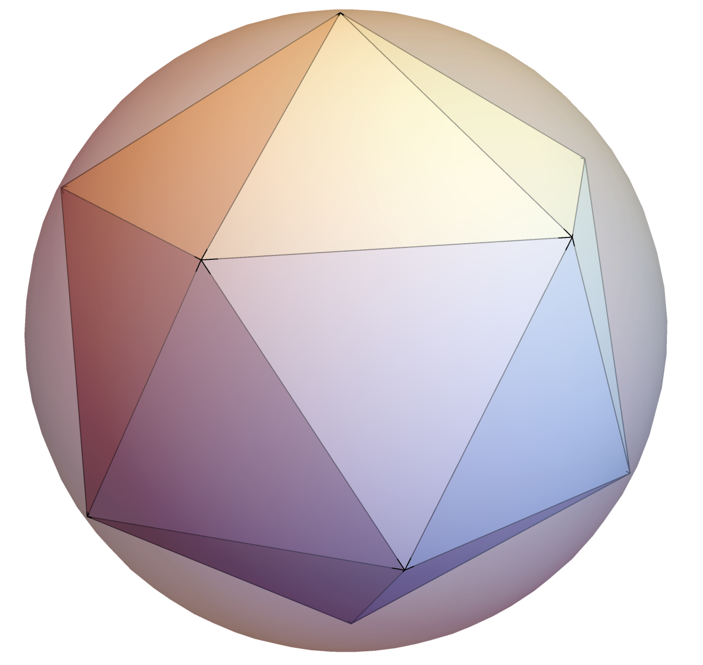

## B01: Quasi-Particle Dynamics in Low-Dimensional Topological Systems

:::{.columns}

:::{.column width=50%}

+ PLs:  Thomas Luu & Ulf Meißner
  
+ Postdoc started last November
  - Could not attend due to medical appointment (that could not be rescheduled in a reasonable amount of time)

+ Most recent work related to engineering spin centers in 1-D chains [arXiv:2507.18806](https://arxiv.org/abs/2507.18806)
  - submitted to ***Nature Communications***
  - Come to poster **B01** to hear more about it
:::

:::{.column width=50%}

:::{.r-stack}
{fig-align='center' width=60%}
:::

:::{.r-stack}
:::{style='font-size:70%'}
Lin Wang
:::

:::

:::

:::

# T-Designs

+ Came about from discussions at NuMeriQS-sponsored ECT$^*$ workshop on [***Hamiltonian Lattice Gauge Theories***](https://indico.ectstar.eu/event/242/overview)

+ Preliminary learning stage
  - potential relevance for NuMeriQS?
		
## Spherical T-Design

:::{.columns}

:::{.column width=50%}

:::{style='font-size:80%'}
+ Given:  Any polonomial $f$ of degree $\le t$ residing on a $d$-dimensional unit sphere $S^d$
+ $\exists$ a set of $N$-points ${\Omega_i}$on $S^d$ where
    $$ \frac{1}{|S^d|}\int_{\Omega\in S^d}d\Omega f(\Omega) = \frac{1}{N}\sum_{i}^N f(\Omega_i) $$
+ Similar to ***Quadrature Integration*** $\int dx p(x) \approx \sum_i\omega_ip(x_i)$
  - but here all weights $\omega_i=1/N$
+ Existence proof that $N$ exists for any $d,t$ combination [(Seymour & Zaslavsky)](https://www.sciencedirect.com/science/article/pii/0001870884900227?via%3Dihub)

:::
:::

:::{.column width=50%}

:::{.callout-note icon=false .fragment}
## Example: Spherical 5-design

{fig-algin='center' width=40%}

:::{style='font-size:80%'}
$$
f(x,y,z)=\sqrt{3} x^4+11 x y z+\frac{x y}{\sqrt{3}}+\sqrt{5} y^2
$$

$$ 
\frac{1}{4\pi}\int_{\Omega\in S^3}d\Omega f(\Omega) = \frac{1}{12}\sum_{i}^{12} f(\Omega_i) = \frac{\sqrt{3}}{5}+\frac{\sqrt{5}}{3} 
$$

:::

:::

:::

:::

:::{.callout-warning .fragment}
There exists no simple algorithm to find these $N$ points! 

:::

## Connection to [Snub Polygons](https://en.wikipedia.org/wiki/Snub_polyhedron)?

::: {layout-ncol=2}
{height=10%}

{height=10%}
:::

## Quantum T-Design

:::{style='font-size:80%'}

+ Can generalize to qubits defined on a Bloch sphere (ie the projective Hilbert space $P(H)$)

+ A ***quantum t-design*** is a finite set of $N$ quantum states that reproduces statistical properties of the uniform Haar distribution, up to $t$-th moments
  - ***state t-design***
	$$
	\int d\psi \langle f||\psi\rangle\langle\psi|^{\otimes t}|i\rangle=\frac{1}{N}\sum_i^N\langle f||\psi_i\rangle\langle\psi_i|^{\otimes t}|i\rangle
    $$
  - ***unitary t-design***
    $$
	\int dU\ U^{\otimes t}\rho(U^\dagger)^{\otimes t} =\frac{1}{|\{\mathcal{U}\}|}\sum_{U_i\in\{\mathcal{U}\}}U_i^{\otimes t}\rho(U_i^\dagger)^{\otimes t}
	$$
	for any operator $\rho$.
	
:::{.callout-note .fragment}
## Example:  Application to qubits
The 6 Pauli-eigenstates of $\sigma_z$, $\sigma_+$, and $\sigma_-$ form the simplest quantum state (qubit) 2-design
:::

:::

## Where do we go from here?

