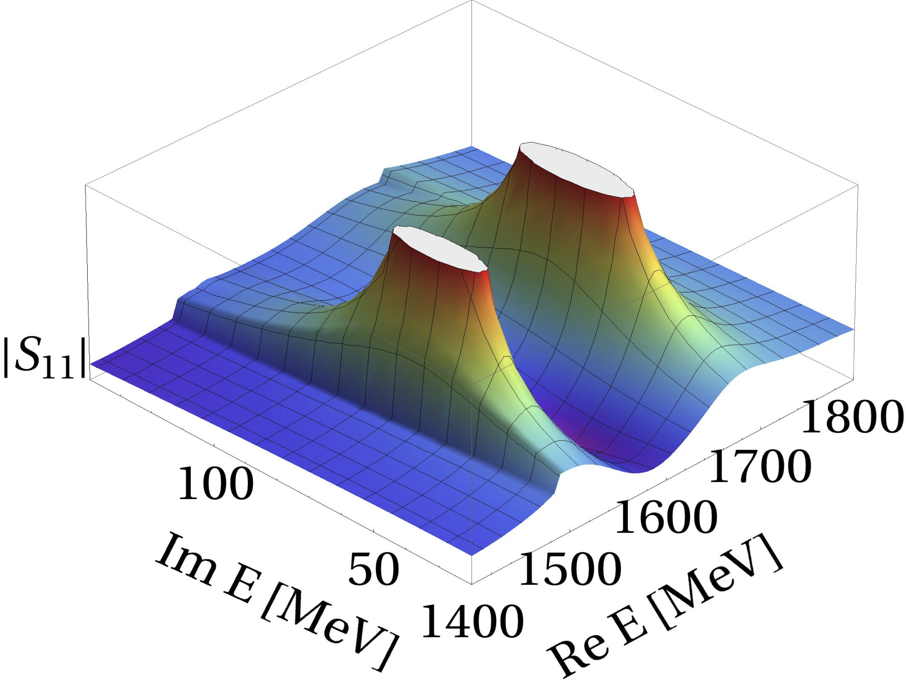
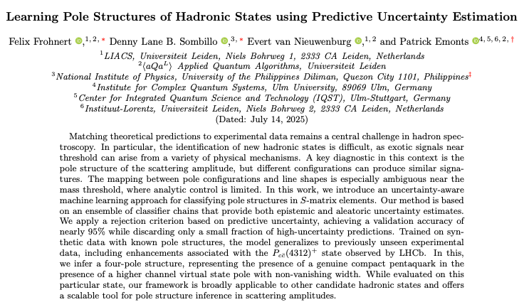
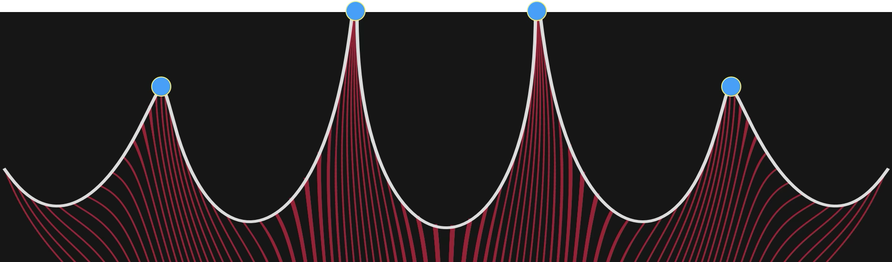

## Outline

+ Status of Poll
  
+ Developments within the last year
  
+ Ideas for more engagement
	
# Poll

## Questions

1. Do you use ML in your project, and if yes, how so?
  
2. Have you initiated any joint efforst with other Projects that use ML?

3. Do you think your project would benefit from using (more) ML techniques?
  
4. Would you like to learn more about ML techniques?

:::{.callout-note .fragment}
## Statistics
Received 11 responses (out of 13 requests):  85% response rate
:::

---

### Do you use ML in your project, and if yes, how so?

+ 5 projects use ML (33% usage)
  - A01 -- ML-generated potentials
  - A03, A05 -- ML generated input data, in collaboration with Julia Westermayr
  - A05 -- graph NN applied to trajectories
  - B01, C02 -- ML to alleviate sign problem
  - Normalizing flows applied to the Hubbard model

---

### Have you initiated any joint efforts with other Projects that use ML?

+ 2 positives
  - Discussions between Barbara (and collaborators) and Lena (and collaborators)
  - Joint effort between A01 and A05 related to graph NNs
  
---  
  
### Do you think your project would benefit from using (more) ML techniques?

- For the projects that already use ML, the answer was obviously ***YES***

- 4 (semi-)positive responses (out of 10 : 40%)
  - A02 -- **optimization of DFT integration grid** and **factorization in automatic code generation**
  - B05 -- **location of pole positions**
  
- Optimistic answer:
  - "Maybe in the 3rd funding period."
  
---

### Would you like to learn more about ML techniques?

- 4 positive responses (26.7%)
  - Somewhat mixed enthusiasm
    - "Yes, I know basically nothing about it."
	- "I don't mind of course, but there are other things I'd like to learn more."
- Negative responses were quite negative.
	- "We have enough at the moment."
	- "Not now."
	- ". . . 4x no."


:::{.callout-tip .fragment}
## Interesting request:
  - ***Status of normalizing flows in LQCD***
:::
	
# Developments so far

## Courses at UBonn

+ Lena has introduced a ML course to the graduate physics program at UBonn
  - ***Machine Learning for Quantum Scientists*** (physics7516)
  - Well received by students (Lena gets all our graduate students now)

+ Lena and Barbara and Tom (and others) have introduced a ML seminar course
  - ***Machine Learning for (Astro-) Physics and Chemistry*** (physics657)
  - couples physics, chemistry, and astro
  
+ David and myself have added ML topic to the undergraduate computer physics course (physik441)

---

```{=html}
<iframe width="1248" height="800" src="https://physics441-computerphysik-sose2025-4765f7.gitlab-pages.uni-bonn.de/revealjs/12_ML.html#/2/18" title="Webpage example"></iframe>
```

---

## Can we use ML to determine pole locations? (B05)

:::{.columns}

:::{.column width=40%}
:::{.r-stack}
{fig-align='center'}
:::

:::

:::{.column width=10%}

:::

:::{.column width=50%}

:::{style='font-size:90%'}
+ Discussed problem with ***ML experts*** @ FZJ
  - Conclusion: Purely algebraic problem, ML not needed

+ Recent paper says otherwise:
  - [Pole structure inference]( https://arxiv.org/pdf/2507.07668)

    {fig-align='center'}
:::
:::

:::

# Ideas for more engagement

## Combining Spin Physics with Graph NNs

+ (Group) Convolutional NNs to learn ground state of (Heisenberg) Spin systems (David)
  - Regular grid of spin sites
  
+ Can we apply to irregular sites?
  - Maybe ***Graph Convolutional Networks (GCNs)*** can be useful here?
    * Potential joint effort between Petra's group and condensed matter people
	* Is the idea even interesting?
  


## Diffusion models to stabilize Holomorphic flows

+ Holomorphic flow equations used to **flow** configurations
  - needed for ***alleviating*** the sign problem in Monte Carlo simulations

:::{.r-stack .fragment}
{fig-align='center'}
:::

+ Flowing is unstable due to presence of ***attractors*** (blue points)
  - all points will flow to blue points exponentially fast
  - can diffusion models be used to overcome this instability?
  - what about continuous normalizing flows?
  
## Marrying ML and Tensor Contraction Engine??

+ Tensor contraction is relevant in many fields
  - quantum chemistry
  - condensed matter
  - quantum computing
  
+ Can we use ML to aid Tensor Contraction Engines?
  - Can this help efforts in A02?


# Other ideas?


