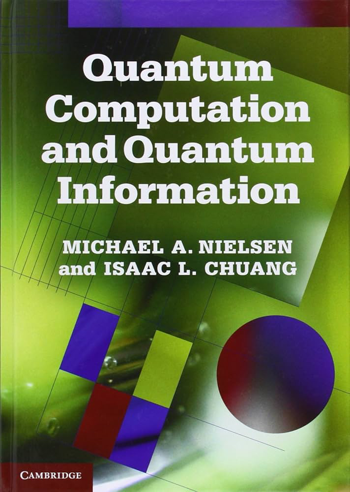

## Introduction to Quantum Computing

:::{.columns}

:::{.column width=50%}
:::{style='font-size:80%'}
Goals of talk

+ Provide foundation for understanding *quantum computing* and *quantum algorithms*

+ Should cover mostly topics of chapters 1 & 2 of [Nielsen & Chuang](https://profmcruz.wordpress.com/wp-content/uploads/2017/08/quantum-computation-and-quantum-information-nielsen-chuang.pdf) 
  - quantum mechanics and relevant postulates
  - quantum (unitary) operators and circuits
  - basic quantum algorithms
	+ Deutsch, Shor, Grover, QuFT
  - limitations and potential advantages
	
+ Types of Quantum Computers
  - gate-based vs annealer
  - quantum *computation* vs *simulation*

:::{.callout-warning .fragment}
## Talk date scheduled for Nov. 14
Mentor:  Thomas Luu [t.luu@fz-juelich.de]
:::
:::

:::

:::{.column width=50%}

:::{.r-stack}
{fig-align='center' width=70%}
:::

:::{.r-stack}
:::{style='font-size:70%'}
[Nielsen & Chuang](https://profmcruz.wordpress.com/wp-content/uploads/2017/08/quantum-computation-and-quantum-information-nielsen-chuang.pdf)

Other references are also possible
:::

:::

:::

:::

