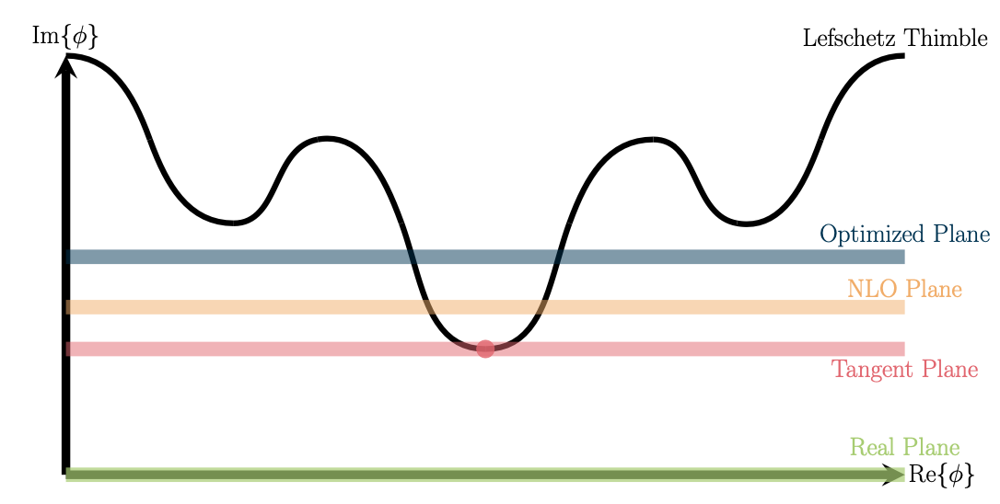
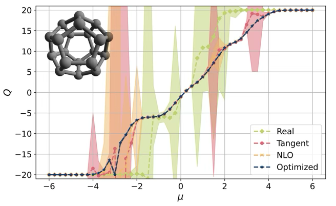

## Outline
+ Motivation
  - What's the big deal?
  - Why should you care?

## Carbon Nano-Systems

::: {layout="[[33,33,33], [-20,60,-20]]" layout-valign="center"}

{#fig-ribbon}

Examples
:::

## Hamiltonian

In general we are interested in evaluating
\begin{align}
	\langle O\rangle
	=&
	\frac{1}{\mathcal{Z}}{\rm tr}\left({O e^{-\beta H}}\right)\\
	H
	=& 
	\sum_{yx} \left(p^\dagger_y K_{yx} p_x + h^\dagger_y K_{yx} h_x \right)
	+ \frac{1}{2} \sum_{yx} \rho_y V_{yx} \rho_x
	- \mu \sum_x \rho_x
\end{align}

<!--
#	H 
#	= 
#	\sum_{yx} \left(p^\dagger_y K_{yx} p_x + h^\dagger_y K_{yx} h_x \right)
#	+ \frac{1}{2} \sum_{yx} \rho_y V_{yx} \rho_x
#	- \mu \sum_x \rho_x
-->

where $\rho\equiv p^\dagger p^{}-h^\dagger h^{}$ and $\beta=\frac{1}{T}$.

For most of the work presented here we use tight-binding dynamics and Hubbard onsite interaction:

\begin{align}
	K_{xy} &= \kappa \delta_{\langle xy \rangle}
	&
	V_{xy} &= U \delta_{xy}.
	\label{eq:hubbard}
\end{align}

## Path Integral Formalism

By Trotterizing we introduce a temporal direction $\tau\in[0,\beta)$ and can transform $\mathcal{Z}$ into a functional integral
\begin{align}
	\mathcal{Z} &= \int D\phi\; e^{-S[\phi]}\\
	\langle O\rangle &= \frac{1}{\mathcal{Z}}\int D\phi\; O[\phi]\; e^{-S[\phi]}=\int D\phi\; O[\phi]\; P[\phi]\\
	S[\phi] &= \frac{1}{2} \phi^\dagger V^{-1} \phi + \log \det M[-\phi;-\kappa,-\mu] M[\phi;\kappa,\mu]
	\label{eq:partition function}
\end{align}
where $\phi$ represents a single real number of each spacetime position,  $S$ is an *action*, and $M$ is the *fermion matrix*.

## When life is good\ldots

::: {.panel-tabset}

### Sign-problem free

+ bipartite lattice
  - nearest neighbor site is on *other* sublattice
+ zero chemical potential $\mu=0$
  - no doping (no finite density)
+ $\det M[-\phi;-\kappa]=\det M[-\phi;\kappa]=\det M^\ast[\phi;\kappa]=\det M^\dagger[\phi;\kappa]$
+ $\det M[-\phi;-\kappa] M[\phi;\kappa]=\det M^\dagger[\phi;\kappa] M^{}[\phi;\kappa]\ge 0$

$\implies$ NO SIGN PROBLEM!

### Example: carbon nanotubes
$(3,3)$-chirality

::: {layout="[[33,-5,23,-5,33]]" layout-valign="center"}

:::

:::

## What observables $O$ are we interested in?

Single-body correlation functions $\langle p_x^{}(\tau)p_y^\dagger(0)\rangle = \langle M_{xy;\tau}^{-1}\rangle$

<!--  - two-body $\langle p_{y'}^{}(\tau)p_{x'}^{}(\tau)p_x^\dagger(0)p_y^\dagger(0)\rangle = \langle M_{x'x;\tau}^{-1}M_{y'y;\tau}^{-1}-M_{x'y;\tau}^{-1}M_{y'x;\tau}^{-1}\rangle$
-->

::: {layout="[[33,33,33]]" layout-valign="center"}

:::

## Determined location of quantum phase transition in 2D Hubbard

+ Finite size scaling analysis
  - tune $U_c$, $\beta$ and $\nu$ to obtain data collapse (universal line)
  - most precise value of critical coupling to date :  $U_c=3.835(14)$
  - J. Ostmeyer, **T.L.**, et al., [2105.06936](https://arxiv.org/abs/2105.06936)

## Two-body dynamics

+ Can assign spin/isospin quantum numbers to the holes and particles

|            | $S_z=1/2$   | $S_z=-1/2$  |
|------------|:-------------:|:-------------:|
| $I_z=1/2$  | $p^\dagger$ |  $h^{}$     |
| $I_z=-1/2$ | $h^\dagger$ |  $p^{}$     |

: Isospin $I$ and Spin $S$ assignments

+ Two-body interpolating operators

{fig-align="center"}

## Two-body Observables

<!--
:::: {.columns}
::: {.column width="50%"}
-->
+ $I_z=1,S_z=1$ correlation function: $\langle p_{y'}^{}(\tau)p_{x'}^{}(\tau)p_x^\dagger(0)p_y^\dagger(0)\rangle = \langle M_{x'x;\tau}^{-1}M_{y'y;\tau}^{-1}-M_{x'y;\tau}^{-1}M_{y'x;\tau}^{-1}\rangle$

+ $I_z=0,S_z=1$ correlation function: $\frac{1}{2}\langle\left(p_i^\dagger h_j^\dagger + h_i^\dagger p_j^\dagger \right)\left( h_k^{} p_l^{} + p_k^{} h_l^{} \right)\rangle
=\langle M^{-1\ast}_{ki;\tau}M^{-1}_{lj;\tau}+M^{-1\ast}_{li;\tau}M^{-1}_{kj;\tau}\rangle$

{fig-align="center"}

"charge" $Q\equiv 2I_z$

<!--
:::

::: {.column width="50%"}

:::

::::
-->

## To bind or not to bind
{fig-align="center"}

+ Energy shift $\Delta E_0 = E_{2}-2E_1$
  - $\Delta E_0 \ge 0 \implies$ repulsive (unbound)
  - $\Delta E_0 <0 \implies$ attractive (perhaps bound)
  - P. Sinilkov, **T.L.**, et al., [2502.04015](https://arxiv.org/abs/2502.04015)

## When life is not so good\ldots

::: {.panel-tabset}

### Have sign-problem 

+ non-bipartite lattice
  - cannot divide system into sublattices
+ non-zero chemical potential $\mu\ne0$
  - doping (finite density)
+ $\det M[-\phi;-\kappa,-\mu]!=\det M^\dagger[\phi;\kappa,\mu]$
+ $\det M[-\phi;-\kappa,-\mu] M[\phi;\kappa,\mu]\in\mathbb{C}$

$\implies$ HAVE SIGN PROBLEM! :pensive:

### Reweighting
Problem occurs because $S$ becomes complex
\begin{align}
	S[\phi] &= \frac{1}{2} \phi^\dagger V^{-1} \phi + \log \det M[-\phi;-\kappa,-\mu] M[\phi;\kappa,\mu] = S_{\mathcal{R}}[\phi]+iS_{\mathcal{I}}[\phi]\\
	\langle O\rangle &= \frac{1}{\mathcal{Z}}\int D\phi\; O[\phi]\; e^{-S[\phi]}=\int D\phi\; O[\phi]\; P[\phi]
\end{align}
Poor man's attempt to *mitigate* sign problem: reweighting
\begin{align}
	\langle O\rangle = \frac{1}{\mathcal{Z}}\int D\phi&\ O[\phi]\; e^{-S_{\mathcal{R}}[\phi]-iS_{\mathcal{I}}[\phi]}
	=\frac{\int D\phi\; O[\phi]e^{-iS_{\mathcal{I}}[\phi]}\; e^{-S_{\mathcal{R}}[\phi]}}{\int D\phi\; e^{-S_{\mathcal{R}}[\phi]}}\frac{\int D\phi\; e^{-S_{\mathcal{R}}[\phi]}}{\int D\phi\; e^{-S_{\mathcal{R}}[\phi]-iS_{\mathcal{I}}[\phi]}}\\
	&=\frac{\langle Oe^{-iS_{\mathcal{I}}}\rangle_{\mathcal{R}}}{\langle e^{-iS_{\mathcal{I}}}\rangle_{\mathcal{R}}}
	\quad\quad;\quad\quad\mbox{"average sign"}\  =\ \langle e^{-iS_{\mathcal{I}}}\rangle
\end{align}

### Examples

::: {layout="[[33,33,33]]" layout-valign="center"}

:::

:::

## Life gets really hard!

+ In most cases reweighting is insufficient
+ $|\langle e^{-iS_{\mathcal{I}}}\rangle|\sim 0$ already for modest sizes of $\mu$
+ Extensive property$\implies$ gets worse with system size

::: {layout="[[50,50]]" layout-valign="center"}

Can we do better than vanilla reweighting?

:::

## Contour deformations

::: {.panel-tabset}

### Lefschtz thimbles
:::: {.columns}

::: {.column width="50%"}
::: {style="font-size: 80%;"}
+ Idea: push manifold of integration $\phi\in\mathbb{R}^N$ into the complex plain $\phi\in\mathbb{C}^N$
+ $\exists$ certain manifolds $\mathcal{T}\subset\mathbb{C}^N$ where $S_{\mathcal{I}}[\phi\in\mathcal{T}]={\rm constant}$
:::
:::

::: {.column width="10%"}

:::

::: {.column width="40%"}

{fig-align="right"}

:::

:::

\begin{equation}
\int_{\phi\in\mathbb{R}^N}\mathcal{D}[\phi]e^{-S[\phi]}
\to
\sum_{\mathcal{T}}e^{-iS_{\mathcal{I}}^{\mathcal{T}}}\int_{\varphi\in\mathcal{T}\subset\mathbb{C}^N}\mathcal{D}[\varphi]e^{-S_{\mathcal{R}}[\varphi]}
\end{equation}

### "Learning" manifolds

::: {.columns}

::: {.column width="40%"}
::: {style="font-size: 60%;"}
+ Location of thimbles not know *a priori*
  - Can approach thimbles via holomorphic flow
  - However, determining exact locations of all relevant thimbles just as hard as original sign problem
  - Numerically intensive
+ Train a NN to "learn" location of Lefschetz thimbles
:::

{fig-align="center"}

:::

::: {.column width="60%"}

{fig-align="center"}

:::

:::

### Constant shifts

::: {.columns}

::: {.column width="50%"}

::: {style="font-size: 80%;"}

*Sometimes simpler is just better*

+ Any contour deformation is allowed as long as
  - No poles are crossed (Cauchy's theorem)
  - Original homology class is preserved
+ Constant shift deformations satisfy these conditions

:::

:::

::: {.column width="50%"}

{fig-align="center"}

:::

:::

{fig-align="center" width=40%}

:::

## Pesky ergodicity

## Radial updates

## Topological properties of nanoribbons

::: {.panel-tabset}

### Topological invariants

### 'Fuji' and 'Kilamanjaro' localization

### Effective theory of 1-D spins

### Gap closing condition w/ Interactions

:::
