## Who is this guy?

:::{.columns}

:::{.column width='50%'}

+ Originally a nuclear many-body theorist
  - University of Washington (Seattle)
  
+ Staff member at Lawrence Livermore National Lab (California) 2005-2013
  - Access to big computers
  - Performed quantum monte carlo (QMC) simulations of ***Quantum Chromodynamics*** (QCD)
	* quarks and gluons
  
+ University of Bonn/Forschungszentrum Jülich (2013-present)
  - Applied QMC methods to low-dimensional strongly correlated electronic systems
    * electrons on physical lattices
	
:::

:::{.column width='50%'}

{fig-align='right' width="70%"}

:::
	
:::

## Perspective on my research

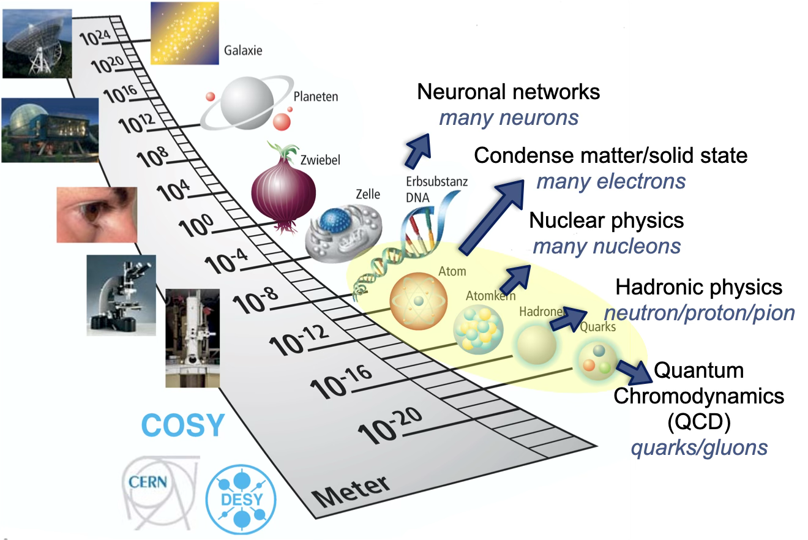{fig-align='center'}
  
# Why use QMC?
  
## ***Curse of Dimensionality***

+ Consider a simple 1-d integral using Simpson's $k=4$ rule

  $$
  \int_a^b dx f(x) = \frac{h}{3}\left(f_0+4f_1+2f_2+\cdots+4f_{N-1}+f_N\right)\quad;\quad h=\frac{b-a}{N},\ f_i=f(x_i)
  $$

  convergence of this integral $\sim\mathcal{O}(N^{-k})$
  
+ In $d$ dimensions, convergence scales as $\sim\mathcal{O}(N^{-k/d})$

+ Example of deterministic ("grid-based") 

:::{.callout-note .fragment}
## How do we refine out calculation?
:::

## Refining our deterministic calculation

:::{.fragment}

+ Increase the number of "integration points" to increase accuracy

+ Let's double our accuracy$\implies N\to N'=2^d N$

| d      | 10   | 20      | 30         |
|:------:|:----:|:-------:|:----------:|
| $N'/N$ | 1024 | 1048576 | 1073741824 |

:::

:::{.callout-warning .fragment}
## Example: molecular dynamics calculations of molecules in 1 cm$^3$ volume

$$ \mathrm{\#\  of\  particles\ } N\approx 10^{23}\implies \mathrm{phase\  space\  dimension\ } \Pi_i dx_i dp_i\sim 6N = d $$

:::

:::{.r-stack .fragment}

Good luck!

:::

## Curse of Dimensionality occurs everywhere

:::{style='font-size:80%'}

:::{.columns}

:::{.column width="33%"}

:::{.callout-tip .fragment}
## Quantum many-body problem

- Many-body nuclear systems
- Exponential growth in basis states
- Anti-symmetry of fermions!

:::

:::

:::{.column width="33%"}

:::{.callout-tip .fragment}
## Quantum Chromodynamics

- Valence quarks dictate the particle state
- But there are in principle an infinite number of sea particles

:::

:::

:::{.column width="33%"}

:::{.callout-tip .fragment}
## Strongly correlated electrons in low Dimensions

- Low-dimensional lattice structure enhances interactions
- Exponential growth in dimensionality

:::

:::

:::

:::

:::{.r-stack .fragment}
***Non-perturbative phenomena***
:::

:::{style='font-size:80%'}

:::{.columns .fragment}

:::{.column width="33%"}

:::{.callout-tip}
## Machine Learning

- Model complexity grows with number of features

:::

:::

:::{.column width="33%"}

:::{.callout-tip}
## Statistics

- Estimating distribution or regression function requires exponentially more samples

:::

:::

:::{.column width="33%"}

:::{.callout-tip}
## Optimization

- Brute force search of high-d surfaces becomes hard!!!

:::

:::

:::

:::

:::{.callout-warning .fragment}

High-dimensional spaces become exponentially hard to sample from!

:::

## Lifting the curse

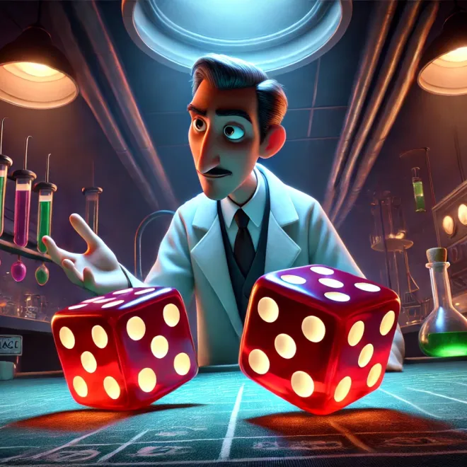{fig-align='center'}

:::{.r-stack}
Enter Monte Carlo
:::

+ Instead of calculating an observable ***deterministically***, we estimate an observable ***stochastically***

:::{.callout-important .fragment}
## The price we pay is that our ***estimate*** has an associated ***uncertainty***
:::

## Simplest example of MC estimate

:::{.r-stack}
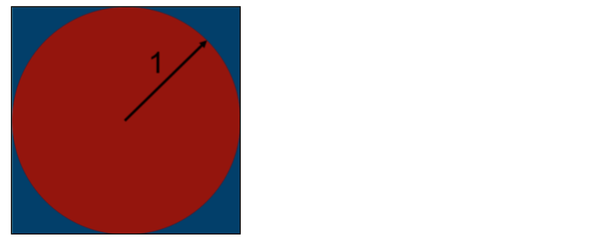{fig-align='center'}

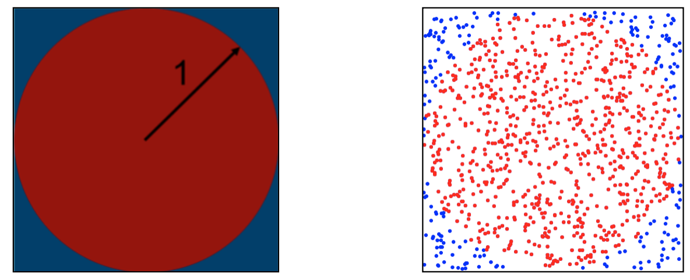{fig-align='center' .fragment}
:::

+ Estimate of $\pi$

 $$ \pi = 4\frac{\mathrm{area\ of\ circle}}{\mathrm{area\ of\ square}}\approx 4 \frac{\mathrm{\#\ red\ points}}{\mathrm{\#\ of\ red\ \&\ blue\ points}} $$

## Advantages of (Q)MC

+ Ideal for high-dimensional spaces

+ Valid for both weakly and strongly interacting systems
  - independent of complexity of problem!

+ Error of estimate scales with number of samples $N_{\mathrm{cfg}}$ as $\mathcal{O}(N_{\mathrm{cfg}}^{-1/2})$
  - controllable and systematic
  - independent of dimension $d$
  
:::{.callout-warning .fragment}
## But. . .

:::{.columns}

:::{.column width="50%"}

+ Requires big computers
+ Noisy estimates
+ Can obtain biased results
  - non-ergodic
+ Infamous numerical ***sign-problem***

:::

:::{.column width="50%"}

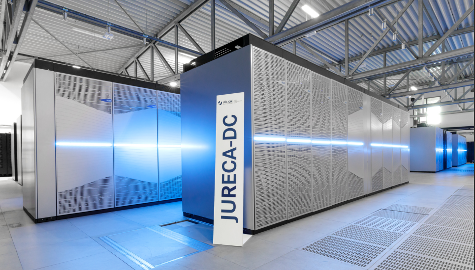{fig-align="center" width="60%"}

:::

:::

:::

## Carbon Nano-Systems

::: {layout="[[33,33,33], [-20,60,-20]]" layout-valign="center"}

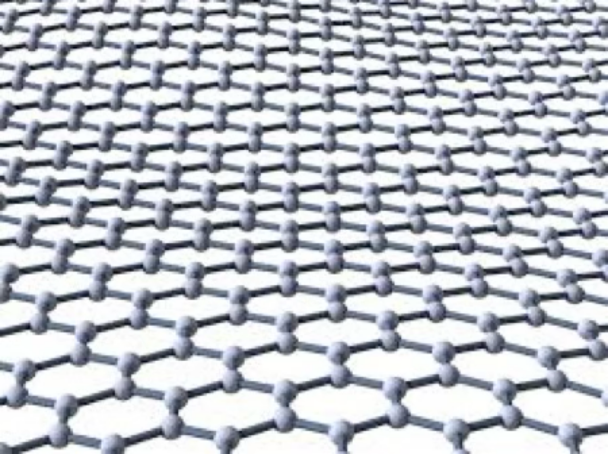

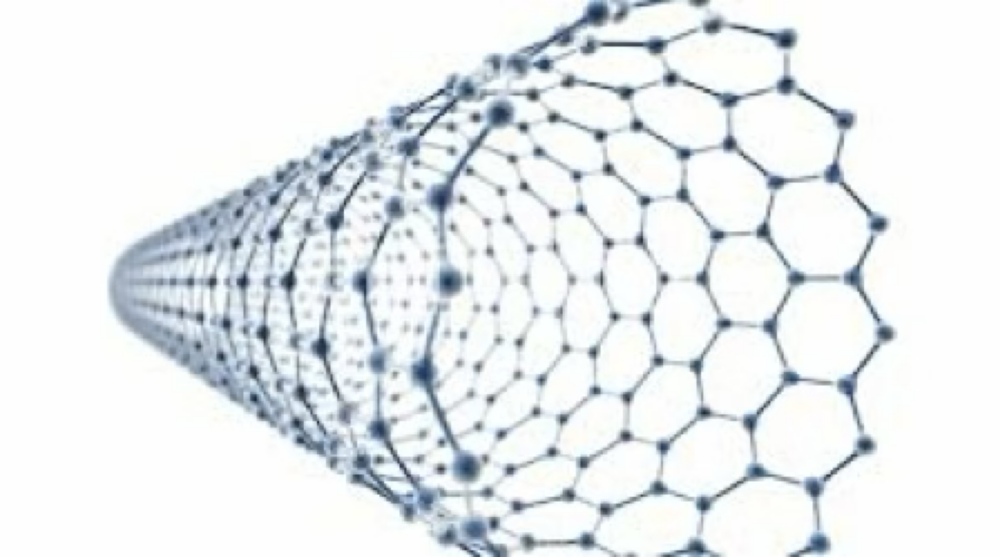

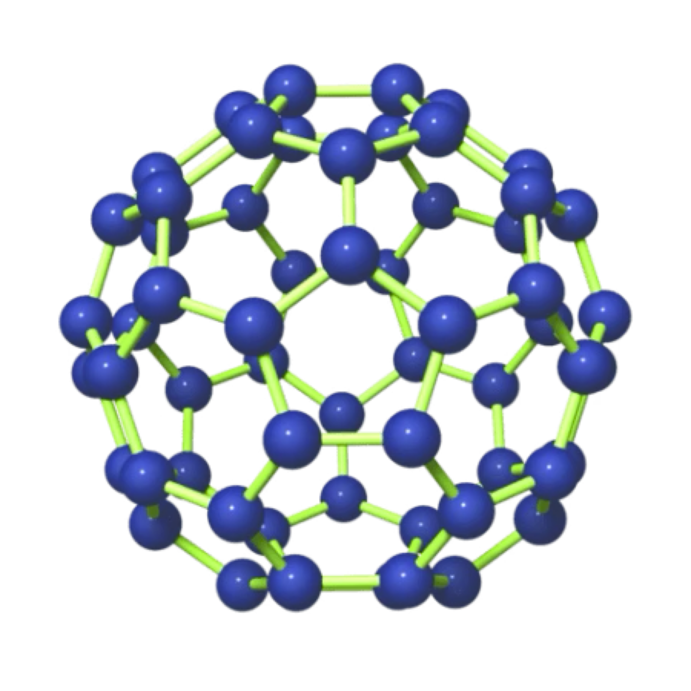

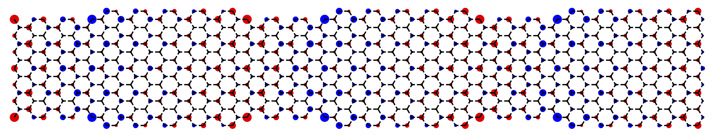

:::

:::{.r-stack}
Examples
:::

## Hamiltonian

:::{style='font-size:80%'}
+ General Hamiltonian is of the form

$$
  H
	= 
	\sum_{yx} \left(p^\dagger_y K_{yx} p_x + h^\dagger_y K_{yx} h_x \right)
	+ \frac{1}{2} \sum_{yx} \rho_y V_{yx} \rho_x
	- \mu \sum_x \rho_x
$$

+ $\rho_x\equiv p_x^\dagger p_x^{}-h_x^\dagger h_x^{}$ (particle and hole creation/annihilation operators)
   
:::
:::{.columns .fragment}

:::{.column width="60%"}

:::{style='font-size:80%'}

:::{.callout-note}
## The Hubbard model

For most of the work presented here we use tight-binding dynamics and Hubbard onsite interaction:

\begin{align}
	K_{xy} &= \kappa \delta_{\langle xy \rangle}
	&
	V_{xy} &= U \delta_{xy}.
	\label{eq:hubbard}
\end{align}

:::

:::

:::

:::{.column width="40%"}

{fig-align="center"}

:::

:::

##  Attempting a direct diagonalization of $H$

{fig-align='center'}

$N_x=72$ sites

:::{.callout-warning}
## Full diagonalization of this problem

Dimensionality of the problem scales as $4^{N_x}$

Example: $4^{72}=22300745198530623141535718272648361505980416$

:::

## First steps towards Quantum Monte Carlo

Instead of diagonalizing $H$, we concentrate on obtaining thermal expectation values of any operator $O$

$$
  \langle O \rangle = \frac{1}{Z}\mathrm{Tr}\  Oe^{-\beta H}
$$

where $\beta=1/T$ is in inverse temperature and 

$$
Z=\mathrm{Tr}\ e^{-\beta H}
$$

is the ***partition function***.

The trace is performed over the entire ***Fock space***

:::{.callout-warning .fragment}
## Have we gained anything

Not really. . .

:::

## Introduce Auxiliary Field $\phi$

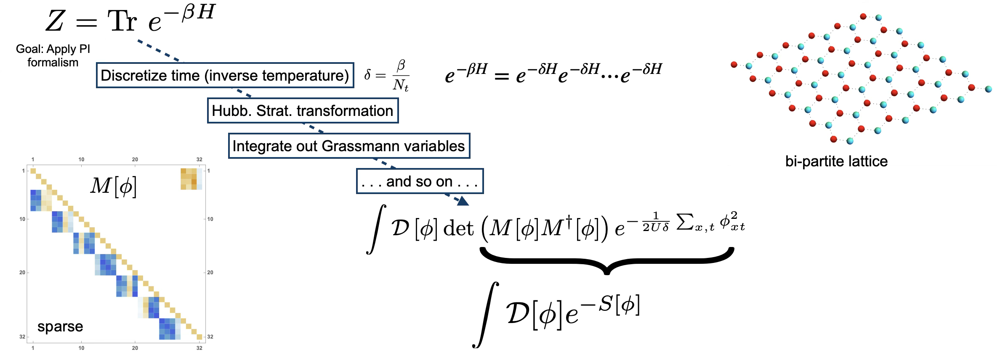{fig-align='center'}

:::{.columns}

:::{.column width="50%"}

:::{.callout-note .fragment}
## Hubbard-Stratonovich transformation

$$e^{-\frac{\delta U}{2}\rho_{x,t}^2}\propto\int d\phi_{x,t}e^{-\frac{\phi_{x,t}^2}{2\delta U}+i\phi_{x,t}\rho_{x,t}}$$

"Linearized" the density term

:::

:::

:::{.column width="50%"}

:::{.callout-note .fragment}
## Integration measure $\mathcal{D}[\phi]$

$$\int \mathcal{D}[\phi]=\int\Pi_{x,t}d\phi_{x,t}$$

High-dimensional integral!!  Enter Monte Carlo. . .

:::

:::

:::

## Feynman's Path Integral

$$ \langle O\rangle = \int\mathcal{D}[\phi]O[\phi]\frac{e^{-S[\phi]}}{Z}= \int\mathcal{D}[\phi]O[\phi]\mathbb{P}[\phi]$$

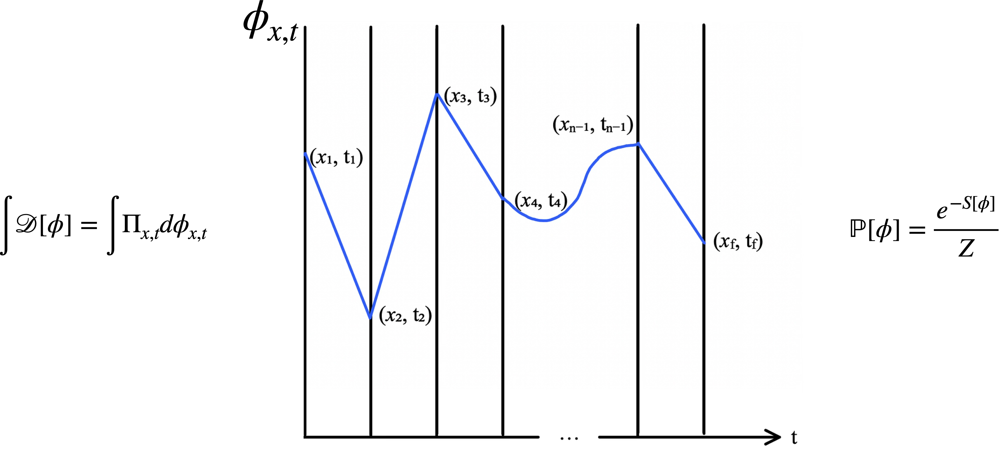{fig-align='center'}

:::{.callout-important .fragment}
## Importance Sampling
Not all paths are equally important!  Want to ***sample*** most relevant paths dictated by $\mathbb{P}[\phi]$.
:::

<!--
+ and can transform $\mathcal{Z}$ into a functional integral
  \begin{align}
	\mathcal{Z} &= \int D\phi\; e^{-S[\phi]}\\
	\langle O\rangle &= \frac{1}{\mathcal{Z}}\int D\phi\; O[\phi]\; e^{-S[\phi]}=\int D\phi\; O[\phi]\; P[\phi]\\
	S[\phi] &= \frac{1}{2} \phi^\dagger V^{-1} \phi + \log \det M[-\phi;-\kappa,-\mu] M[\phi;\kappa,\mu]
	\label{eq:partition function}
  \end{align}
  where $\phi$ represents a single real number of each spacetime position,  $S$ is an *action*, and $M$ is the *fermion matrix*.
-->
<!--
## When life is good\ldots

::: {.panel-tabset}

### Sign-problem free

+ bipartite lattice
  - nearest neighbor site is on *other* sublattice
+ zero chemical potential $\mu=0$
  - no doping (no finite density)
+ $\det M[-\phi;-\kappa]=\det M[-\phi;\kappa]=\det M^\ast[\phi;\kappa]=\det M^\dagger[\phi;\kappa]$
+ $\det M[-\phi;-\kappa] M[\phi;\kappa]=\det M^\dagger[\phi;\kappa] M^{}[\phi;\kappa]\ge 0$

$\implies$ NO SIGN PROBLEM!

### Example: carbon nanotubes
$(3,3)$-chirality

::: {layout="[[33,-5,23,-5,33]]" layout-valign="center"}

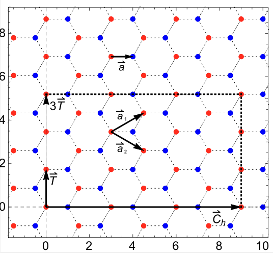

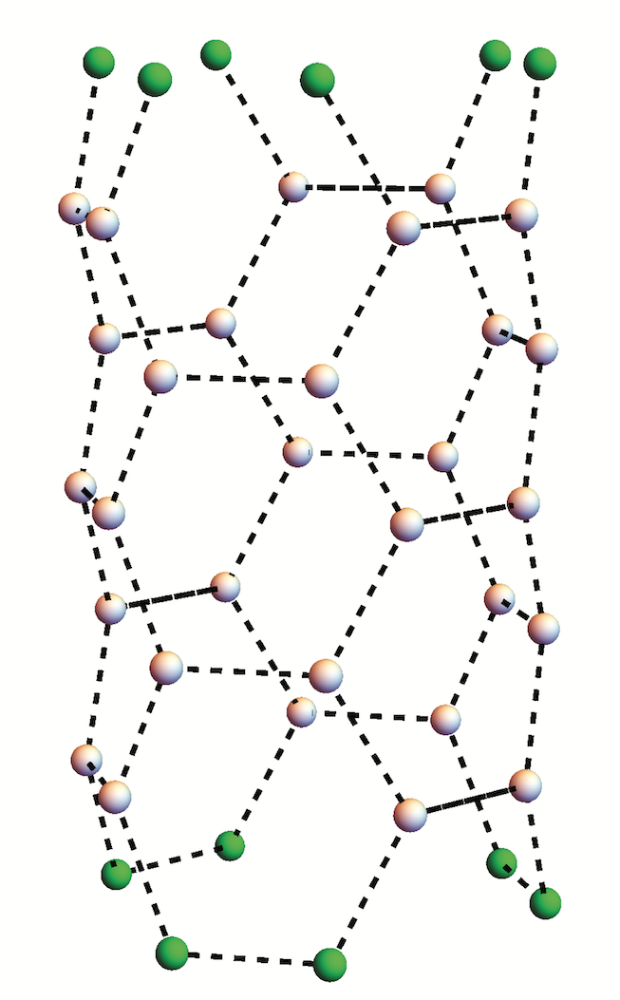

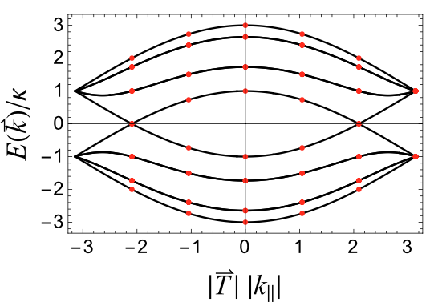

:::

:::
-->

## Anatomy of a QMC simulation

:::{style='font-size:80%'}

:::{.fragment}
+ Generate ***ensemble*** of field configurations $\phi_i\in\{\phi\}$ stochastically where 
  $$ \mathbb{P}[\phi_i]\sim e^{-S[\phi_i]}/Z $$
:::

:::{.fragment}
+ Estimate $\langle O\rangle$ 
  $$ \langle O\rangle = \frac{1}{N_{\mathrm{cfg}}}\sum_{\phi_i\in\{\phi\}}O[\phi_i] + \mathcal{O}(N_{\mathrm{cfg}}^{-1/2}) $$
  
  - Perform error analysis
    - Determine autocorrelation
    - bootstrap errors
:::

:::{.fragment}
+ Perform limit extrapolations
  - continuum $\delta\to 0$
  - thermodynamic $N_x\to\infty$
  - zero-temperature $\beta\to\infty$
  - $m_\pi\to m_\pi^{\mathrm{phys}}$ (LQCD)
:::  

:::

## Techniques adapted from lattice QCD

:::{.callout-tip}
## Markov Chain Monte Carlo (MCMC) w/ Hybrid (Hamiltonian) MC  ([Duane et al. Phys.Lett. B195 (1987) 216-222](https://www.sciencedirect.com/science/article/pii/037026938791197X?via%3Dihub))
{fig-align='center' width="80%"}
:::

:::{style='font-size:60%'}
+ Other "borrowed" ideas
  - pseudo-fermions, J. Ostmeyer, **T.L.**, et al., [Phys.Rev.B 102 (2020) 245105](https://arxiv.org/abs/2005.11112)
  - Hasenbusch preconditioning, J. Ostmeyer, **T.L.** et al. [Comput.Phys.Commun. 236 (2019) 15-25](https://arxiv.org/abs/1804.07195) 
:::

#  {background-video="assets/snakeV2.m4v" background-video-loop="true" background-video-muted="true" background-size="contain" .center}

:::{.r-stack .fragment}
{fig-align='center' width="72%"}
:::
:::{.r-stack .fragment}
F. Temmen, **T.L.**, et al. [Phys.Rev.B 112 (2025) 045134](https://arxiv.org/abs/2504.01575)
:::

<!--
:::{.columns}

:::{.column width="20%"}

:::{.r-stack .center} 
Non-ergodic 
:::

:::

:::{.column width="80%"}

:::

:::
-->

<!--
:::{.r-stack}



:::
-->

# What observables $O$ are we interested in?

## Anatomy of a correlator

Single-body correlation functions $\langle p_x^{}(\tau)p_y^\dagger(0)\rangle = \langle M_{xy;\tau}^{-1}\rangle\equiv C(\tau)$

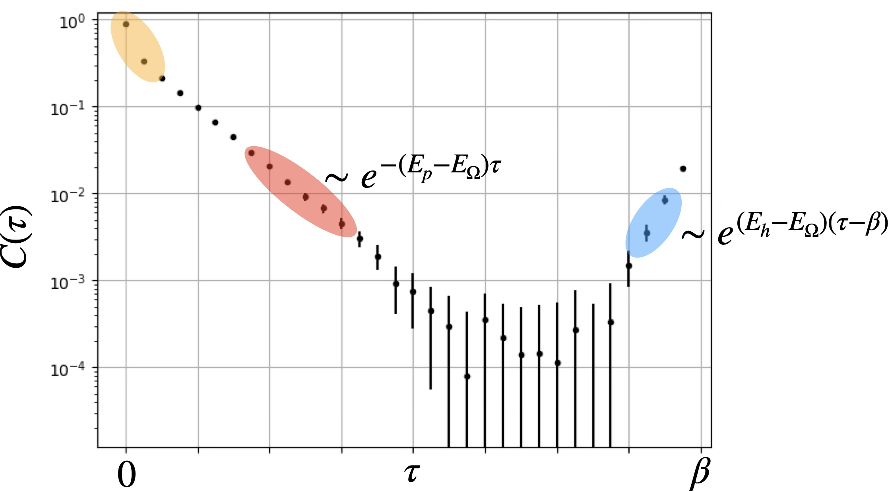{fig-align="center" height=4in}

:::{.callout-note}
## Spectral Decomposition Theorem
\begin{align}
C(\tau)&=A_p e^{-(E_p-E_\Omega)\tau}+A_{ex} e^{-(E_{ex}-E_\Omega)\tau}+\ldots+A_he^{(E_h-E_\Omega)(\tau-\beta)}\\
&\to A_pe^{-(E_p-E_\Omega)\tau}\quad\quad(0\ll\tau\ll\beta)
\end{align}
:::

<!--  - two-body $\langle p_{y'}^{}(\tau)p_{x'}^{}(\tau)p_x^\dagger(0)p_y^\dagger(0)\rangle = \langle M_{x'x;\tau}^{-1}M_{y'y;\tau}^{-1}-M_{x'y;\tau}^{-1}M_{y'x;\tau}^{-1}\rangle$

::: {layout="[[33,33,33]]" layout-valign="center"}
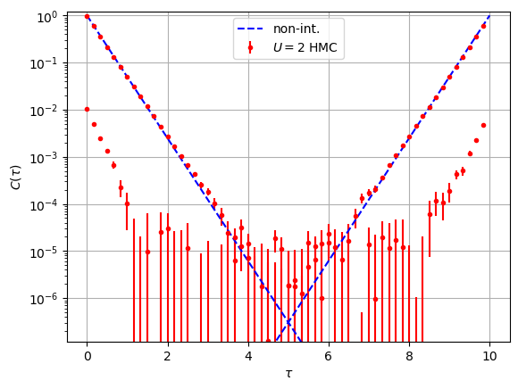

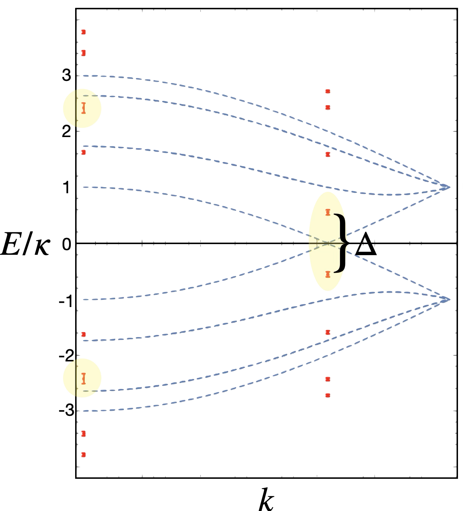

:::
-->

## We can now extract excitation energies

:::{.r-stack}
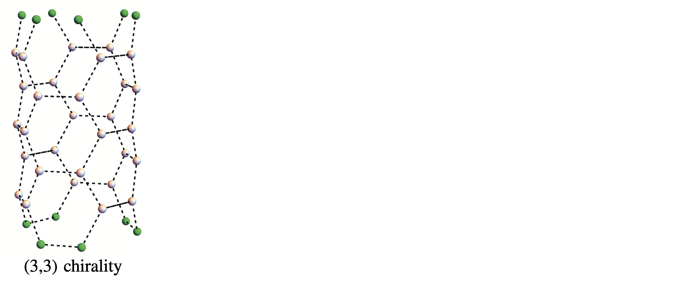{fig-align="center"}

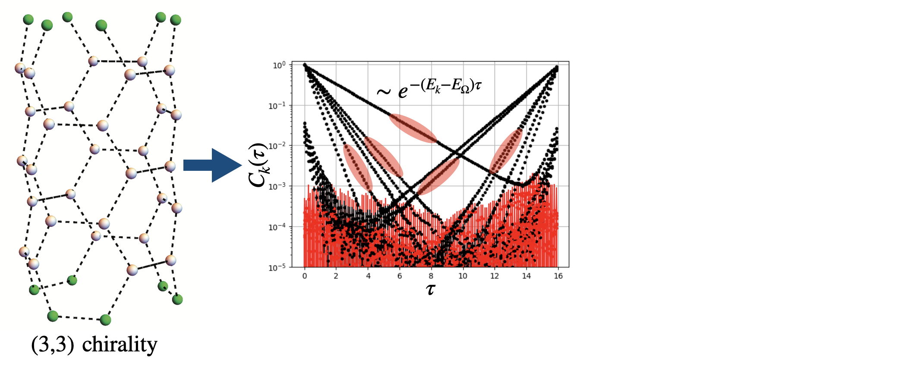{fig-align="center" .fragment}

{fig-align="center" .fragment}
:::

+ First QMC simulation of nanotube
  - **T.L.** & Lähde [Phys.Rev. B93 (2016) 155106](https://arxiv.org/abs/1511.04918)

## Determined quantum phase transition in 2D Hubbard (honeycomb)

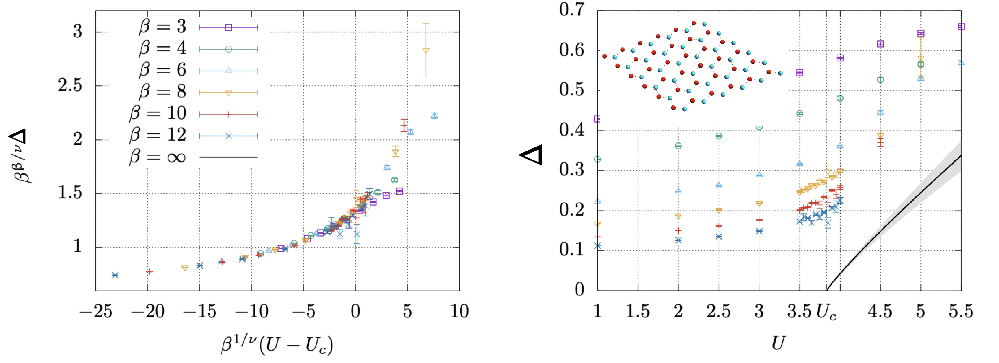

+ Finite size scaling analysis
  - tune $U_c$, $\beta$ and $\nu$ to obtain data collapse (universal line)
  - most precise value of critical coupling to date :  $U_c=3.835(14)$
  - J. Ostmeyer, **T.L.**, et al., [Phys.Rev.B 104 (2021) 155142](https://arxiv.org/abs/2105.06936)

## Multi-particle excitations

{fig-align='center' width="10%"}

<!--
+ Can assign spin/isospin quantum numbers to the holes and particles

|            | $S_z=1/2$   | $S_z=-1/2$  |
|------------|:-------------:|:-------------:|
| $I_z=1/2$  | $p^\dagger$ |  $h^{}$     |
| $I_z=-1/2$ | $h^\dagger$ |  $p^{}$     |

: Isospin $I$ and Spin $S$ assignments

+ Two-body interpolating operators

{fig-align="center"}
-->

### Excitons {.center}

  - particle-hole excitations 
    * "bright" excitons
	* "dark" excitons
  - analogous to pions in lattice QCD
  - $I_z=0,S_z=1$ correlation function: $\frac{1}{2}\langle\left(p_i^\dagger h_j^\dagger + h_i^\dagger p_j^\dagger \right)\left( h_k^{} p_l^{} + p_k^{} h_l^{} \right)\rangle
=\langle M^{-1\ast}_{ki;\tau}M^{-1}_{lj;\tau}+M^{-1\ast}_{li;\tau}M^{-1}_{kj;\tau}\rangle$
  - Are "dark" excitons bound? P. Sinilkov, **T.L.**, et al., [PoS LATTICE2024 (2025) 075](https://arxiv.org/abs/2502.04015)

<!--
{fig-align="center"}

"charge" $Q\equiv 2I_z$
-->

<!--
## To bind or not to bind
{fig-align="center"}

+ Energy shift $\Delta E_0 = E_{2}-2E_1$
  - $\Delta E_0 \ge 0 \implies$ repulsive (unbound)
  - $\Delta E_0 <0 \implies$ attractive (perhaps bound)
  - P. Sinilkov, **T.L.**, et al., [2502.04015](https://arxiv.org/abs/2502.04015)
-->  
  
# Localized states in low-D systems

## Hybrid nanoribbons

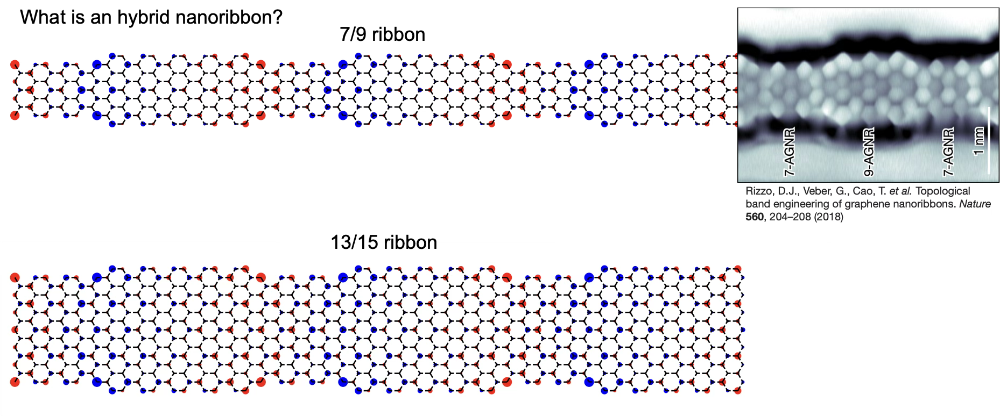{fig-align="center"}

## Lowest energy state exhibits "localization"

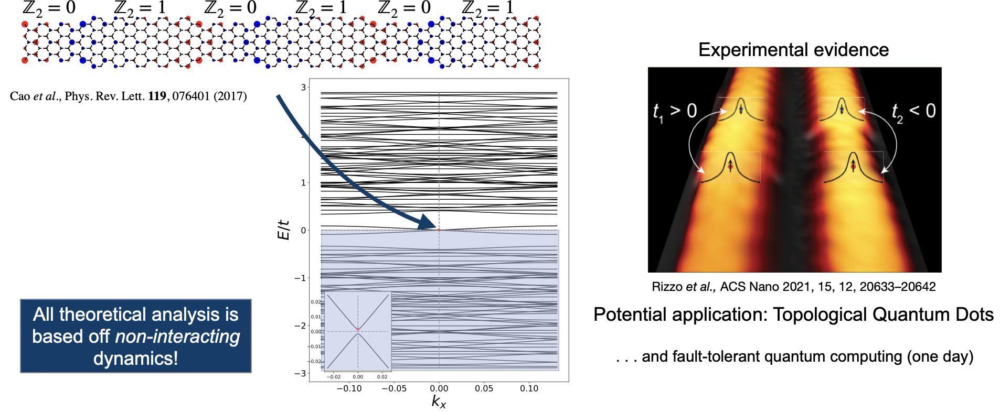{fig-align="center"}

## QMC Simulations

:::{.columns}

:::{.column width="50%"}

:::{.r-stack}
Localizations persist with strong interactions
:::

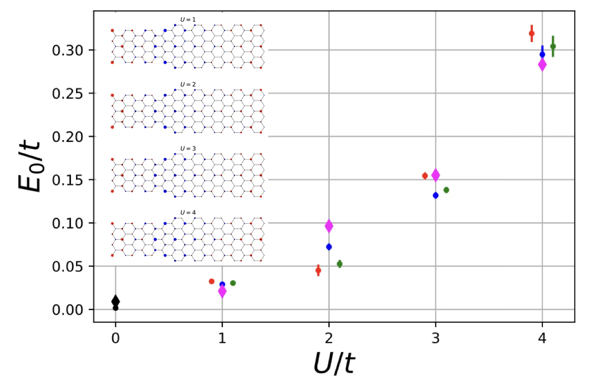{fig-align="center"}

+  **T.L.**, U.-G. Meißner, L. Razmadze [Phys.Rev.B 106 (2022) 195422](https://arxiv.org/abs/2204.02742)

:::

:::{.column width="50%"}

:::{.r-stack}
An effective theory for 1-D spin chain
:::

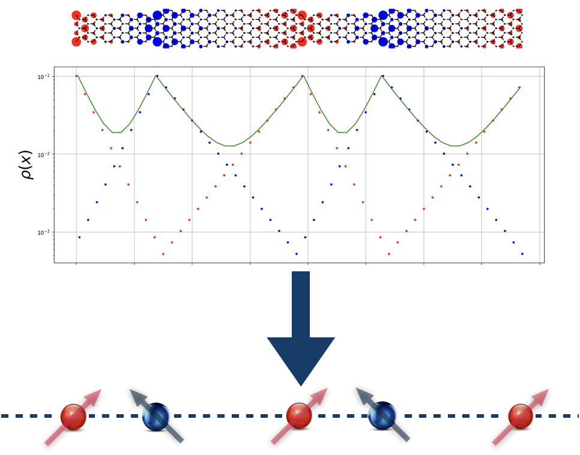{fig-align="center"}

:::{style='font-size:80%'}
$$
H_{1D}=
-\sum_ka^\dagger_k
\begin{pmatrix}
m_s & t_Ae^{ik}+t_Be^{-ik}\\
t_A e^{-ik}+t_Be^{ik} & -m_s
\end{pmatrix}
a^{}_k
$$
:::

:::

:::

## A novel form of localization

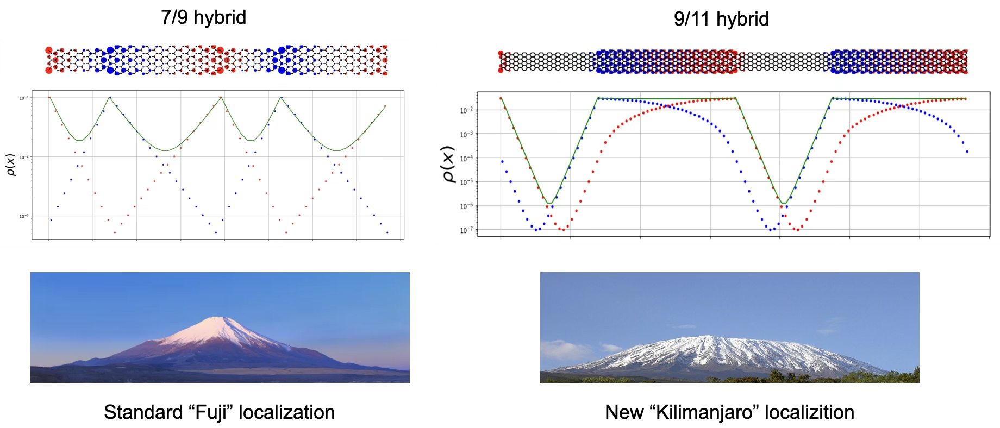{fig-align='center'}

+ J. Ostmeyer, **T.L.**, et al. [Phys.Rev.B 109 (2024) 195135](https://arxiv.org/abs/2401.04715)

## The interacting Su-Schrieffer-Heeger (SSH) model

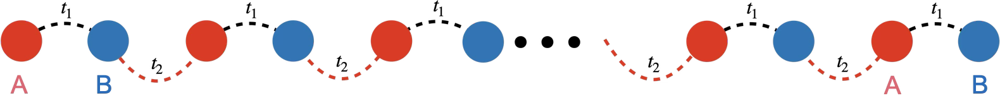{fig-align='center' width="50%"}

:::{.columns}

:::{.column width="50%"}

:::{style='font-size:80%'}
+ Topological $t_1<t_2$, $t_1=v,\ t_2=w$

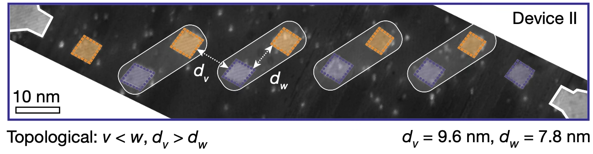{fig-align="center"}

{fig-align='center' width="80%"}

+ Experimentally realizable
  - Silicon quantum dots
    [Kiczynski et al., Nature 606 (2022) 694](https://www.nature.com/articles/s41586-022-04706-0)
  - Artificial lattices
    [Meier et al., Nature Commun. 7 (2016) 13986](https://www.nature.com/articles/ncomms13986)
:::

:::

:::{.column width="50%"}

:::{style='font-size:80%'}

:::{.callout-note .fragment}
## Localized spin centers w/ defects and interactions

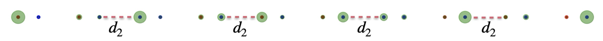{fig-align='center' width="65%"}

{fig-align='center'}

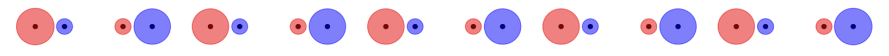{fig-align='center' width="70%"}

L. Wang, **T.L.**, U.-G. Meißner [2507.18806](https://arxiv.org/abs/2507.18806)
:::

:::

:::

:::

# The "Sign Problem"

## Complex Action $S[\phi]$

:::{.columns}

:::{.column width="50%"}

+ Probability only makes sense when
  $$
  \mathbb{P}[\phi]=\frac{e^{-S[\phi]}}{Z}\in \mathbb{R}_+ \implies S[\phi]\in \mathbb{R}
  $$

+ $\exists$ systems when $S[\phi]\in \mathbb{C}$
  + non-bipartite lattice
	- cannot divide system into sublattices
   + non-zero chemical potential $\mu\ne0$
	 - doping (away from half-filling)
	 - QCD at finite baryon density
	 
	 
:::

:::{.column width="50%"}

:::{.callout-important .fragment}

Most interesting problems have a sign problem!

+ Phase transitions at finite density (e.g. hardonic matter to quark/gluon plasma)
+ Doped Mott-Insulators (e.g. high-$T_c$ superconductivity)
+ Frustrated systems (quantum spin-systems on non-bipartite lattices)
+ Real-time evolution (e.g. non-equilibrium processes)
:::

:::{.callout-note .fragment}
## Reweighting
\begin{align}
	\langle O\rangle &= \frac{1}{\mathcal{Z}}\int \mathcal{D}[\phi]\ O[\phi]\; e^{-S_{\mathcal{R}}[\phi]-iS_{\mathcal{I}}[\phi]}\\
	&=\frac{\int \mathcal{D}[\phi]\; O[\phi]e^{-iS_{\mathcal{I}}[\phi]}e^{-S_{\mathcal{R}}[\phi]}}{\int D\phi\; e^{-S_{\mathcal{R}}[\phi]}}\frac{\int D\phi\; e^{-S_{\mathcal{R}}[\phi]}}{\int D\phi\; e^{-S_{\mathcal{R}}[\phi]-iS_{\mathcal{I}}[\phi]}}\\
	&=\frac{\langle Oe^{-iS_{\mathcal{I}}}\rangle_{\mathcal{R}}}{\langle e^{-iS_{\mathcal{I}}}\rangle_{\mathcal{R}}}
	\quad;\quad\mbox{"average phase"}\  =\ \langle e^{-iS_{\mathcal{I}}}\rangle
\end{align}
:::

:::

:::

## Examples

::: {layout="[[33,33,33]]" layout-valign="center"}

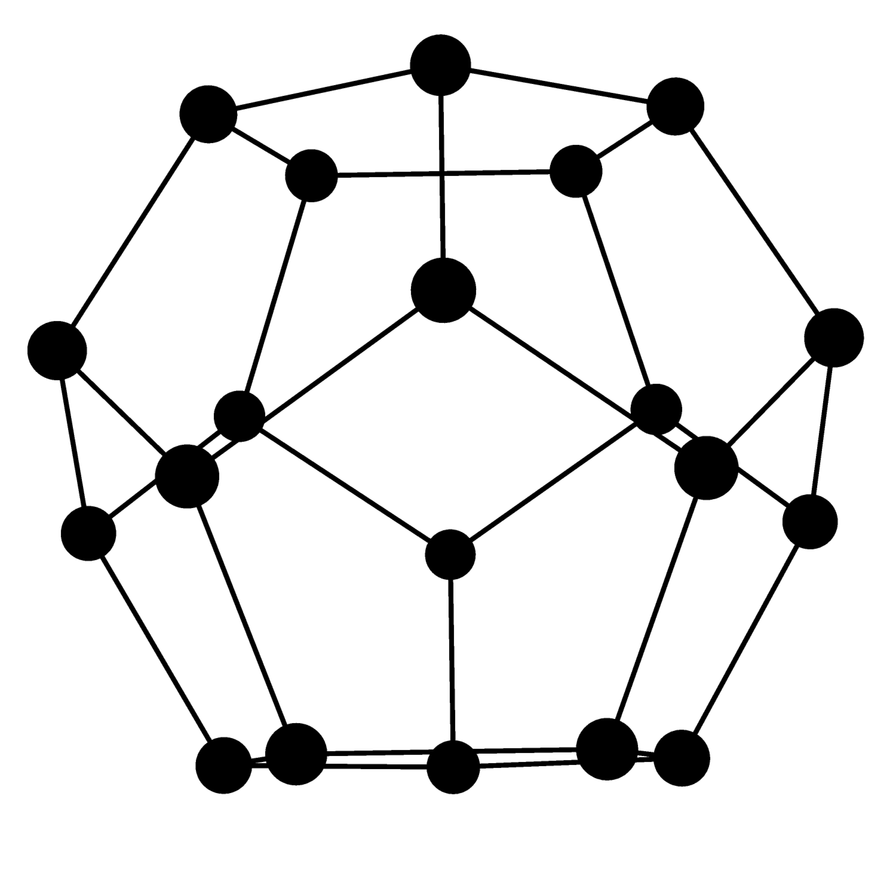

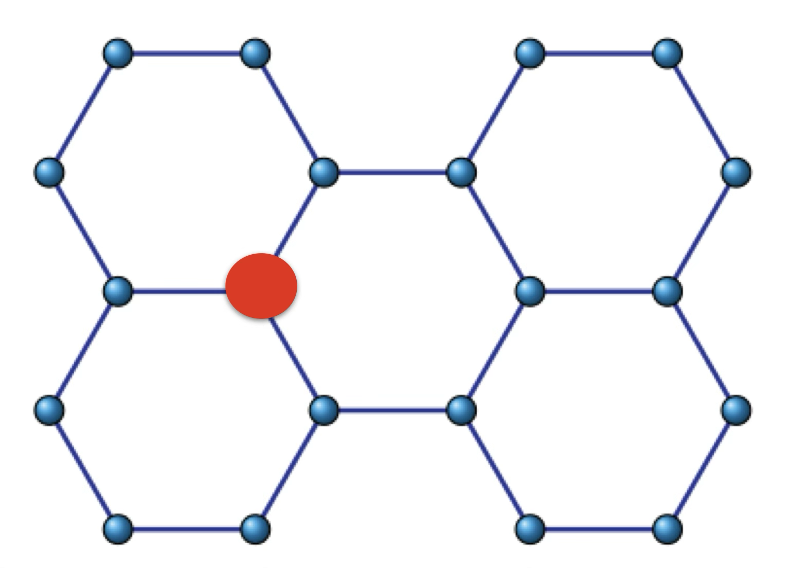

:::

<!--
## Life gets really hard!

+ In most cases reweighting is insufficient
+ $|\langle e^{-iS_{\mathcal{I}}}\rangle|\sim 0$ already for modest sizes of $\mu$
+ Extensive property$\implies$ gets worse with system size

::: {layout="[[50,50]]" layout-valign="center"}

Can we do better than vanilla reweighting?

:::
-->

## Alleviating the Sign Problem w/ Contour deformations

Push domain of $\phi\in\mathbb{R}^N\to\mathbb{C}^N$ 

::: {.panel-tabset}

### Lefschtz thimbles
:::: {.columns}

::: {.column width="50%"}
::: {style="font-size: 80%;"}
+ $\exists$ certain manifolds $\mathcal{T}\subset\mathbb{C}^N$ where $S_{\mathcal{I}}[\phi\in\mathcal{T}]={\rm constant}$
:::

\begin{align}
\int_{\phi\in\mathbb{R}^N}&\mathcal{D}[\phi]e^{-S[\phi]}\\
\to&
\sum_{\mathcal{T}}e^{-iS_{\mathcal{I}}^{\mathcal{T}}}\int_{\varphi\in\mathcal{T}\subset\mathbb{C}^N}\mathcal{D}[\varphi]e^{-S_{\mathcal{R}}[\varphi]}
\end{align}

:::

::: {.column width="10%"}

:::

::: {.column width="40%"}

{fig-align="right"}

:::

:::

+ M. Cristoforetti et al., [Phys.Rev. D88 (2013) 051501](https://arxiv.org/abs/1303.7204)
+ Kanazawa & Tanizaki [JHEP 1503 (2015) 044](https://arxiv.org/abs/1412.2802)

### "Learning" manifolds

::: {.columns}

::: {.column width="40%"}
::: {style="font-size: 60%;"}
+ Location of thimbles not know *a priori*
  - Can approach thimbles via holomorphic flow
  - However, determining exact locations of all relevant thimbles just as hard as original sign problem
  - Numerically intensive
+ Train a NN to "learn" location of Lefschetz thimbles
:::

{fig-align="center"}

:::{style='font-size:60%'}
+ J.-L. Wynen, **T.L.**, et al., [Phys.Rev.B 103 (2021) 125153](https://arxiv.org/abs/2006.11221)
+ M. Rodekamp, **T.L.**, et al., [Phys.Rev.B 106 (2022) 125139](https://arxiv.org/abs/2203.00390)
:::

:::

::: {.column width="60%"}

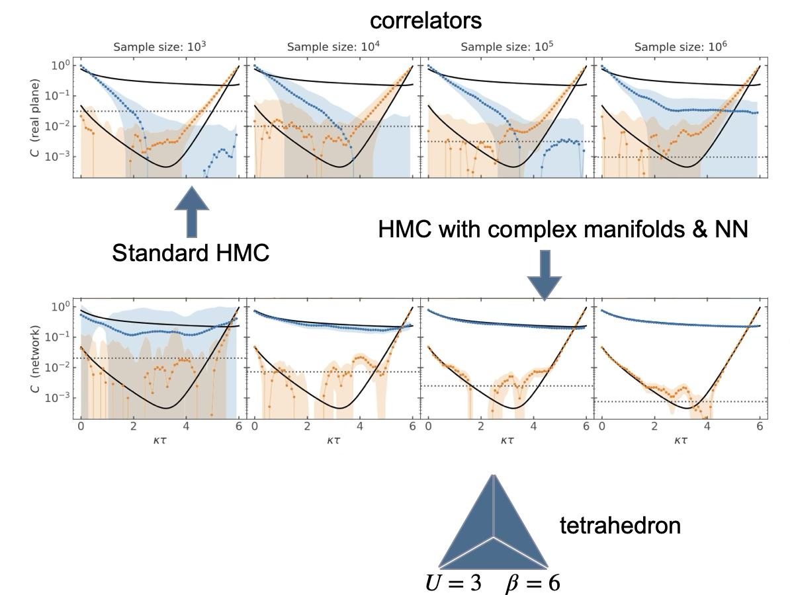{fig-align="center"}

:::

:::

### Constant shifts

$$\phi_{x,t}\to\phi_{x,t}+i\phi_c\quad\forall\ x,t$$

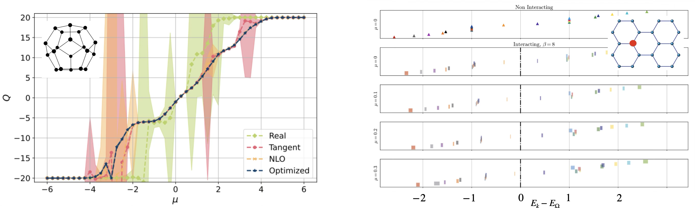{fig-align='center'}

:::{style='font-size:60%'}
+ M. Rodekamp, **T.L.**, et al.,[Eur.Phys.J.B 98 (2025) 36](https://arxiv.org/abs/2406.06711)
+ C. Gäntgen, **T.L.**, et al., [Phys.Rev.B 109 (2024) 195158](https://arxiv.org/abs/2307.06785)
:::

:::

## Recapitulation

+ The ***Curse of Dimensionality*** and strongly-interacting systems drive the need for QMC

+ Low-D systems are ideal for QMC
  - Quasi multi-particle excitations above the bulk ground state
  - Localization of topological states w/ interactions
  
+ Excellent algorithmic development already done within the LQCD community
  - HMC
  - pseudo-fermions
  - preconditioners
  
+ Development of algorithms to ***alleviate*** the sign problem
  - adaption of machine learning techniques
  - normalizing flows

<!--
## Pesky ergodicity

## Radial updates

## Topological properties of nanoribbons

::: {.panel-tabset}

### Topological invariants

### 'Fuji' and 'Kilamanjaro' localization

### Effective theory of 1-D spins

### Gap closing condition w/ Interactions

:::

-->
