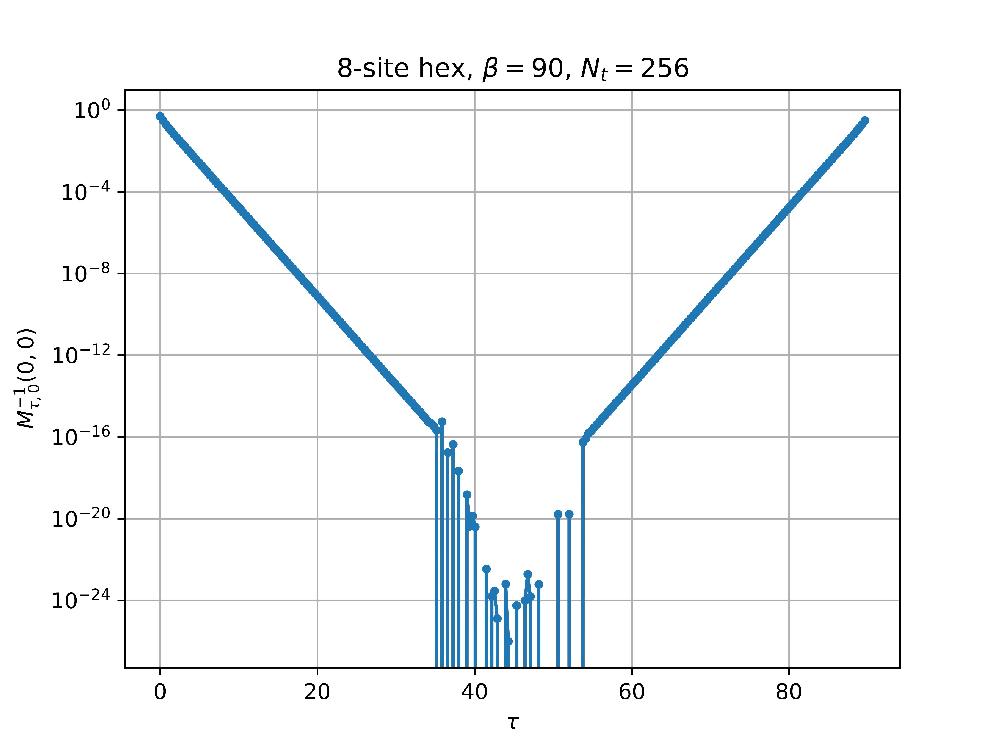

## Preliminary Expressions
:::{style='font-size:70%'}

+ The sausage:

$$ \underbrace{F_k(N_t-1).F_k(N_t-2)\ldots F_k(0)}_{\mathrm{``sausage"}}\quad;\quad F_k(t)\equiv \underbrace{e^{\tilde\kappa}}_{\mathrm{dense}}. \underbrace{e^{i\phi_t(x)}}_{\mathrm{diagonal}} \quad;\quad \tilde\kappa=\kappa\frac{\beta}{N_t}$$

+ "prefix"/"suffix" terms:

$$ \Pi(t) = F_k(t).F_k(t-1)\ldots F_k(0)\ ,\ \Pi(-1)\equiv\mathbb{1}\quad;\quad \Sigma(t) = F_k(N_t-1).F_k(N_t-2)\ldots F_k(t)$$

+ "sausage" is simply $\Sigma(t).\Pi(t-1) = \Sigma(0)=\Pi(N_t-1)$ for any value $t$
  
+ Of fundamental importance is the inverse fermion matrix $M^{-1}$:

:::{style='font-size:80%'}
$$
  \begin{pmatrix}
  \mathbb{1} & 0 & 0 & \cdots & F_k(N_t-1)\\
  -F_k(0) & \mathbb{1} & 0 & \cdots & 0 \\
  0 & -F_k(1) & \mathbb{1} & \cdots & 0\\
  \vdots & \vdots & \ddots & \ddots  & \vdots\\
  0 & \cdots & -F_k(N_t-3) & \mathbb{1} & 0\\
  0 & \cdots & 0 & -F_k(N_t-2) & \mathbb{1} 
  \end{pmatrix}^{-1}_{t_f,t_i}
$$
:::

:::

---

:::{style='font-size:70%'}
+ The inverse of the fermion matrix is

:::{style='font-size:45%'}
$$
\begin{pmatrix}
  [\mathbb{1}+\Sigma(0)]^{-1} & -\Sigma(1).[\mathbb{1}+\Pi(0).\Sigma(1)]^{-1} & -\Sigma(2).[\mathbb{1}+\Pi(1).\Sigma(2)]^{-1} & \cdots& -\Sigma(t_i).[\mathbb{1}+\Pi(t_i-1).\Sigma(t_i)]^{-1} &\cdots & -\Sigma(N_t-1).[\mathbb{1}+\Pi(N_t-2).\Sigma(N_t-1)]^{-1}\\
  F_k(0).[\mathbb{1}+\Sigma(0)]^{-1} & [\mathbb{1}+\Pi(0).\Sigma(1)]^{-1} & -F_k(0).\Sigma(2).[\mathbb{1}+\Pi(1).\Sigma(2)]^{-1} & & & \cdots & \vdots \\
  F_k(1).F_k(0).[\mathbb{1}+\Sigma(0)]^{-1}  & F_k(1).[\mathbb{1}+\Pi(0).\Sigma(1)]^{-1} & [\mathbb{1}+\Pi(1).\Sigma(2)]^{-1} & & & \cdots & \vdots\\
  F_k(2).F_k(1).F_k(0).[\mathbb{1}+\Sigma(0)]^{-1}  & F_k(2).F_k(1).[\mathbb{1}+\Pi(0).\Sigma(1)]^{-1} & F_k(2).[\mathbb{1}+\Pi(1).\Sigma(2)]^{-1} & \cdots& &  & \vdots\\
  \vdots & \vdots & \ddots & \ddots  & \vdots & & \\
  \Pi(t_f-1).[\mathbb{1}+\Sigma(0)]^{-1}  & \cdots &  & \cdots & [\mathbb{1}+\Pi(t_i-1).\Sigma(t_i)]^{-1} & & \cdots\\
  \vdots & \cdots & \cdots & \cdots & &[\mathbb{1}+\Pi(N_t-3).\Sigma(N_t-2)]^{-1} & -\Pi(N_t-3).\Sigma(N_t-1).[\mathbb{1}+\Pi(N_t-2).\Sigma(N_t-1)]^{-1}\\
  \Pi(N_t-2).[\mathbb{1}+\Sigma(0)]^{-1} & \cdots & \vdots & & & F_k(N_t-2).[\mathbb{1}+\Pi(N_t-3).\Sigma(N_t-2)]^{-1}  & [\mathbb{1}+\Pi(N_t-2).\Sigma(N_t-1)]^{-1} 
\end{pmatrix}
$$
:::

+ General expression in terms of "prefixes/suffixes" is

:::{style='font-size:70%'}
$$ 
M^{-1}[\phi]_{t_f,t_i}=
\begin{cases}
\Pi(t_f-1).\Pi^{-1}(t_i-1).[\mathbb{1}+\Pi(t_i-1).\Sigma(t_i)]^{-1} & \forall\ t_f\ge t_i\\
-\Pi(t_f-1).\Sigma(t_i).[\mathbb{1}+\Pi(t_i-1).\Sigma(t_i)]^{-1} & \forall\ t_f < t_i
\end{cases}
$${#eq-cxy1}
:::

+ Also equivalent, after some manipulation, to

:::{style='font-size:70%'}
$$ 
M^{-1}[\phi]_{t_f,t_i}=
\begin{cases}
\Pi(t_f-1).[\Pi(t_i-1)+\Pi(t_i-1).\Sigma(0)]^{-1}&=\Pi(t_f-1).[\mathbb{1}+\Sigma(0)]^{-1}.\Pi^{-1}(t_i-1) & \forall\ t_f\ge t_i\\
-\Pi(t_f-1).[\Pi(t_i-1)+\Sigma^{-1}(t_i)]^{-1}&=-\Pi(t_f-1).[\mathbb{1}+\Sigma(0)]^{-1}.\Sigma(t_i) & \forall\ t_f < t_i
\end{cases}
$${#eq-cxy2}
:::

+ I worry that these expressions, as they are written, are not stable to compute, so an alternative is^[Not sure if this is any better!]

:::{style='font-size:70%'}
$$ 
M^{-1}[\phi]_{t_f,t_i}=
\begin{cases}
[\Pi(t_i-1).\Pi^{-1}(t_f-1)+\Pi(t_i-1).\Sigma(t_f)]^{-1} & \forall\ t_f\ge t_i\\
-[\Pi(t_i-1).\Pi^{-1}(t_f-1)+\Sigma^{-1}(t_i).\Pi^{-1}(t_f-1)]^{-1} & \forall\ t_f < t_i
\end{cases}
$${#eq-cxy3}
:::

:::

---

:::{style='font-size:80%'}
+ Finn points out another representation obtained from using the [Woodbury Matrix Identity](https://en.wikipedia.org/wiki/Woodbury_matrix_identity):

:::{style='font-size:80%'}
$$
M^{-1}[\phi]_{t_f,t_i}=
\begin{cases}
\Pi(t_f-1).\Pi^{-1}(t_i-1)-\Pi(t_f-1).[\mathbb{1}+\Sigma(0)]^{-1}.\Sigma(t_i) & \forall\ t_f\ge t_i\\
-\Pi(t_f-1).[\mathbb{1}+\Sigma(0)]^{-1}.\Sigma(t_i) & \forall\ t_f < t_i
\end{cases}
$${#eq-cxy5}
:::

:::

## Unifying all these expressions

:::{style='font-size:80%'}

+ Let me make the more general definition that incorporates both 'prefix' and 'suffix' terms

:::{style='font-size:80%'}
$$
\Pi(t',t)=
\begin{cases}
F_k(t').F_k(t'-1)\ldots F_k(t+1).F_k(t)\quad &\forall\ t'\ge t\\
F_k((t'+N_t)\%N_t).F_k(t'+N_t-1)\%N_t)\ldots F_k((t+1)\%N_t).F_k(t)\quad &\forall\ t'< t
\end{cases}
$$
:::

+ This definition allows for a very compact expression^[Yes, I know, Finn has already derived all these expressions months ago!] for $M^{-1}$

:::{style='font-size:80%'}
$$
M^{-1}[\phi]_{t_f,t_i}=\mathcal{B}_{t_f,t_i}\times
\begin{cases}
[\mathbb{1}+\Pi(t_i-1,t_i)]^{-1} & \forall\ t_f = t_i\\
\left[\Pi^{-1}(t_f-1,t_i)+\Pi(t_i-1,t_f)\right]^{-1} & \forall\ t_f \ne t_i
\end{cases}
$${#eq-invM}
:::

  where 

:::{style='font-size:80%'}
$$
\begin{equation}
\mathcal{B}_{t_f,t_i}=
\begin{cases}
+1 & \forall\ t_f\ge t_i\\
-1 & \forall\ t_f<t_i
\end{cases}
\end{equation}
$$
:::

:::

---

:::{style='font-size:80%'}

+ Let's assume we have decompositions for $\Pi(t',t)\ \forall\ t',t$

:::{style='font-size:80%'}
$$
\Pi(t',t)  = U_\pi(t',t).D_\pi(t',t).V_\pi(t',t)\implies \Pi^{-1}(t',t)  = V^{-1}_\pi(t',t).D^{-1}_\pi(t',t).U^\dagger_\pi(t',t)
$$
:::

+ With the decompositions of $\Pi(t',t)$ obtained above, I can write the $t_f\ne t_i$ part^[The $t_f=t_i$ part is simply the force $\dot\pi(t_i)$ calculation, which we have already implemented.] of @eq-invM as

:::{style='font-size:70%'}
$$
[\Pi^{-1}(t_f-1,t_i)+\Pi(t_i-1,t_f)]^{-1}=\left[V_\pi^{-1}(t_f-1,t_i).D^{-1}_\pi(t_f-1,t_i).U^\dagger_\pi(t_f-1,t_i)+U_\pi(t_i-1,t_f).D_\pi(t_i-1,t_f).V_\pi(t_i-1,t_f)\right]^{-1}
$$
:::

+ This expression needs to be decomposed one last time, which requires that I choose one  of the two terms to make diagonally dominant in order to do the decomposition.    Here's my strategy:
  - If $\max\left(|D^{-1}_\pi(t_f-1,t_i)|\right) > \max\left(|D_\pi(t_i-1,t_f)|\right)$, then I decompose as follows:

	:::{style='font-size:60%'}
$$
\begin{align}
[\Pi^{-1}(t_f-1,t_i)+\Pi(t_i-1,t_f)]^{-1}&=[V_\pi^{-1}(t_f-1,t_i)\underbrace{\left(D^{-1}_\pi(t_f-1,t_i)+V_\pi(t_f-1,t_i).U_\pi(t_i-1,t_f).D_\pi(t_i-1,t_f).V_\pi(t_i-1,t_f).U_\pi(t_f-1,t_i)\right)}_{u.d.t}U^\dagger_\pi(t_f-1,t_i)]^{-1}\\
&=U_\pi(t_f-1,t_i).t^{-1}.d^{-1}.u^\dagger.V_\pi(t_f-1,t_i)
\end{align}
$$
	:::
	
  - otherwise I decompose as
  
  	:::{style='font-size:60%'}
$$
\begin{align}
[\Pi^{-1}(t_f-1,t_i)+\Pi(t_i-1,t_f)]^{-1}&=[U_\pi(t_i-1,t_f)\underbrace{\left(U^\dagger_\pi(t_i-1,t_f).V^{-1}_\pi(t_f-1,t_i).D^{-1}_\pi(t_f-1,t_i)U^\dagger_\pi(t_f-1,t_i).T^{-1}_\pi(t_i-1,t_f)+D_\pi(t_i-1,t_f)\right)}_{u.d.t}V_\pi(t_i-1,t_f)]^{-1}\\
&=V^{-1}_\pi(t_i-1,t_t).t^{-1}.d^{-1}.u^\dagger.U^\dagger_\pi(t_i-1,t_f)
\end{align}
$$
	:::

:::

---

{fig-align='center'}

## Calculating the fermion propagator ***on the fly***

:::{style='font-size:80%'}

+ Currently in **NSL** the prefix $\Pi(t)$ and suffix $\Sigma(t)$ terms are evaluated when calculating the forces

\begin{align}
\Pi(t) &= F_k(t).F_k(t-1)\ldots F_k(0)\equiv U_\pi(t).D_\pi(t).V_\pi(t)\\
\Sigma(t) &= F_k(N_t-1).F_k(N_t-2)\ldots F_k(t)\equiv U_\sigma(t).D_\sigma(t).V_\sigma(t)
\end{align}

+ From these terms I want to determine which components of the inverse fermion matrix I can compute ***without*** having to evaluate an expression of the form $D.V.V^{-1}.D^{-1}$, since such an evaluation usually results in loss of precision^[Note that summing terms $V^{-1}.D^{-1}.U^\dagger+U.D.V$ is okay.]

+ A simple analysis shows that we can calulate the following:

:::{style='font-size:80%'}
\begin{align}
M^{-1}[t,t]&= [\mathbb{1}+\Pi(t-1).\Sigma(t)]^{-1}=[\mathbb{1}+ U_\pi(t-1).D_\pi(t-1).V_\pi(t-1).U_\sigma(t).D_\sigma(t).V_\sigma(t)]^{-1} & \forall\ t\in[0,N_t-1]\\
M^{-1}[t,0]&= [\Pi^{-1}(t-1)+\Sigma(t)]^{-1}=[V^{-1}_\pi(t-1).D^{-1}_\pi(t-1).U^\dagger_\pi(t-1)+ U_\sigma(t).D_\sigma(t).V_\sigma(t)]^{-1} & \forall\ t\in[1,N_t-1]\\
M^{-1}[0,t]&= -[\Pi(t-1)+\Sigma^{-1}(t)]^{-1}=-[U_\pi(t-1).D_\pi(t-1).V_\pi(t-1)+ V^{-1}_\sigma(t).D^{-1}_\sigma(t).U^\dagger_\sigma(t)]^{-1} & \forall\ t\in[1,N_t-1]
\end{align}
:::

+ This corresponds to all elements on the diagonal, the first row, and the first column of $M^{-1}$.

:::
