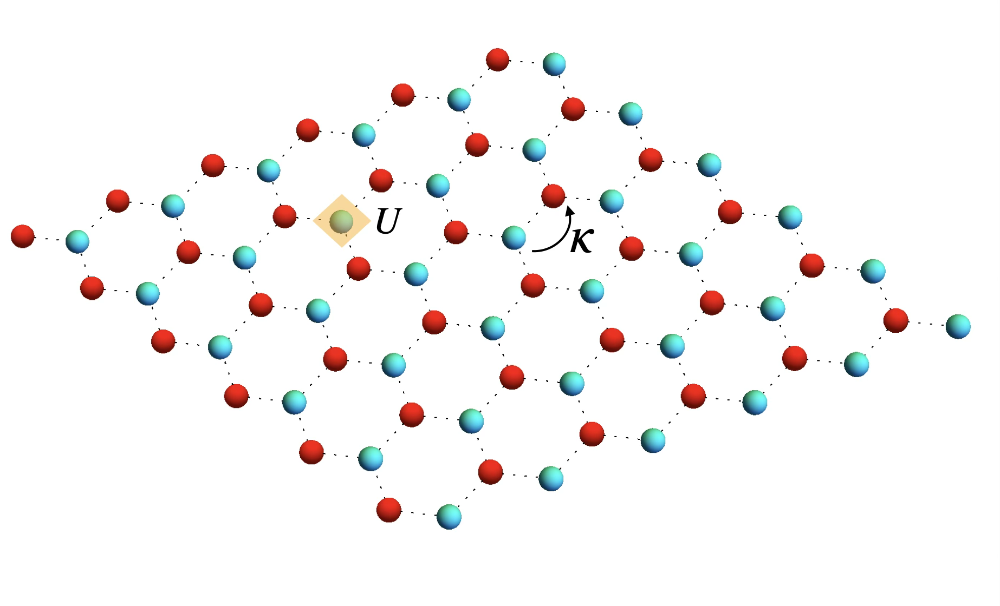
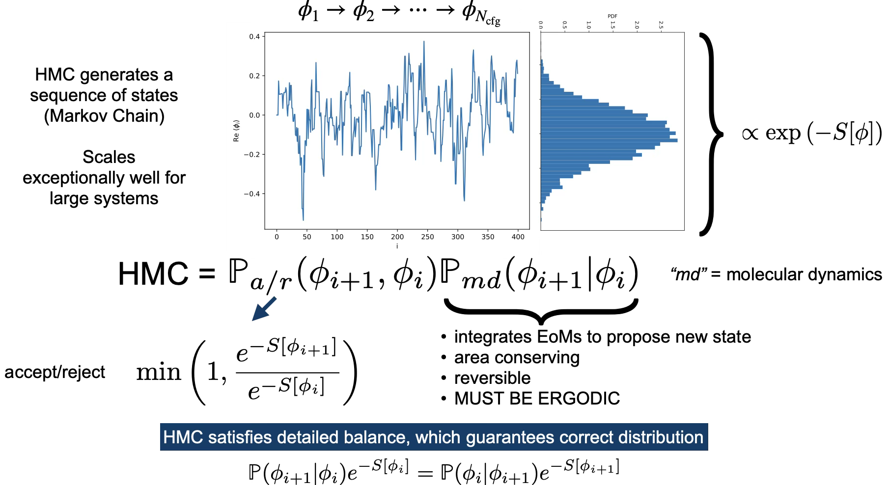

## Who is this guy?

:::{.columns}

:::{.column width='50%'}

+ Originally a nuclear many-body theorist
  - University of Washington (Seattle)
  
+ Staff member at Lawrence Livermore National Lab (California) 2005-2013
  - Access to big computers
  - Performed quantum monte carlo (QMC) simulations of ***Quantum Chromodynamics*** (QCD)
	* quarks and gluons and discretized space-time lattices
  
+ University of Bonn/Forschungszentrum Jülich (2013-present)
  - Applied QMC methods to low-dimensional strongly correlated electronic systems
    * electrons on physical crystal lattices
	
:::

:::{.column width='50%'}

{fig-align='right' width="70%"}

:::
	
:::

## How it all started

:::{.columns}
:::{.column width='50%'}
**Trion**

](assets/trion.png){width=75% fig-align='center'}

:::{.r-stack}
[Matsunaga et al., PRL 106, 037404 (2011)](https://journals.aps.org/prl/abstract/10.1103/PhysRevLett.106.037404) found evidence for a ***bound*** 3-body quasi-particle system with ***non-zero net charge*** in [*doped*]{style="color:red;"} (7,5) chiral carbon nanotube.
:::
:::

:::{.column width='50%'}
**Nucleon**

](assets/nucleon.png){width=61% fig-align='right'}
:::

:::

## Physics in low dimensions is really cool!

## Why one would think low-D is ***easier***

## Why I lose sleep over this problem

## How to put a Hamiltonian on the lattice 101 

+ General Hamiltonian is of the form

\begin{equation}
  H
	= 
	\sum_{yx} \left(p^\dagger_y K_{yx} p_x + h^\dagger_y K_{yx} h_x \right)
	+ \frac{1}{2} \sum_{yx} \rho_y V_{yx} \rho_x
	- \mu \sum_x \rho_x
\end{equation}

+ $\rho_x\equiv p_x^\dagger p_x^{}-h_x^\dagger h_x^{}$ (particle and hole creation/annihilation operators)
   
:::{.columns .fragment}

:::{.column width="60%"}

:::{.callout-note}
## The Hubbard model

For most of the work presented here we use tight-binding dynamics and Hubbard onsite interaction:

\begin{align}
	K_{xy} &= \kappa \delta_{\langle xy \rangle}
	&
	V_{xy} &= U \delta_{xy}.
	\label{eq:hubbard}
\end{align}

:::

:::

:::{.column width="40%"}

{fig-align="center"}

:::

:::

##  Attempting a direct diagonalization of $H$

{width='60%' fig-align='center'}

$N_x=72$ sites

:::{.callout-warning}
## Full diagonalization of this problem

Dimensionality of the problem scales as $4^{N_x}$

Example: $4^{72}=22300745198530623141535718272648361505980416$

:::

## First steps towards Quantum Monte Carlo

Instead of diagonalizing $H$, we concentrate on obtaining thermal expectation values of any operator $O$

\begin{equation}
  \langle O \rangle = \frac{1}{Z}\mathrm{Tr}\  Oe^{-\beta H}
\end{equation}

where $\beta=1/T$ is in inverse temperature and 

\begin{equation}
Z=\mathrm{Tr}\ e^{-\beta H}
\end{equation}

is the ***partition function***.

The trace is performed over the entire ***Fock space***

:::{.callout-warning .fragment}
## Have we gained anything

Not really. . .

:::

## Introduce Auxiliary Field $\phi$

{fig-align='center'}

:::{.columns}

:::{.column width="50%"}

:::{.callout-note .fragment}
## Hubbard-Stratonovich transformation

\begin{equation}
e^{-\frac{\delta U}{2}\rho_{x,t}^2}\propto\int d\phi_{x,t}e^{-\frac{\phi_{x,t}^2}{2\delta U}+i\phi_{x,t}\rho_{x,t}}
\end{equation}

"Linearized" the density term

:::

:::

:::{.column width="50%"}

:::{.callout-note .fragment}
## Integration measure $\mathcal{D}[\phi]$

\begin{equation}
\int \mathcal{D}[\phi]=\int\Pi_{x,t}d\phi_{x,t}
\end{equation}

High-dimensional integral!!  Enter Monte Carlo. . .

:::

:::

:::

## Techniques adapted from lattice QCD

:::{.callout-tip}
## Markov Chain Monte Carlo (MCMC) w/ Hybrid (Hamiltonian) MC  ([Duane et al. Phys.Lett. B195 (1987) 216-222](https://www.sciencedirect.com/science/article/pii/037026938791197X?via%3Dihub))
{fig-align='center' width="80%"}
:::

:::{style='font-size:80%'}
+ Other "borrowed" ideas
  - pseudo-fermions, J. Ostmeyer, **T.L.**, et al., [Phys.Rev.B 102 (2020) 245105](https://arxiv.org/abs/2005.11112)
  - Hasenbusch preconditioning, J. Ostmeyer, **T.L.** et al. [Comput.Phys.Commun. 236 (2019) 15-25](https://arxiv.org/abs/1804.07195) 
:::

