## Who is this guy?

:::{.columns}

:::{.column width='50%'}

+ Originally a nuclear many-body theorist
  - University of Washington (Seattle)
  
+ Staff member at Lawrence Livermore National Lab (California) 2005-2013
  - Access to big computers
  - Performed quantum monte carlo (QMC) simulations of ***Quantum Chromodynamics*** (QCD)
	* quarks and gluons and discretized space-time lattices
  
+ University of Bonn/Forschungszentrum Jülich (2013-present)
  - Applied QMC methods to low-dimensional strongly correlated electronic systems
    * electrons on physical crystal lattices
	
:::

:::{.column width='50%'}

{fig-align='right' width="70%"}

:::
	
:::

## How it all started

:::{.columns}
:::{.column width='50%'}
**Trion**

](assets/trion.png){width=75% fig-align='center'}

:::{.r-stack}
[Matsunaga et al., PRL 106, 037404 (2011)](https://journals.aps.org/prl/abstract/10.1103/PhysRevLett.106.037404) found evidence for a ***bound*** 3-body quasi-particle system with ***non-zero net charge*** in [*doped*]{style="color:red;"} (7,5) chiral carbon nanotube.
:::
:::

:::{.column width='50%'}
**Nucleon**

](assets/nucleon.png){width=61% fig-align='right'}
:::

:::

## Physics in low dimensions is really cool!

:::{.incremental}

+ Non-trivial excitations
  - many-body quasi-particle states
  - spin waves or ***magnons***
  - charge density waves
  
+ Mermin-Wagner theorem prevents spontaneous symmetry breaking in low-D
  - topological phase transitions
  - states can exist in different topological sectors
  - localized states vs bulk states
  - Majorana fermions!

+ Novel phenomena only in 2-D
  - Wilczek predicted in 1982 a novel excitation in 2-D
	* [Phys.Rev.Lett. 49 (1982) 957](https://journals.aps.org/prl/pdf/10.1103/PhysRevLett.49.957)
	* [New Kinds of Quantum Statistics](https://arxiv.org/abs/0812.5097)
  - "Anyons" = ***anything goes*** type of statistics
	* Abelian anyons $\to$ fractional quantum Hall effect
	* Non-abelian anyons $\to$ true fault tolerant quantum computing (???)

:::

## Why one would think low-D is ***easier***

:::{.columns}

:::{.column width='50%'}
:::{.incremental}

+ Dimensionality of system is ***smaller*** than that in LQCD
  - spatial volume $\sim \mathcal{O}(1)-\mathcal{O}(10000)$
  - temporal volume $\sim \mathcal{O}(10)-\mathcal{O}(1000)$
  - 2 species (spin up/down or particle/hole)
  - all to all propagators!
  
+ Spatial lattices are ***physical***
  - no spatial continuum limit required
  - no ***scale setting*** required

+ All the hard work has been already done by LQCD (thank you!)
  - preconditioners
  - pseudofermions
  - interpolating operators
  - finite volume quantizations

:::{.r-stack .fragment}
***"THIS WILL BE SO EASY!!!"*** :smirk:
:::

:::

:::

:::{.column width='50%'}

:::{.r-stack}
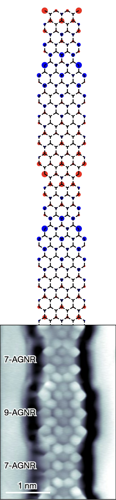{width=40% fig-align='center'}
:::

:::
:::

## :smirk: :blush: :grin: :grimacing: :sweat_smile: :sweat: :confused: :frowning: :unamused: :confounded:  :angry: :rage: :pensive: :fearful: :cold_sweat: :cry: :sob: :tired_face:

:::{.incremental}

+ Don't know the interaction!
  - Approximate system with ***models***, eg Hubbard model
  - The term ***ab initio*** is used very carelessly in this field

+ Many systems of interest are (nearly) gapless
  - temperature must be ***colder*** than gap
  - $T\ll 1\implies \beta\gg 1$ $\implies$ numerical instabilities
  
+ Ergodicity is not guaranteed!

+ The most interesting systems occur away from ***half-filling***, i.e. they are doped!
  - presents numerical sign problem
  
+ Geometry of system can also cause sign problem
  - non-bipartite ***frustrated*** systems
  
:::{.callout-warning .fragment}
Most of the work I show will be related to addressing these issues!
:::

:::

## How to put a Hamiltonian on the lattice 101 

+ General Hamiltonian is of the form

\begin{equation}
  H
	= 
	\sum_{yx} \left(p^\dagger_y K_{yx} p_x + h^\dagger_y K_{yx} h_x \right)
	+ \frac{1}{2} \sum_{yx} \rho_y V_{yx} \rho_x
	- \mu \sum_x \rho_x
\end{equation}

+ $\rho_x\equiv p_x^\dagger p_x^{}-h_x^\dagger h_x^{}$ (particle and hole creation/annihilation operators)
   
:::{.columns .fragment}

:::{.column width="60%"}

:::{.callout-note}
## The Hubbard model

For most of the work presented here we use tight-binding dynamics and Hubbard onsite interaction:

\begin{align}
	K_{xy} &= \kappa \delta_{\langle xy \rangle}
	&
	V_{xy} &= U \delta_{xy}.
	\label{eq:hubbard}
\end{align}

:::

:::

:::{.column width="40%"}

{fig-align="center"}

:::

:::

##  Attempting a direct diagonalization of $H$

{width='60%' fig-align='center'}

$N_x=72$ sites

:::{.callout-warning}
## Full diagonalization of this problem

Dimensionality of the problem scales as $4^{N_x}$

Example: $4^{72}=22300745198530623141535718272648361505980416$

:::

## First steps towards Quantum Monte Carlo

Instead of diagonalizing $H$, we concentrate on obtaining thermal expectation values of any operator $O$

\begin{equation}
  \langle O \rangle = \frac{1}{Z}\mathrm{Tr}\  Oe^{-\beta H}
\end{equation}

where $\beta=1/T$ is in inverse temperature and 

\begin{equation}
Z=\mathrm{Tr}\ e^{-\beta H}
\end{equation}

is the ***partition function***.

The trace is performed over the entire ***Fock space***

:::{.callout-warning .fragment}
## Have we gained anything

Not really. . .

:::

## Introduce Auxiliary Field $\phi$

{fig-align='center'}

:::{.columns}

:::{.column width="50%"}

:::{.callout-note .fragment}
## Hubbard-Stratonovich transformation

\begin{equation}
e^{-\frac{\delta U}{2}\rho_{x,t}^2}\propto\int d\phi_{x,t}e^{-\frac{\phi_{x,t}^2}{2\delta U}+i\phi_{x,t}\rho_{x,t}}
\end{equation}

"Linearized" the density term

:::

:::

:::{.column width="50%"}

:::{.callout-note .fragment}
## Integration measure $\mathcal{D}[\phi]$

\begin{equation}
\int \mathcal{D}[\phi]=\int\Pi_{x,t}d\phi_{x,t}
\end{equation}

High-dimensional integral!!  Enter Monte Carlo. . .

:::

:::

:::

## Techniques adapted from lattice QCD

:::{.callout-tip}
## Markov Chain Monte Carlo (MCMC) w/ Hybrid (Hamiltonian) MC  ([Duane et al. Phys.Lett. B195 (1987) 216-222](https://www.sciencedirect.com/science/article/pii/037026938791197X?via%3Dihub))
{fig-align='center' width="80%"}
:::

:::{style='font-size:80%'}
+ Other "borrowed" ideas
  - pseudo-fermions, J. Ostmeyer, S.Krieg, T.Lähde,**T.L.**, et al., [Phys.Rev.B 102 (2020) 245105](https://arxiv.org/abs/2005.11112)
  - Hasenbusch preconditioning, J. Ostmeyer, S.Krieg, **T.L.** et al. [Comput.Phys.Commun. 236 (2019) 15-25](https://arxiv.org/abs/1804.07195) 
:::

# Quasi-particle excitations from correlators

## Anatomy of a correlator

Single-body correlation functions $\langle p_x^{}(\tau)p_y^\dagger(0)\rangle = \langle M_{xy;\tau}^{-1}\rangle\equiv C(\tau)$

{fig-align="center" height=4in}

:::{.callout-note}
## Spectral Decomposition Theorem
\begin{align}
C(\tau)&=A_p e^{-(E_p-E_\Omega)\tau}+A_{ex} e^{-(E_{ex}-E_\Omega)\tau}+\ldots+A_he^{(E_h-E_\Omega)(\tau-\beta)}\\
&\to A_pe^{-(E_p-E_\Omega)\tau}\quad\quad(0\ll\tau\ll\beta)
\end{align}
:::

<!--  - two-body $\langle p_{y'}^{}(\tau)p_{x'}^{}(\tau)p_x^\dagger(0)p_y^\dagger(0)\rangle = \langle M_{x'x;\tau}^{-1}M_{y'y;\tau}^{-1}-M_{x'y;\tau}^{-1}M_{y'x;\tau}^{-1}\rangle$

::: {layout="[[33,33,33]]" layout-valign="center"}

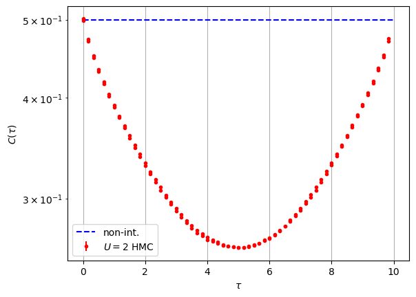

:::
-->

## We can now extract excitation energies

:::{.r-stack}
{fig-align="center"}

{fig-align="center" .fragment}

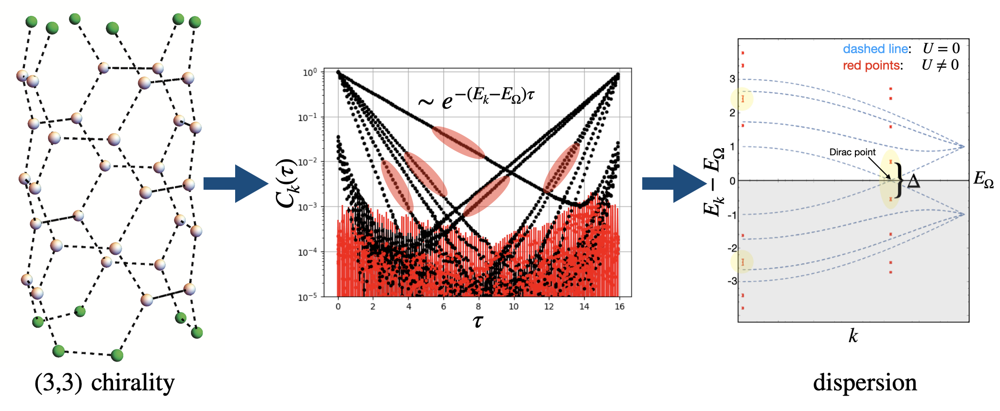{fig-align="center" .fragment}
:::

+ First QMC simulation of nanotube
  - **T.L.** & T. Lähde [Phys.Rev. B93 (2016) 155106](https://arxiv.org/abs/1511.04918)

## Determined quantum phase transition in 2D Hubbard (honeycomb)

+ Finite size scaling analysis
  - tune $U_c$, $\beta$ and $\nu$ to obtain data collapse (universal line)
  - most precise value of critical coupling to date :  $U_c=3.835(14)$
  - J. Ostmeyer, S. Krieg, T. Lähde, **T.L.**, et al., [Phys.Rev.B 104 (2021) 155142](https://arxiv.org/abs/2105.06936)
  

## Two-body excitations

+ Can assign spin/isospin quantum numbers to the holes and particles

:::{.columns}

:::{.column width='50%'}

:::{style='font-size:70%'}

|            | $S_z=1/2$   | $S_z=-1/2$  |
|------------|:-------------:|:-------------:|
| $I_z=1/2$  | $p^\dagger$ |  $h^{}$     |
| $I_z=-1/2$ | $h^\dagger$ |  $p^{}$     |

: Pseudospin (Isospin) $I$ and Spin $S$ assignments

:::

:::

:::{.column width='50%'}

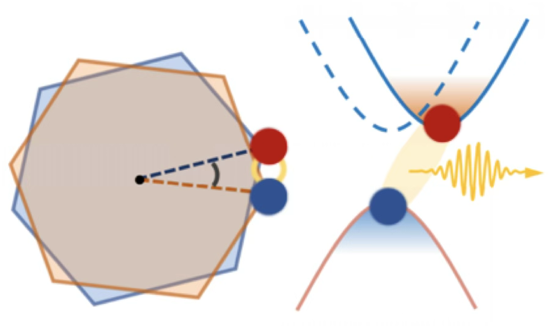{fig-align='center' width="50%"}

:::

:::

+ Two-body interpolating operators

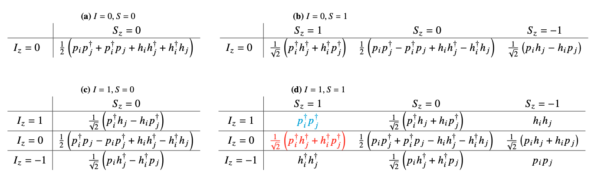{fig-align="center" width='80%'}

---

### Excitons

:::{.columns}

:::{.column width=50%}

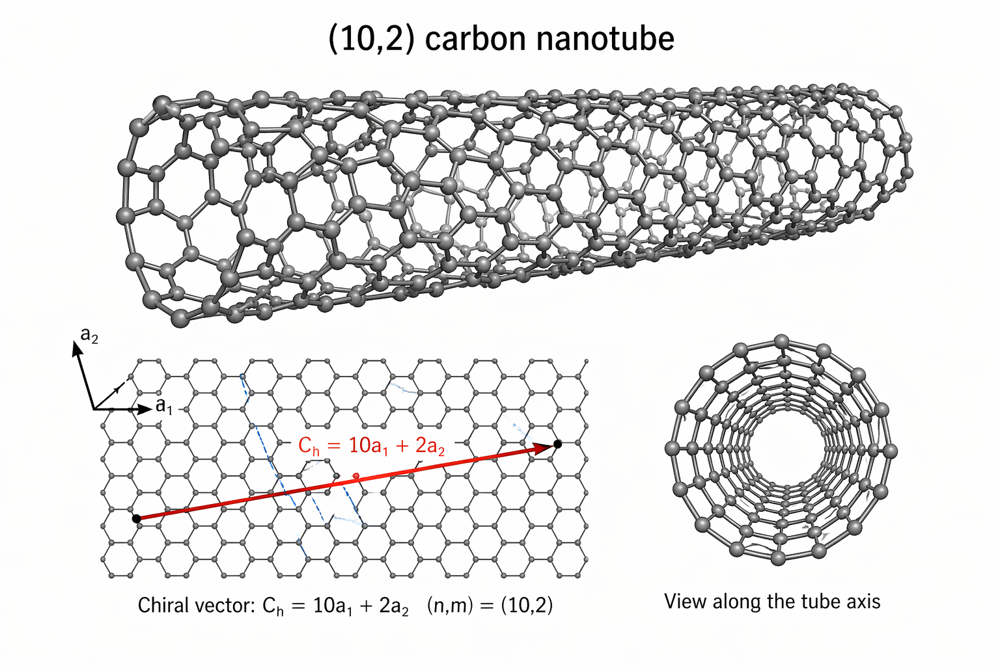{fig-align='center' width='100%'}

:::{style='font-size:80%'}
 - $I_z=0$ corresponds to particle-hole excitations 
   * "bright" excitons
   * "dark" excitons
 - analogous to mesons in lattice QCD
 - First "dark" excitons from QMC:  P. Sinilkov, **T.L.**, et al., [PoS LATTICE2024 (2025) 075](https://arxiv.org/abs/2502.04015)
:::

:::

:::{.column width=50%}

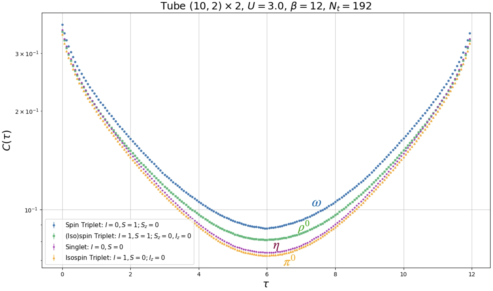{fig-align='center' width='100%'}

:::{.r-stack}

P. Sinilkov et al., in preparation

:::

:::{.callout-important .fragment}

:::{.r-stack}
But what about disconnected diagrams?
:::

:::

:::

:::

## Stabilizing the "Sausage" and disc. diagrams

:::{.columns}

:::{.column width=50%}

:::{style='font-size:80%'}
+ At large $\beta$, numerical instabilities occur in constructing $\det M$,

:::{style='font-size:100%'}
\begin{equation}
\det M[\phi]=\det(\mathbb{1}_{N_x}+\underbrace{F_k(N_t-1).F_k(N_t-2)\ldots F_k(0)}_{\mathrm{``sausage"}})
\end{equation}
:::

+ Inspired by [C.Bauer, SciPost Phys. Core 2, 011 (2020)](https://scipost.org/SciPostPhysCore.2.2.011)
  - Used recursive matrix decompositions (QR) to stablize construction of "sausage"
  - Extended formalism to force calculations to stabilize HMC
  - Can now simulate to much larger values of $\beta$ (room temperature)

+ With decompositions, the force terms give direct access to
  - $M^{-1}_{x,y}(t,t,\phi)$
  - $M^{-1}_{x,y}(t,0,\phi)$
  - $M^{-1}_{x,y}(0,t,\phi)$
  - ***without*** approximations
  
+ Can construct ***any*** many-body two-point function
  
:::{.r-stack}
  **T.L.**, P. Sinilkov, F. Temmen, et al. [arXiv:2604.00815](https://arxiv.org/abs/2604.00815)
:::

:::

:::

:::{.column width=50%}

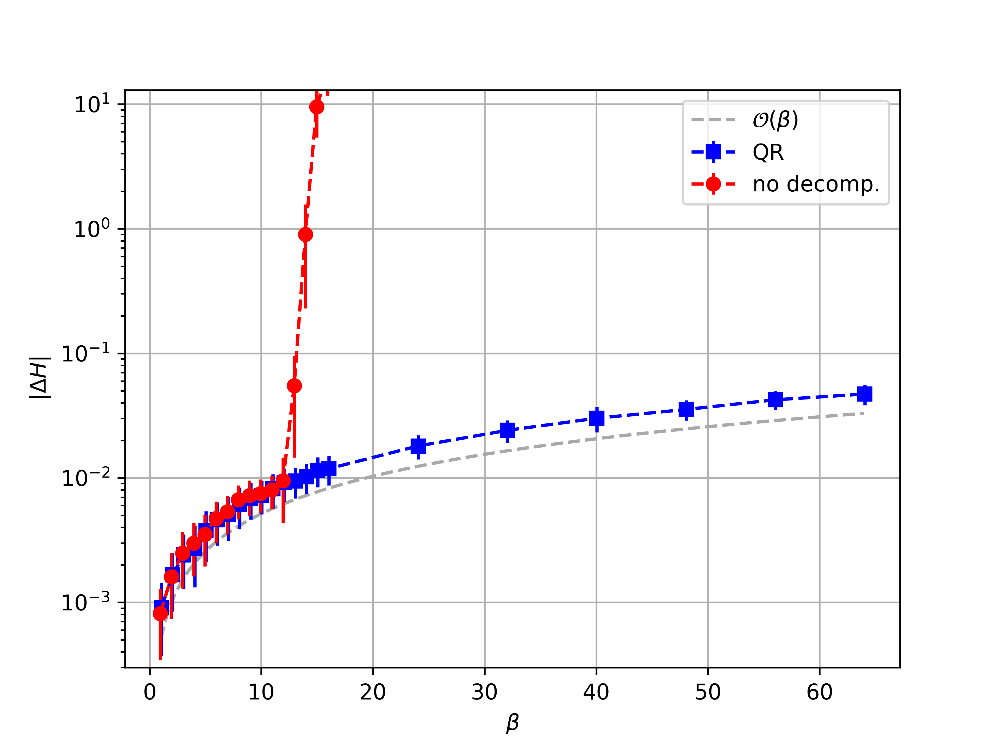

:::

:::

# Ergodicity and all that

#  {background-video="assets/snakeV2.m4v" background-video-loop="true" background-video-muted="true" background-size="contain" .center}

:::{.r-stack .fragment}
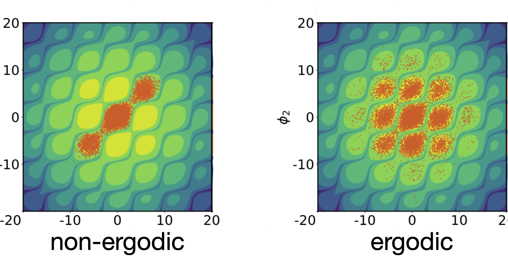{fig-align='center' width="72%"}
:::
:::{.r-stack .fragment}
F. Temmen, **T.L.**, et al. [Phys.Rev.B 112 (2025) 045134](https://arxiv.org/abs/2504.01575)
:::

# Localized states in low-D systems

## Hybrid nanoribbons

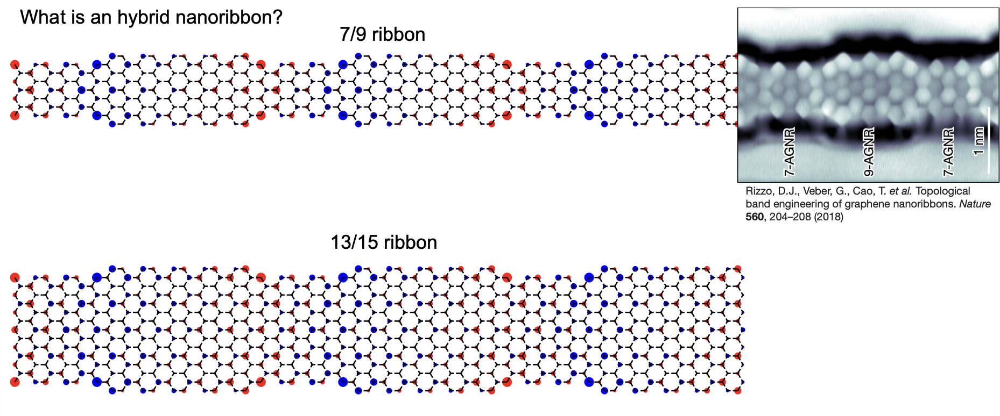{fig-align="center"}

## Lowest energy state exhibits "localization"

{fig-align="center"}

## QMC Simulations

:::{.columns}

:::{.column width="50%"}

:::{.r-stack}
Localizations persist with strong interactions
:::

{fig-align="center"}

+  **T.L.**, U.-G. Meißner, L. Razmadze [Phys.Rev.B 106 (2022) 195422](https://arxiv.org/abs/2204.02742)

:::

:::{.column width="50%"}

:::{.r-stack}
An effective theory for 1-D spin chain
:::

{fig-align="center"}

:::{style='font-size:80%'}
$$
H_{1D}=
-\sum_ka^\dagger_k
\begin{pmatrix}
m_s & t_Ae^{ik}+t_Be^{-ik}\\
t_A e^{-ik}+t_Be^{ik} & -m_s
\end{pmatrix}
a^{}_k
$$
:::

:::

:::

## A novel form of localization

{fig-align='center'}

+ J. Ostmeyer, **T.L.**, et al. [Phys.Rev.B 109 (2024) 195135](https://arxiv.org/abs/2401.04715)

## The interacting SSH model

:::{.columns}

:::{.column width="50%"}

{fig-align='center' width="100%"}

:::{style='font-size:80%'}
+ Topological $t_1<t_2$, $t_1=v,\ t_2=w$

{fig-align="center"}

{fig-align='center' width="80%"}

+ Experimentally realizable
  - Silicon quantum dots
    [Kiczynski et al., Nature 606 (2022) 694](https://www.nature.com/articles/s41586-022-04706-0)
  - Artificial lattices
    [Meier et al., Nature Commun. 7 (2016) 13986](https://www.nature.com/articles/ncomms13986)
:::

:::

:::{.column width="50%"}

:::{style='font-size:80%'}

:::{.callout-note .fragment}
## Localized spin centers w/ defects and interactions

{fig-align='center' width="65%"}

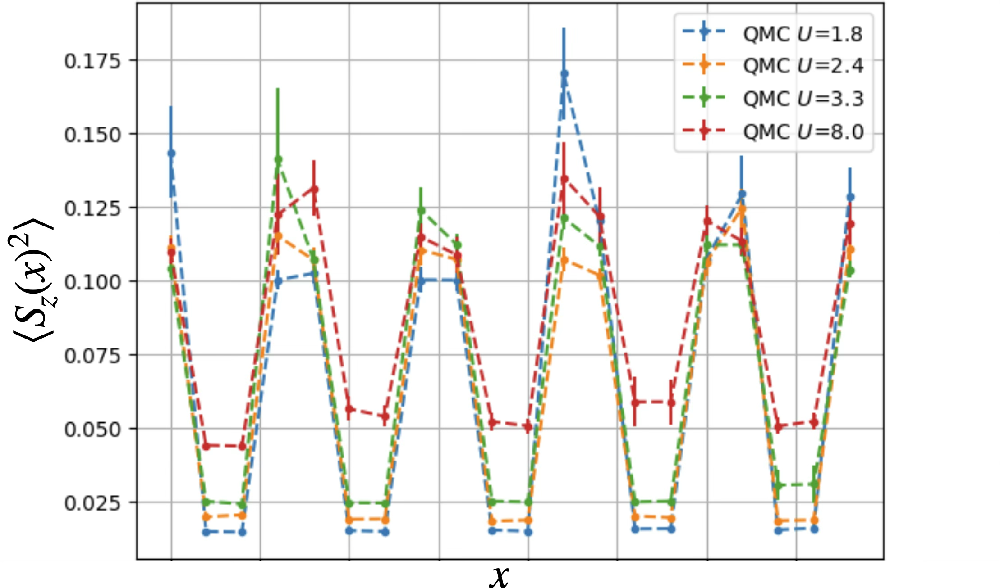{fig-align='center'}

{fig-align='center' width="70%"}

L. Wang, **T.L.**, U.-G. Meißner [Phys.Rev.B 113 (2026) 085111](https://journals.aps.org/prb/abstract/10.1103/n1h1-4vtr)
:::

:::

:::

:::

# The "Sign Problem"

## Complex Action $S[\phi]$

:::{.columns}

:::{.column width="50%"}

+ Probability only makes sense when
  $$
  \mathbb{P}[\phi]=\frac{e^{-S[\phi]}}{Z}\in \mathbb{R}_+ \implies S[\phi]\in \mathbb{R}
  $$

+ $\exists$ systems when $S[\phi]\in \mathbb{C}$
  + non-bipartite lattice
	- cannot divide system into sublattices
   + non-zero chemical potential $\mu\ne0$
	 - doping (away from half-filling)
	 - QCD at finite baryon density
	 
	 
:::

:::{.column width="50%"}

:::{.callout-important .fragment}

Most interesting problems have a sign problem!

+ Phase transitions at finite density (e.g. hardonic matter to quark/gluon plasma)
+ Doped Mott-Insulators (e.g. high-$T_c$ superconductivity)
+ Frustrated systems (quantum spin-systems on non-bipartite lattices)
+ Real-time evolution (e.g. non-equilibrium processes)
:::

:::{.callout-note .fragment}
## Reweighting
\begin{align}
	\langle O\rangle &= \frac{1}{\mathcal{Z}}\int \mathcal{D}[\phi]\ O[\phi]\; e^{-S_{\mathcal{R}}[\phi]-iS_{\mathcal{I}}[\phi]}\\
	&=\frac{\int \mathcal{D}[\phi]\; O[\phi]e^{-iS_{\mathcal{I}}[\phi]}e^{-S_{\mathcal{R}}[\phi]}}{\int D\phi\; e^{-S_{\mathcal{R}}[\phi]}}\frac{\int D\phi\; e^{-S_{\mathcal{R}}[\phi]}}{\int D\phi\; e^{-S_{\mathcal{R}}[\phi]-iS_{\mathcal{I}}[\phi]}}\\
	&=\frac{\langle Oe^{-iS_{\mathcal{I}}}\rangle_{\mathcal{R}}}{\langle e^{-iS_{\mathcal{I}}}\rangle_{\mathcal{R}}}
	\quad;\quad\mbox{"average phase"}\  =\ \langle e^{-iS_{\mathcal{I}}}\rangle
\end{align}
:::

:::

:::

## Examples

::: {layout="[[33,33,33]]" layout-valign="center"}

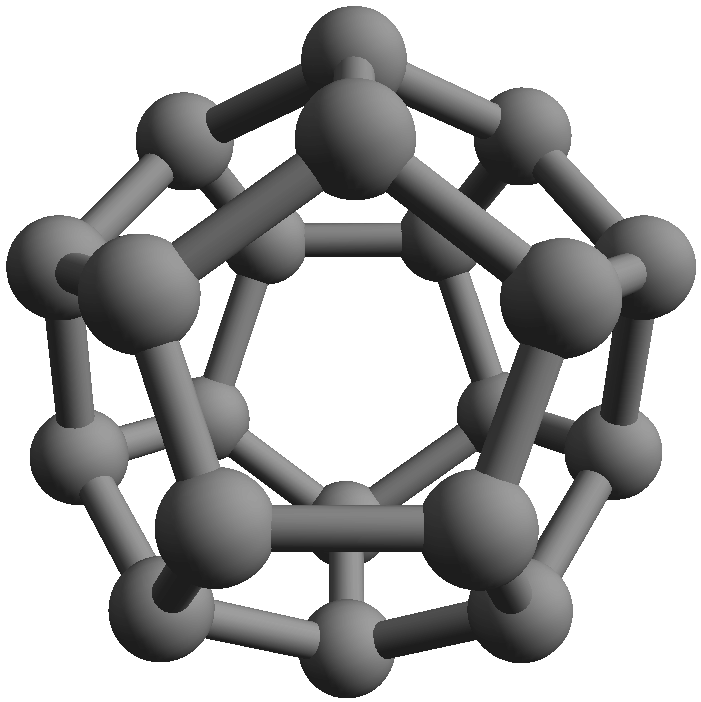{width='90%'}

:::

<!--
## Life gets really hard!

+ In most cases reweighting is insufficient
+ $|\langle e^{-iS_{\mathcal{I}}}\rangle|\sim 0$ already for modest sizes of $\mu$
+ Extensive property$\implies$ gets worse with system size

::: {layout="[[50,50]]" layout-valign="center"}

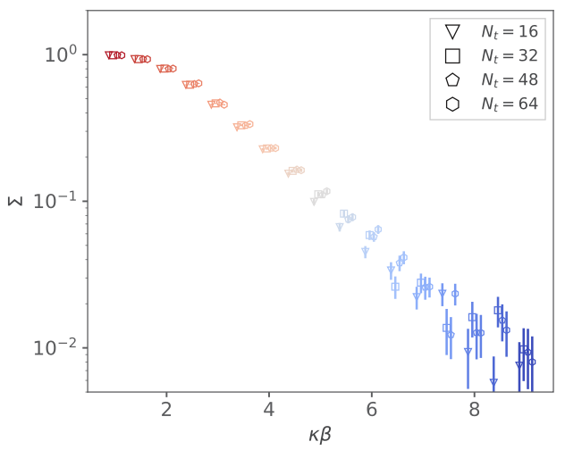

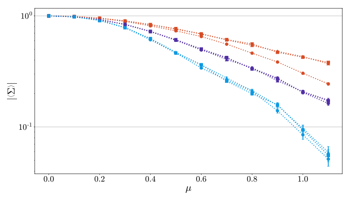
Can we do better than vanilla reweighting?

:::
-->

## Alleviating the Sign Problem w/ Contour deformations

Push domain of $\phi\in\mathbb{R}^N\to\mathbb{C}^N$ 

::: {.panel-tabset}

### Lefschtz thimbles
:::: {.columns}

::: {.column width="50%"}
::: {style="font-size: 80%;"}
+ $\exists$ certain manifolds $\mathcal{T}\subset\mathbb{C}^N$ where $S_{\mathcal{I}}[\phi\in\mathcal{T}]={\rm constant}$
:::

\begin{align}
\int_{\phi\in\mathbb{R}^N}&\mathcal{D}[\phi]e^{-S[\phi]}\\
\to&
\sum_{\mathcal{T}}e^{-iS_{\mathcal{I}}^{\mathcal{T}}}\int_{\varphi\in\mathcal{T}\subset\mathbb{C}^N}\mathcal{D}[\varphi]e^{-S_{\mathcal{R}}[\varphi]}
\end{align}

:::

::: {.column width="10%"}

:::

::: {.column width="40%"}

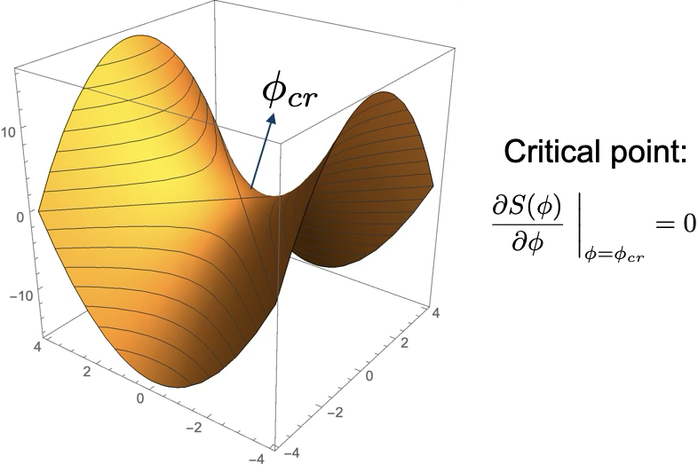{fig-align="right"}

:::

:::

+ M. Cristoforetti et al., [Phys.Rev. D88 (2013) 051501](https://arxiv.org/abs/1303.7204)
+ Kanazawa & Tanizaki [JHEP 1503 (2015) 044](https://arxiv.org/abs/1412.2802)

### "Learning" manifolds

::: {.columns}

::: {.column width="40%"}
::: {style="font-size: 60%;"}
+ Location of thimbles not know *a priori*
  - Can approach thimbles via holomorphic flow
  - However, determining exact locations of all relevant thimbles just as hard as original sign problem
  - Numerically intensive
+ Train a NN to "learn" location of Lefschetz thimbles
:::

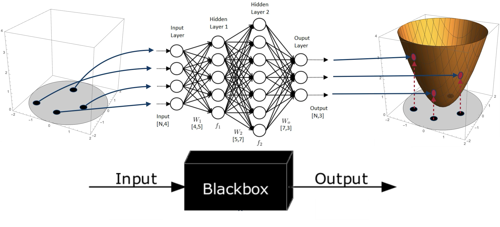{fig-align="center"}

:::{style='font-size:60%'}
+ J.-L. Wynen, **T.L.**, et al., [Phys.Rev.B 103 (2021) 125153](https://arxiv.org/abs/2006.11221)
+ M. Rodekamp, **T.L.**, et al., [Phys.Rev.B 106 (2022) 125139](https://arxiv.org/abs/2203.00390)
:::

:::

::: {.column width="60%"}

{fig-align="center"}

:::

:::

### Constant shifts

$$\phi_{x,t}\to\phi_{x,t}+i\phi_c\quad\forall\ x,t$$

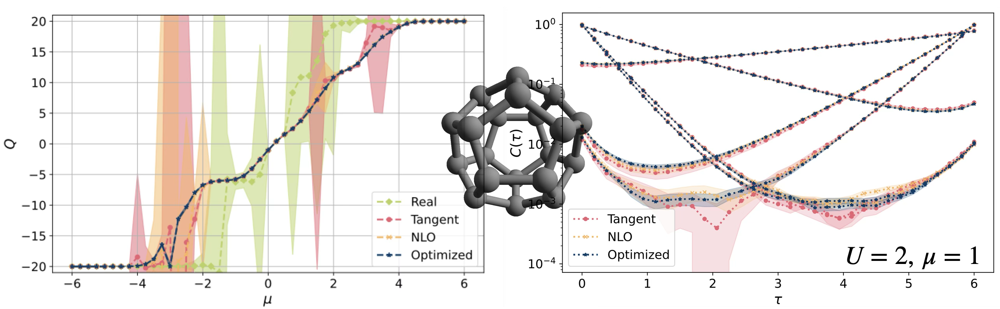{fig-align='center'}

:::{style='font-size:60%'}
+ M. Rodekamp, **T.L.**, et al.,[Eur.Phys.J.B 98 (2025) 36](https://arxiv.org/abs/2406.06711)
+ C. Gäntgen, **T.L.**, et al., [Phys.Rev.B 109 (2024) 195158](https://arxiv.org/abs/2307.06785)
:::

:::

## Alleviating Sign Problem by avoiding it

:::{.columns}

:::{.column width='60%'}

+ Array of 1-d quantum wires

+ Electrons can 
  - hop within a wire, but ***NOT*** across wires
  - have onsite interaction $U$
  - can feel presence of electrons $V$ on nearest wires
  
+ Solve each 1d system with direct method 
  - exact diagonalization
  - tensor networks
  - NO sign problem
  
+ Collection of wires treated stochastically with QMC
  - much milder sign problem
  
+ Hybrid approach:  F. Temmen, **T.L.**, et al. [arXiv:2603.17788](https://arxiv.org/abs/2603.17788)

:::{.callout-warning .fragment}
:::{.r-stack}
"Hey Tom!  This looks like a ***very*** contrived problem!"
:::
:::

:::

:::{.column width='40%'}

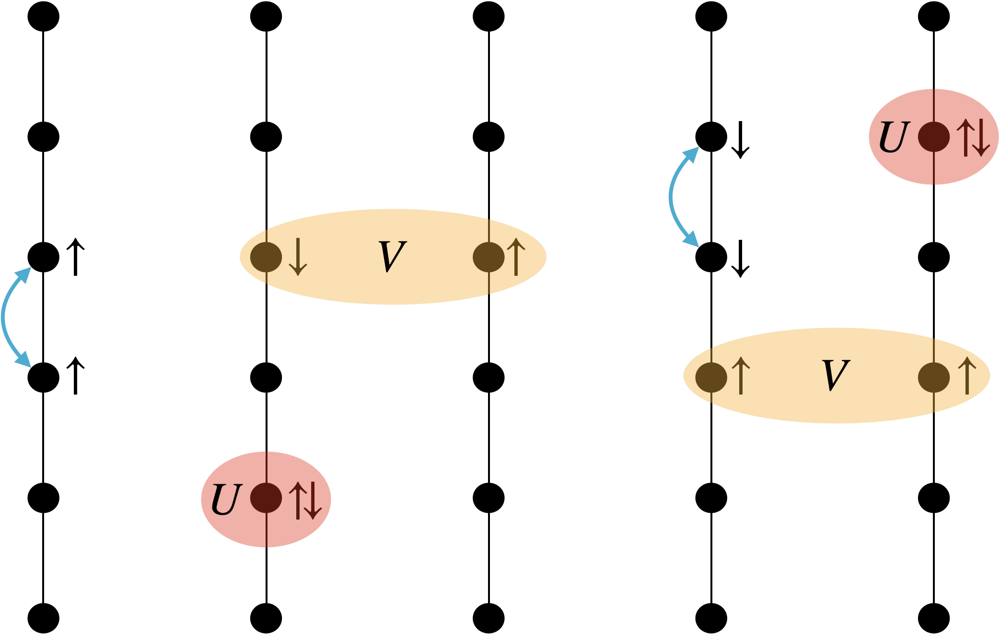{fig-align='center' width='100%'}

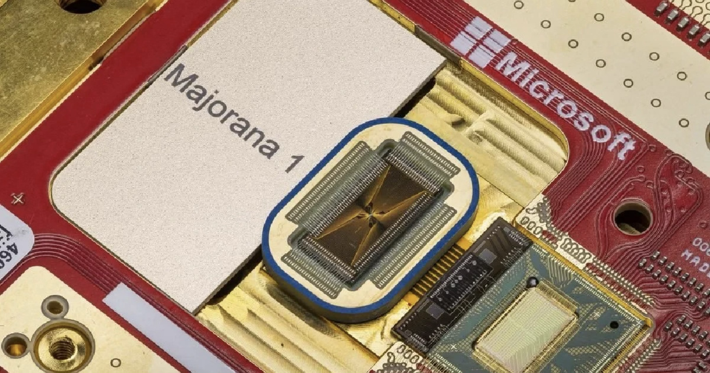{fig-align='center' with='100%' .fragment}

:::{.r-stack .fragment}
[Majorana 1 QPU](https://news.microsoft.com/source/features/ai/microsofts-majorana-1-chip-carves-new-path-for-quantum-computing/)   **controversy of 2025**
:::

:::

:::

## So what's in the future?

:::{.columns}

:::{.column width='50%'}

:::{.callout-note}
## Direct simulations at room temperature

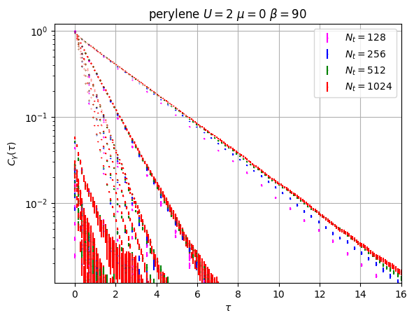{fig-align='center' width='45%'}

:::{.r-stack}
Talk to Petar S.!
:::

:::
  
:::{.callout-note}
## Investigating ***Transition Metal Dichalcogenides*** (TMDs)

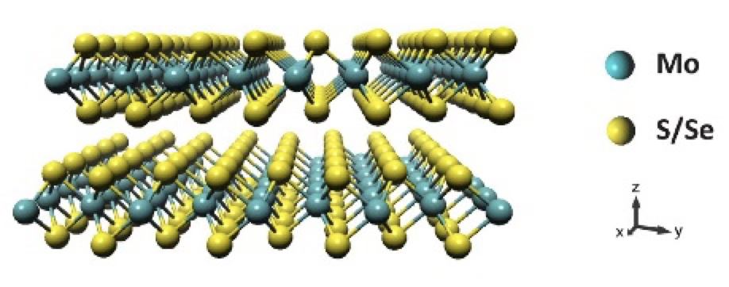{fig-align='center' width='93%'}

:::{.r-stack}
Talk to Finn T.! [(source)](https://elu.sav.sk/en/departments/microelectronics-and-sensors/about-department/2d-materials/)
:::

:::

:::

:::{.column width='50%'}

:::{.callout-note}
##  Engineering phase transitions in nanoribbons
  
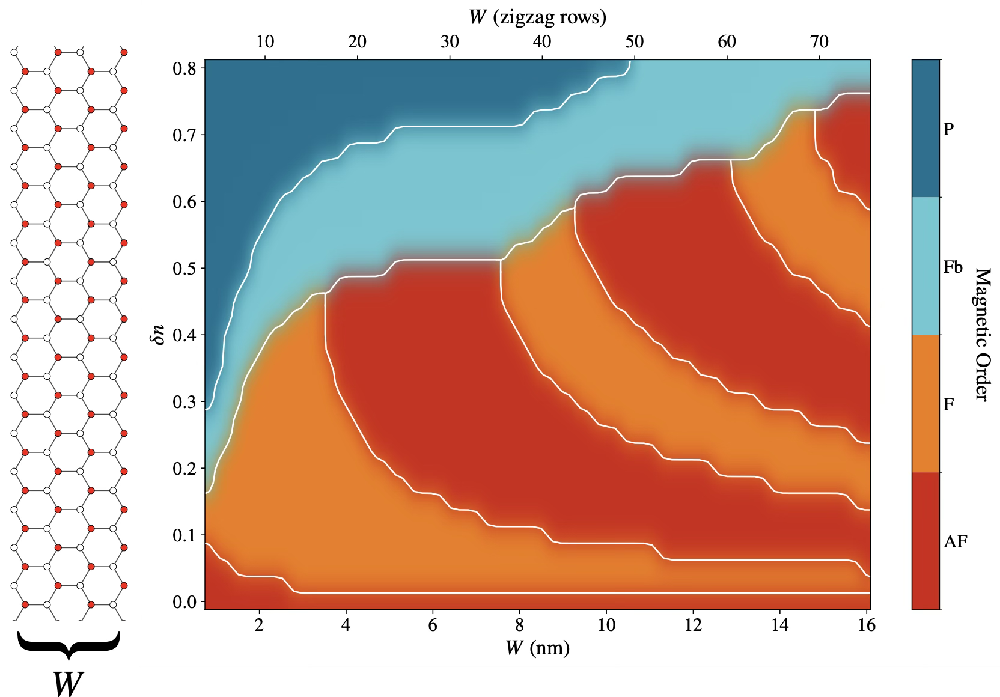{fig-align='center' width='50%'}

:::{.r-stack}
Talk to Felix S. and Lin W.!
:::

:::

:::{.callout-note}
##  Majorana systems via pfaffian QMC
  
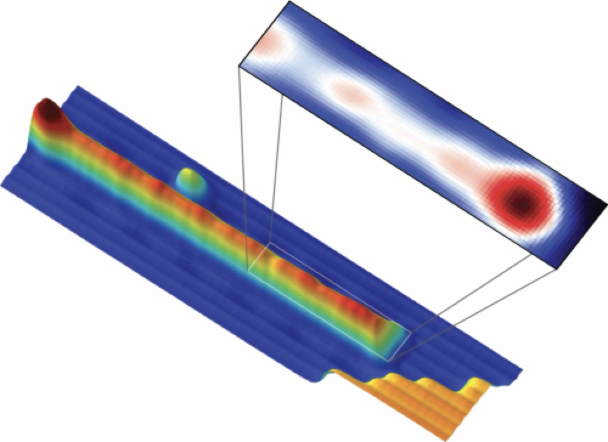{fig-align='center' width='50%'}

:::{.r-stack}
Talk to Thomas H.! [(source)](https://phys.org/news/2014-10-majorana-fermion-physicists-elusive-particle.html#google_vignette)
:::

:::

:::

:::

