# Derivation of Lüscher's formula

## $\delta$-function interaction

The contact interaction is regulated by a hard cutoff $\Lambda$,

$$
\langle \vec p\,' | \hat V_\delta | \vec p \rangle = \frac{4\pi a(\Lambda)}{m}\,\theta(\Lambda - p')\,\theta(\Lambda - p) \, ,
$$

where $a(\Lambda)$ is tuned to reproduce the T-matrix at threshold,

$$
a(\Lambda) = \frac{a_0}{1 - \tfrac{2}{\pi} a_0 \Lambda} \, ,
$$

and $a_0$ is the physical s-wave scattering length.

## Scattering amplitude in free space

:::{.columns}

:::{.column width="60%"}
Because my interaction is separable, the bubble sum can be summed geometrically to give

:::{style='font-size:80%'}
$$
\begin{aligned}
T(\vec p, -\vec p; E)
&= \frac{4\pi a(\Lambda)/m}{1 - \tfrac{4\pi a(\Lambda)}{m}\int\! \tfrac{d^3 q}{(2\pi)^3}\, \tfrac{1}{E - q^2/m + i\epsilon}} \\[4pt]
&= \frac{4\pi a(\Lambda)/m}{1 - \tfrac{2 a(\Lambda)}{\pi}\int\! dq\, \tfrac{q^2}{mE - q^2 + i\epsilon}} \\[4pt]
&= \frac{4\pi/m}{\tfrac{1}{a(\Lambda)} - \tfrac{2}{\pi}\int_0^\Lambda\! dq \left(\mathcal{P}\tfrac{q^2}{mE - q^2} - i\pi q^2 \delta(mE - q^2)\right)}
\end{aligned}
$$

:::

:::

:::{.column width="40%"}

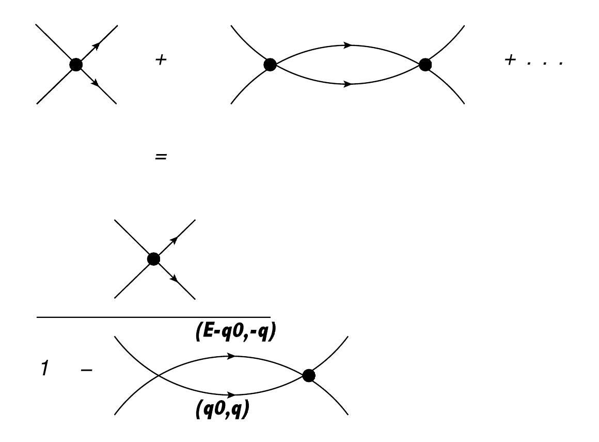{fig-align="center" width="100%"}

:::{.r-stack}
:::{style='font-size:80%'}
The bubble sum using the contact interaction.
:::
:::

:::

:::

---

### Evaluating the denominator

:::{style='font-size:80%'}
$$
\begin{aligned}
\frac{1}{a(\Lambda)} &- \frac{2}{\pi}\int_0^\Lambda\! dq \left(\mathcal{P}\tfrac{q^2}{mE - q^2} - i\pi q^2 \delta(mE - q^2)\right) \\[4pt]
&= \frac{1}{a(\Lambda)} + \frac{2}{\pi}\left(\Lambda - \tfrac{\sqrt{mE}}{2}\log\Big(\tfrac{\Lambda + \sqrt{mE}}{\Lambda - \sqrt{mE}}\Big) - i\tfrac{\pi}{2}\sqrt{mE}\right) \\[4pt]
&= \frac{1}{a_0} - \frac{\sqrt{mE}}{\pi}\log\Big(\tfrac{\Lambda + \sqrt{mE}}{\Lambda - \sqrt{mE}}\Big) - i\sqrt{mE} \, .
\end{aligned}
$$
:::

### Resulting amplitude

:::{style='font-size:80%'}

Plugging this back in gives

$$
\begin{aligned}
T(\vec p, -\vec p; E)
&= \frac{4\pi/m}{\tfrac{1}{a_0} - \tfrac{\sqrt{mE}}{\pi}\log\Big(\tfrac{\Lambda + \sqrt{mE}}{\Lambda - \sqrt{mE}}\Big) - i\sqrt{mE}} \\[4pt]
&\approx \frac{4\pi/m}{\tfrac{1}{a_0} - i\sqrt{mE} - \tfrac{2mE}{\pi}\tfrac{1}{\Lambda} + O(\Lambda^{-2})} \, .
\end{aligned}
$$

+ At threshold one recovers the correct normalization, $T(\vec 0, \vec 0; E=0) = 4\pi a_0/m$.  

+ Assuming the existence of a bound state $E=-B$, one gets the familiar result from the pole of the amplitude:  $B=1/ma_0^2$.

:::

## Lüscher's formula

Within a finite cubic volume of size $L^3$, the analog of the denominator evaluated above is

$$
\begin{aligned}
\frac{1}{a(\Lambda)} - \frac{4\pi}{m}\frac{1}{L^3}\sum_{\vec n}^{2\pi n < \Lambda L}\frac{1}{E - \tfrac{4\pi^2 n^2}{m L^2}}
&= \frac{1}{a(\Lambda)} - \frac{1}{\pi}\frac{1}{L}\sum_{\vec n}^{2\pi n < \Lambda L}\frac{1}{\epsilon - n^2} \\[4pt]
&= \frac{1}{a_0} - \frac{2}{\pi}\Lambda - \frac{1}{\pi}\frac{1}{L}\sum_{\vec n}^{2\pi n < \Lambda L}\frac{1}{\epsilon - n^2} \, ,
\end{aligned}
$$

where I define $\epsilon = \dfrac{E m L^2}{4\pi^2}$.

## Lüscher's formula (cont.)

$\Lambda$ above has dimension of inverse length. Moving to a dimensionless definition of $\Lambda$,

$$
\Lambda \to \frac{2\pi}{L} \Lambda\, ,
$$

we now have

$$
\frac{1}{a_0} - 4\frac{\Lambda}{L} - \frac{1}{\pi}\frac{1}{L}\sum_{\vec n}^{n < \Lambda}\frac{1}{\epsilon - n^2}
= \frac{1}{a_0} - \frac{1}{\pi L}\left(\sum_{\vec n}^{n < \Lambda}\frac{1}{\epsilon - n^2} + 4\pi\Lambda\right) \, ,
$$

which we can rewrite as

$$
-\frac{1}{a_0}=\frac{1}{\pi L}\lim_{\Lambda \to \infty}\left(\sum_{\vec n}^{n < \Lambda}\frac{1}{n^2-\epsilon} - 4\pi\Lambda\right)\equiv \frac{1}{\pi L}S\left(\epsilon\right)
$$

and the RHS is now Lüscher's formula. In particular, the zeros of this function correspond to the eigen-energies of the two-particle interacting system.

# Interpreting this formula

$$
-\frac{L}{a_0}=\frac{1}{\pi}S\left(\epsilon\right)
$$

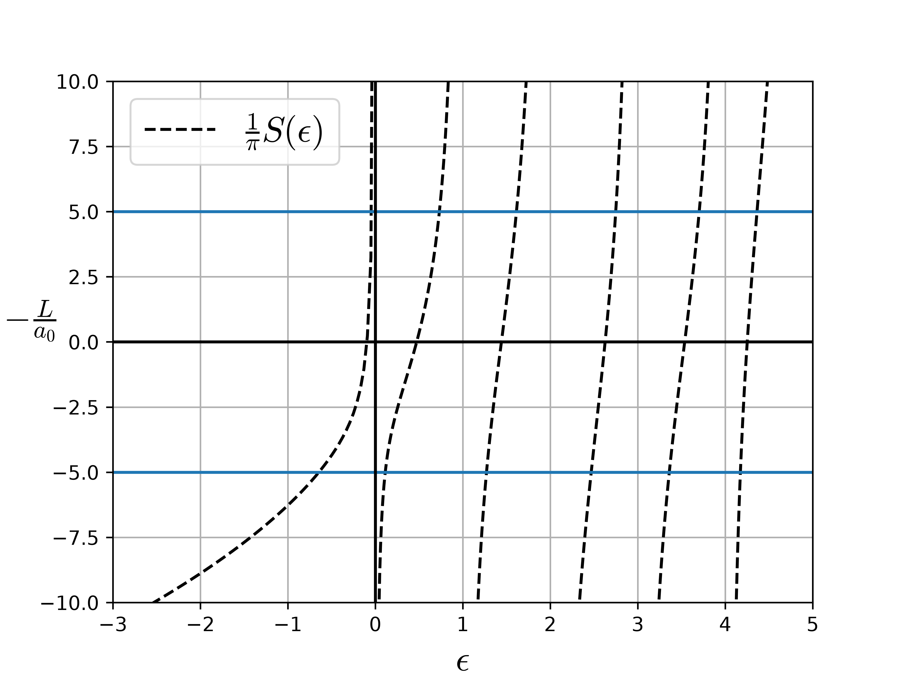{fig-align="center" width="100%"}

# Lüscher's formula in action

## Toy Model

I assume a Hamiltonian with potential of the form

$$
\langle \vec p' | \hat V | \vec p \rangle = V(p',p) = \frac{2\pi C_0}{\mu} f(p') f(p)
$$
$$
f(p) = \exp\left(-\frac{\pi (p r)^2}{32}\right)
$$
$$
C_0^{-1} = \frac{1}{a_0} - \frac{4}{\pi r} \, ,
$$

This is a separable potential with parameters chosen such that

$$
p \cot\delta(p) = \frac{1}{f(p)^2}\left(-\frac{1}{a_0} + \frac{2p}{\sqrt\pi} F\!\left(\tfrac{1}{4} p \sqrt\pi r\right)\right) \approx -\frac{1}{a_0} + \frac{r}{2} p^2 - \frac{r^3}{48} p^4 + \mathcal{O}(p^6)
$$

##

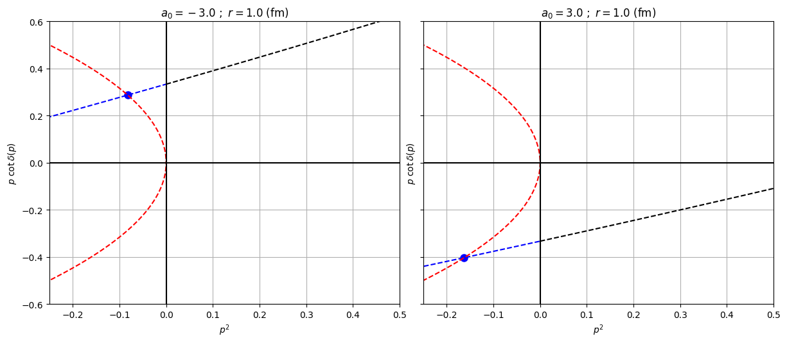{fig-align="center" width="95%"}

## Procedure when particles are put in a box

In a box of side length $L$, the eigenenergies $E$ can be obtained by solving the following transcendental equation

$$
-\frac{L}{a_0} + \frac{4L}{\pi r} = \frac{1}{\pi} \sum_{\vec n \in \text{B.Z.}} \frac{f(\vec n)^2}{\vec n^2 - \epsilon} \, ,
$$

with $\epsilon = \dfrac{E mL^2}{4\pi^2}$ and $f(\vec n) = \exp\left(-\dfrac{\pi^3 r^2}{8 L^2} \vec n^2\right)$. I assume the two particles have equal mass $m$.

Given $\epsilon$, I insert this into Lüscher's formula to get the phase shift

$$
p\cot\delta(p) = \frac{1}{\pi L} S(x)
$$

where

$$
S(\epsilon) = \lim_{\Lambda \to \infty} \left[ \sum_{\vec n}^{\Lambda} \frac{1}{n^2 - \epsilon} - 4\pi\Lambda \right]
$$

## "deuteron" in a box

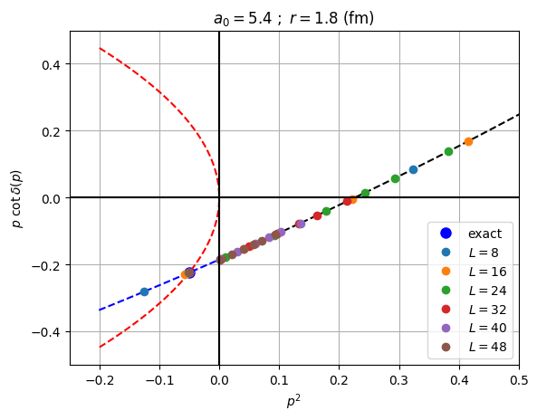{fig-align="center" width="70%"}

## Closer look at the "deuteron" case

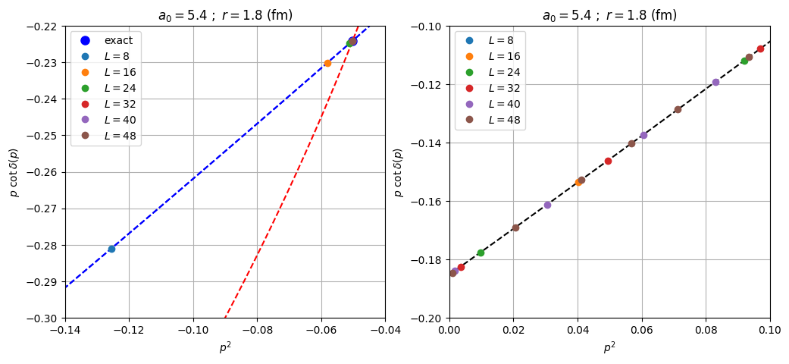{fig-align="center" width="100%"}

## Finite volume dependence of the bound state

:::: {.columns}
::: {.column width="50%"}
Can be shown that the location of the bound state depends exponentially on $L$

$$
E_{-1}(L) = -\frac{\gamma^2}{m}\left(1 + \tfrac{12}{\gamma L}\, \tfrac{e^{-\gamma L}}{1 - 2\gamma(p\cot\delta)'} + \dots \right)
$$
$$
\approx -\frac{\gamma^2}{m}\left(1 + \tfrac{12}{\gamma L}\, \tfrac{e^{-\gamma L}}{1 - \gamma r} \right)
$$

Here I define $p = i\gamma$
:::
::: {.column width="50%"}
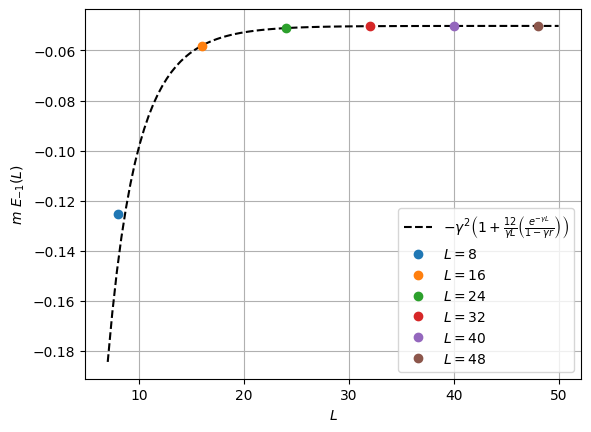{fig-align="center" width="100%"}
:::
::::

## Finite volume dependence of lowest scattering state

Lowest scattering state has polynomial dependence on $L$:

$$
\begin{aligned}
E_0(L) = \frac{4\pi a_0}{m L^3}\Big(&1 + 2.8372974794806\,\tfrac{a_0}{L} + 6.375183165675\left(\tfrac{a_0}{L}\right)^2 \\
&+ 8.582925664437\left(\tfrac{a_0}{L}\right)^3 + 2\pi\,\tfrac{a_0^2 r}{L^3} + \dots\Big)
\end{aligned}
$$

Note: $m E_0 = p^2$

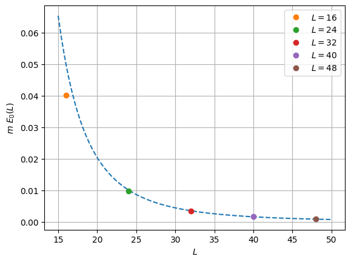{fig-align="center" width="55%"}

## Now let's consider a virtual state situation

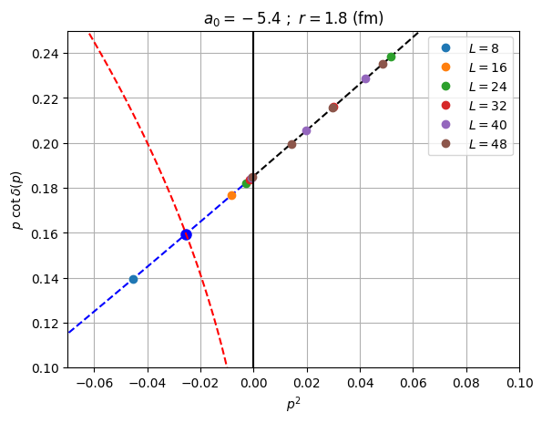{fig-align="center" width="75%"}

## Zooming in again. . .

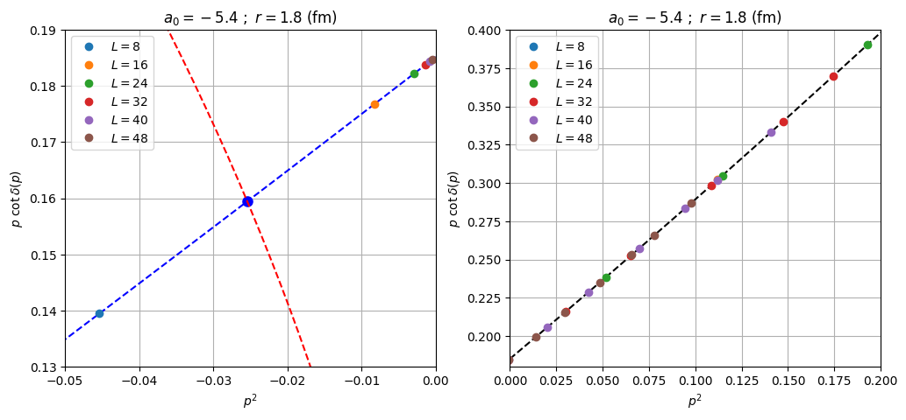{fig-align="center" width="100%"}

## Virtual state has same finite volume dependence as a scattering state

Virtual state has polynomial dependence on $L$ just like a regular scattering state:

$$
\begin{aligned}
E_0(L) = \frac{4\pi a_0}{m L^3}\Big(&1 + 2.8372974794806\,\tfrac{a_0}{L} + 6.375183165675\left(\tfrac{a_0}{L}\right)^2 \\
&+ 8.582925664437\left(\tfrac{a_0}{L}\right)^3 + 2\pi\,\tfrac{a_0^2 r}{L^3} + \dots\Big)
\end{aligned}
$$

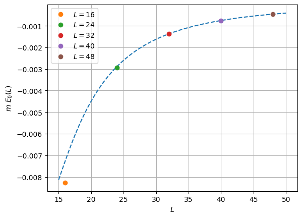{fig-align="center" width="60%"}

## And now a repulsive state

:::: {.columns}
::: {.column width="50%"}

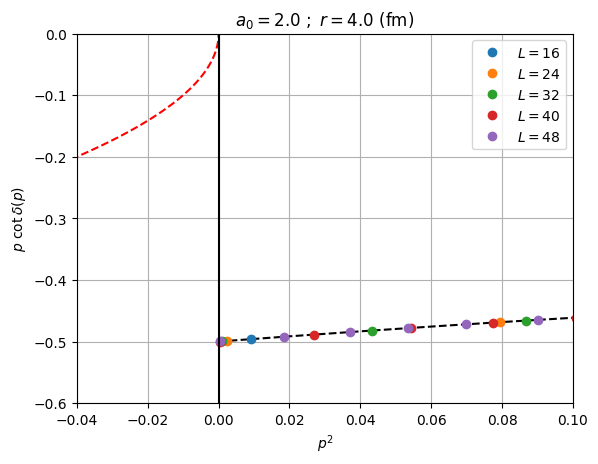{fig-align="center" width="100%"}

:::
::: {.column width="50%"}
Finite-volume dependence of lowest scattering state

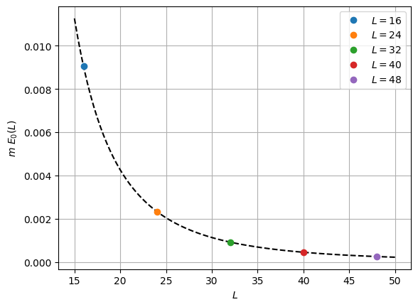{fig-align="center" width="100%"}

:::
::::

