# Derivation of Lüscher's formula

## $\delta$-function interaction

The contact interaction is regulated by a hard cutoff $\Lambda$,

$$
\langle \vec p\,' | \hat V_\delta | \vec p \rangle = \frac{4\pi a(\Lambda)}{m}\,\theta(\Lambda - p')\,\theta(\Lambda - p) \, ,
$$

where $a(\Lambda)$ is tuned to reproduce the T-matrix at threshold,

$$
a(\Lambda) = \frac{a_0}{1 - \tfrac{2}{\pi} a_0 \Lambda} \, ,
$$

and $a_0$ is the physical s-wave scattering length.

## Scattering amplitude in free space

:::{.columns}

:::{.column width="60%"}
Because this interaction is separable, the bubble sum can be summed geometrically to give

:::{style='font-size:80%'}
$$
\begin{aligned}
T(\vec p, -\vec p; E)
&= \frac{4\pi a(\Lambda)/m}{1 - \tfrac{4\pi a(\Lambda)}{m}\int\! \tfrac{d^3 q}{(2\pi)^3}\, \tfrac{1}{E - q^2/m + i\varepsilon}} \\[4pt]
&= \frac{4\pi a(\Lambda)/m}{1 - \tfrac{2 a(\Lambda)}{\pi}\int\! dq\, \tfrac{q^2}{mE - q^2 + i\varepsilon}} \\[4pt]
&= \frac{4\pi/m}{\tfrac{1}{a(\Lambda)} - \tfrac{2}{\pi}\int_0^\Lambda\! dq \left(\mathcal{P}\tfrac{q^2}{mE - q^2} - i\pi q^2 \delta(mE - q^2)\right)}
\end{aligned}
$$

:::

:::

:::{.column width="40%"}

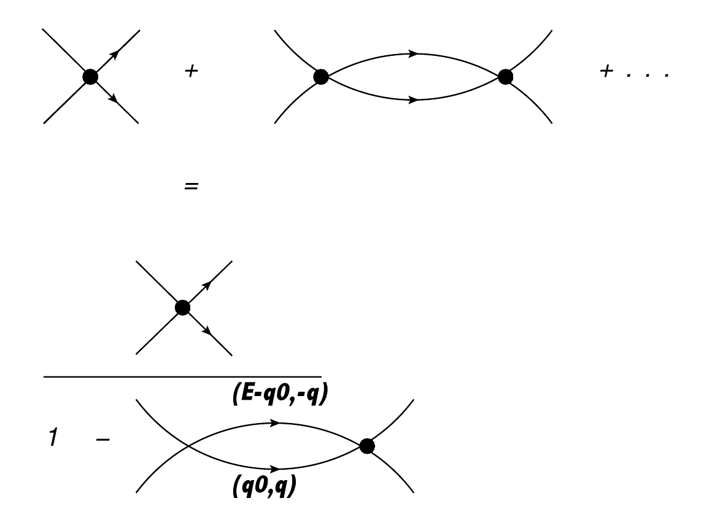{fig-align="center" width="100%"}

:::{style='font-size:80%'}
The bubble sum using the contact interaction.
:::

:::

:::

---

### Evaluating the denominator

:::{style='font-size:80%'}
$$
\begin{aligned}
\frac{1}{a(\Lambda)} &- \frac{2}{\pi}\int_0^\Lambda\! dq \left(\mathcal{P}\tfrac{q^2}{mE - q^2} - i\pi q^2 \delta(mE - q^2)\right) \\[4pt]
&= \frac{1}{a(\Lambda)} + \frac{2}{\pi}\left(\Lambda - \tfrac{\sqrt{mE}}{2}\log\Big(\tfrac{\Lambda + \sqrt{mE}}{\Lambda - \sqrt{mE}}\Big) + i\tfrac{\pi}{2}\sqrt{mE}\right) \\[4pt]
&= \frac{1}{a_0} - \frac{\sqrt{mE}}{\pi}\log\Big(\tfrac{\Lambda + \sqrt{mE}}{\Lambda - \sqrt{mE}}\Big) + i\sqrt{mE} \, .
\end{aligned}
$$
:::

### Resulting amplitude

:::{style='font-size:80%'}

Plugging this back in gives

$$
\begin{aligned}
T(\vec p, -\vec p; E)
&= \frac{4\pi/m}{\tfrac{1}{a_0} - \tfrac{\sqrt{mE}}{\pi}\log\Big(\tfrac{\Lambda + \sqrt{mE}}{\Lambda - \sqrt{mE}}\Big) + i\sqrt{mE}} \\[4pt]
&\approx \frac{4\pi/m}{\tfrac{1}{a_0} + i\sqrt{mE} - \tfrac{2mE}{\pi}\tfrac{1}{\Lambda} + O(\Lambda^{-2})} \, .
\end{aligned}
$$

+ At threshold one recovers the correct normalization, $T(\vec 0, \vec 0; E=0) = 4\pi a_0/m$.  

+ Assuming the existence of a bound state $E=-B$, one gets the familiar result from the pole of the amplitude:  $B=\frac{1}{ma_0^2}$.

:::

## Lüscher's formula

Within a finite cubic volume of size $L^3$, the analog of the denominator evaluated above is

$$
\begin{aligned}
\frac{1}{a(\Lambda)} - \frac{4\pi}{m}\frac{1}{L^3}\sum_{\vec n}^{2\pi n < \Lambda L}\frac{1}{E - \tfrac{4\pi^2 n^2}{m L^2}}
&= \frac{1}{a(\Lambda)} - \frac{1}{\pi}\frac{1}{L}\sum_{\vec n}^{2\pi n < \Lambda L}\frac{1}{\epsilon - n^2} \\[4pt]
&= \frac{1}{a_0} - \frac{2}{\pi}\Lambda - \frac{1}{\pi}\frac{1}{L}\sum_{\vec n}^{2\pi n < \Lambda L}\frac{1}{\epsilon - n^2} \, ,
\end{aligned}
$$

where I define $\epsilon = \dfrac{E m L^2}{4\pi^2}$.

## Lüscher's formula (cont.)

$\Lambda$ above has dimension of inverse length. Moving to a dimensionless definition of $\Lambda$,

$$
\Lambda \to \frac{2\pi}{L} \Lambda\, ,
$$

we now have^[The limit $\Lambda \to \infty$ is tacitly assumed, but sometimes I write it explicitly.]

$$
\frac{1}{a_0} - 4\frac{\Lambda}{L} - \frac{1}{\pi}\frac{1}{L}\sum_{\vec n}^{n < \Lambda}\frac{1}{\epsilon - n^2}
= \frac{1}{a_0} - \frac{1}{\pi L}\left(\sum_{\vec n}^{n < \Lambda}\frac{1}{\epsilon - n^2} + 4\pi\Lambda\right) \, ,
$$

which we can rewrite as

$$
-\frac{1}{a_0}=\frac{1}{\pi L}\lim_{\Lambda \to \infty}\left(\sum_{\vec n}^{n < \Lambda}\frac{1}{n^2-\epsilon} - 4\pi\Lambda\right)\equiv \frac{1}{\pi L}S\left(\epsilon\right)
$${#eq-contact-luescher}

and the RHS is now Lüscher's formula. In particular, values of $\epsilon$ that satisfy this equality correspond to the eigen-energies of the two-particle interacting system.

## Interpretation: $-\frac{L}{a_0}=\frac{1}{\pi}S\left(\epsilon\right)$

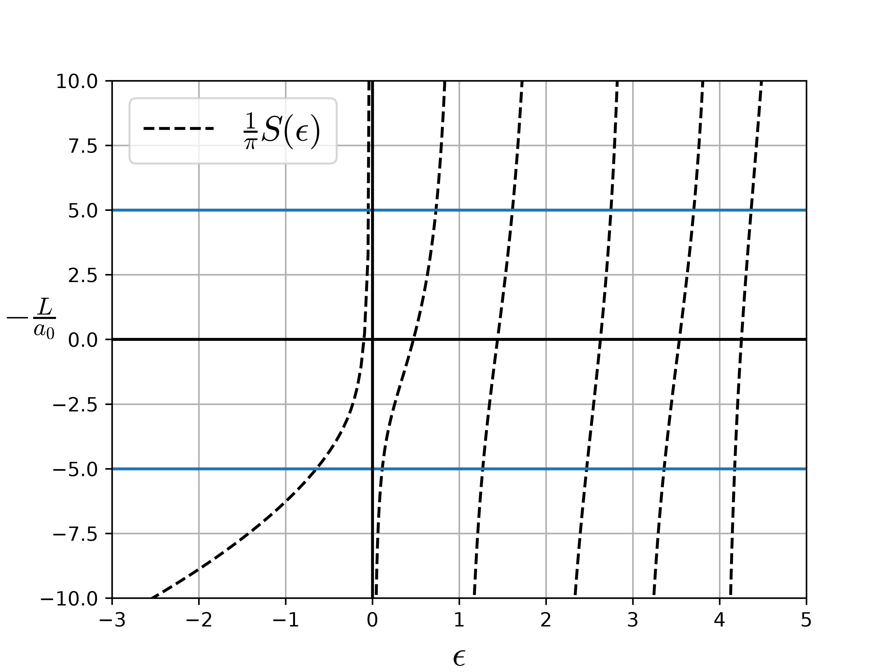{fig-align="center" width="100%"}

:::{style='font-size:80%'}
+ Given horizontal line $-L/a_0$, the allowed quantized energies $\epsilon$ occur at the intersection of line with the dashed curves
:::

## The full expression
:::{style='font-size:80%'}
To obtain the full *model-independent* Lüscher formula, the idea is to generalize the potential

$$
\langle \vec p\,' | \hat V | \vec p \rangle = \theta(\Lambda - p')\left(C_0(\Lambda)+C_2(\Lambda)\frac{p'^2+p^2}{2}+\ldots\right)\theta(\Lambda - p) \, ,
$$

where the coefficients $C_i(\Lambda)$ are tuned such that the scattering amplitude gives the correct physical phase shift $\delta$,

$$
T(\vec p,-\vec p;E) = -\frac{4\pi}{m}\frac{1}{p\cot\delta - ip}
$$

When we repeat the calculation in a finite volume with this potential, it leads to the full Lüscher formula

$$
p\cot\delta = \frac{1}{\pi L}S(\epsilon)\ .
$$
where $\epsilon$ is defined as before.

:::{.callout-note}

For detailed derivations see

+ [Two Nucleons on a Lattice](https://arxiv.org/abs/hep-lat/0312004) by S.R. Beane, P.F.Bedaque, A. Parreno, M.J. Savage 
+ [Fitting two nucleons inside a box](https://arxiv.org/abs/hep-lat/0702021) by Paulo F. Bedaque, Ikuro Sato

and of course the original sources by Lüscher (***Warning!!  Hard to understand!!***)

+ [Commun.Math.Phys. 104 (1986) 177](https://link.springer.com/article/10.1007/BF01211589) & [Commun.Math.Phys. 105 (1986) 153-188](https://link.springer.com/article/10.1007/BF01211097)

:::

:::

# Lüscher's formula in action

## Toy Model

I assume a Hamiltonian with potential of the form

$$
\langle \vec p' | \hat V | \vec p \rangle = V(p',p) = \frac{2\pi C_0}{\mu} f(p') f(p)
$$
$$
f(p) = \exp\left(-\frac{\pi (p r)^2}{32}\right)
$$
$$
C_0^{-1} = \frac{1}{a_0} - \frac{4}{\pi r} \, ,
$$

This is a separable potential with parameters chosen such that

$$
p \cot\delta(p) = \frac{1}{f(p)^2}\left(-\frac{1}{a_0} + \frac{2p}{\sqrt\pi} F\!\left(\tfrac{1}{4} p \sqrt\pi r\right)\right) \approx -\frac{1}{a_0} + \frac{r}{2} p^2 - \frac{r^3}{48} p^4 + \mathcal{O}(p^6)
$$

##

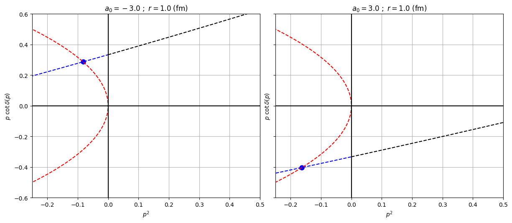{fig-align="center" width="95%"}

## Procedure when particles are put in a box

In a box of side length $L$, the eigenenergies $E$ can be obtained by solving the following transcendental equation

$$
-\frac{L}{a_0} + \frac{4L}{\pi r} = \frac{1}{\pi} \sum_{\vec n \in \text{B.Z.}} \frac{f(\vec n)^2}{\vec n^2 - \epsilon} \, ,
$$

with $\epsilon = \dfrac{E mL^2}{4\pi^2}$ and $f(\vec n) = \exp\left(-\dfrac{\pi^3 r^2}{8 L^2} \vec n^2\right)$. I assume the two particles have equal mass $m$.

Given $\epsilon$, I insert this into Lüscher's formula to get the phase shift

$$
p\cot\delta(p) = \frac{1}{\pi L} S(\epsilon)
$$

where

$$
S(\epsilon) = \lim_{\Lambda \to \infty} \left[ \sum_{\vec n}^{n < \Lambda} \frac{1}{n^2 - \epsilon} - 4\pi\Lambda \right]
$$

## "deuteron" in a box

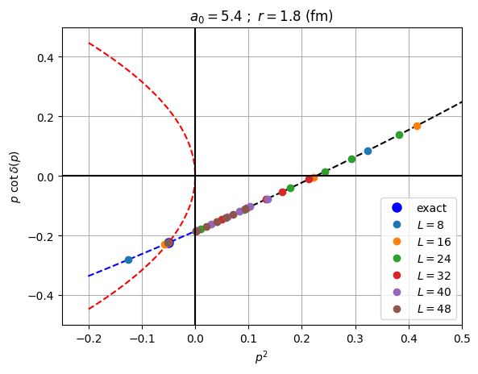{fig-align="center" width="70%"}

## Closer look at the "deuteron" case

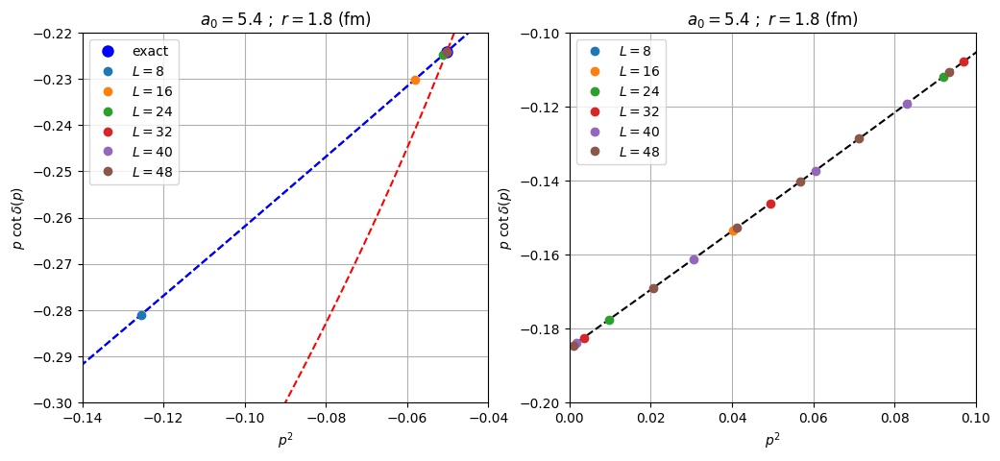{fig-align="center" width="100%"}

## Finite volume dependence of the bound state

:::: {.columns}
::: {.column width="50%"}
Can be shown that the location of the bound state depends exponentially on $L$

$$
E_{-1}(L) = -\frac{\gamma^2}{m}\left(1 + \tfrac{12}{\gamma L}\, \tfrac{e^{-\gamma L}}{1 - 2\gamma(p\cot\delta)'} + \dots \right)
$$
$$
\approx -\frac{\gamma^2}{m}\left(1 + \tfrac{12}{\gamma L}\, \tfrac{e^{-\gamma L}}{1 - \gamma r} \right)
$$

Here I define $p = i\gamma$
:::
::: {.column width="50%"}
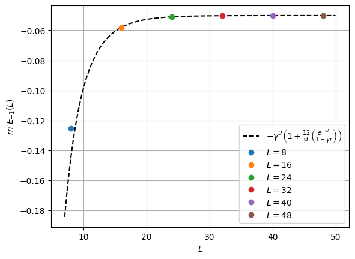{fig-align="center" width="100%"}
:::
::::

:::{.callout-note}
+ See [Two Nucleons on a Lattice](https://arxiv.org/abs/hep-lat/0312004) by S.R. Beane, P.F.Bedaque, A. Parreno, M.J. Savage  
:::

## Finite volume dependence of lowest scattering state

:::{.style='font-size:80%'}
:::{.columns}

:::{.column width=50%}
Lowest scattering state has polynomial dependence on $L$:

$$
\scriptsize
\begin{aligned}
E_0(L) = \frac{4\pi a_0}{m L^3}\Big(&1 + 2.8372974794806\,\tfrac{a_0}{L}\\
&+ 6.375183165675\left(\tfrac{a_0}{L}\right)^2 \\
&+ 8.311950724058\left(\tfrac{a_0}{L}\right)^3 + 2\pi\,\tfrac{a_0^2 r}{L^3} + \dots\Big)
\end{aligned}
$$

Note: $m E_0 = p^2$
:::

:::{.column width=50%}
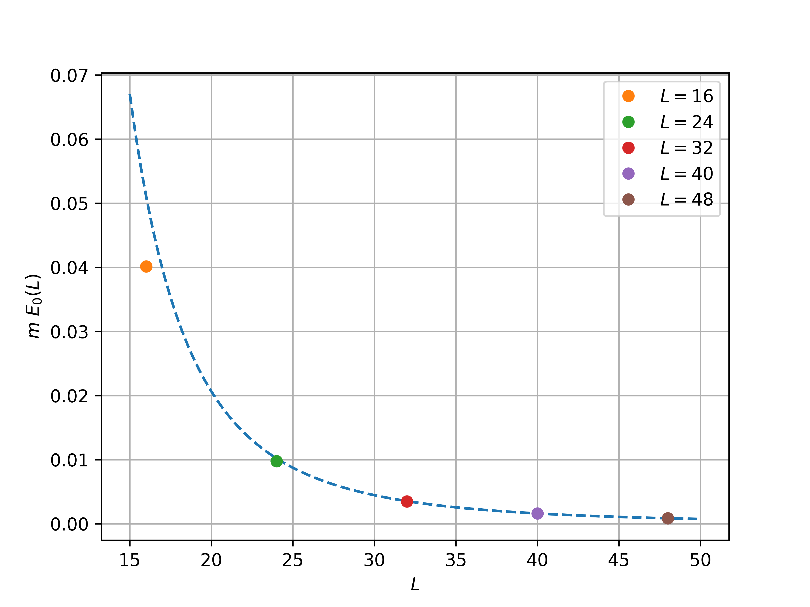{fig-align="center" width="100%"}

:::
:::

:::{.callout-note}
+ See [$n$-Boson Energies at Finite Volume and Three-Boson Interactions](https://arxiv.org/pdf/0707.1670) by S.R. Beane, W. Detmold, M.J. Savage  
:::
:::

## Now let's consider a virtual state situation

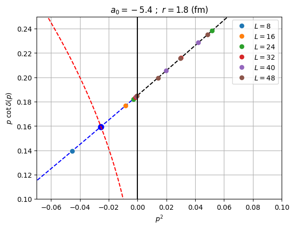{fig-align="center" width="75%"}

## Zooming in again. . .

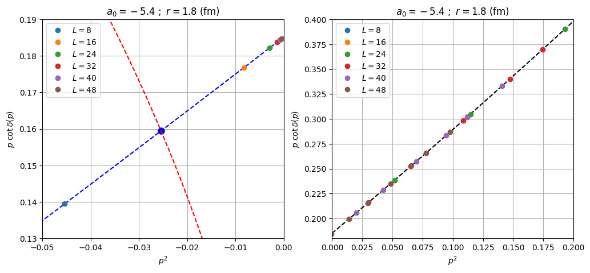{fig-align="center" width="100%"}

## Virtual state has same finite volume dependence as a scattering state

:::{.style='font-size:80%'}

:::{.columns}

:::{.column width=50%}
Virtual state has polynomial dependence on $L$ just like a regular scattering state:

$$
\scriptsize
\begin{aligned}
E_0(L) = \frac{4\pi a_0}{m L^3}\Big(&1 + 2.8372974794806\,\tfrac{a_0}{L} \\
&+ 6.375183165675\left(\tfrac{a_0}{L}\right)^2 \\
&+ 8.311950724058\left(\tfrac{a_0}{L}\right)^3 + 2\pi\,\tfrac{a_0^2 r}{L^3} + \dots\Big)
\end{aligned}
$$
:::

:::{.column width=50%}

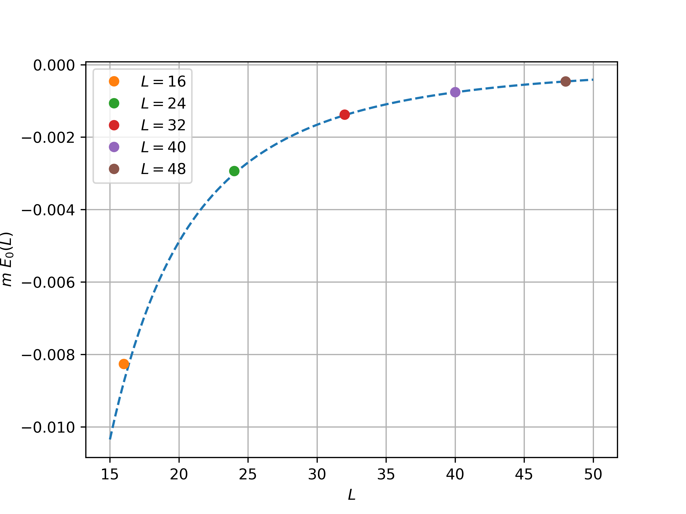{fig-align="center" width="100%"}

:::
:::
:::

## And now a repulsive state

:::: {.columns}
::: {.column width="50%"}

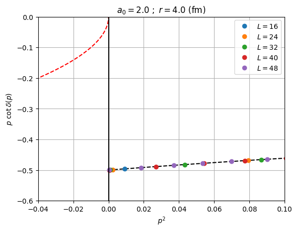{fig-align="center" width="100%"}

:::
::: {.column width="50%"}

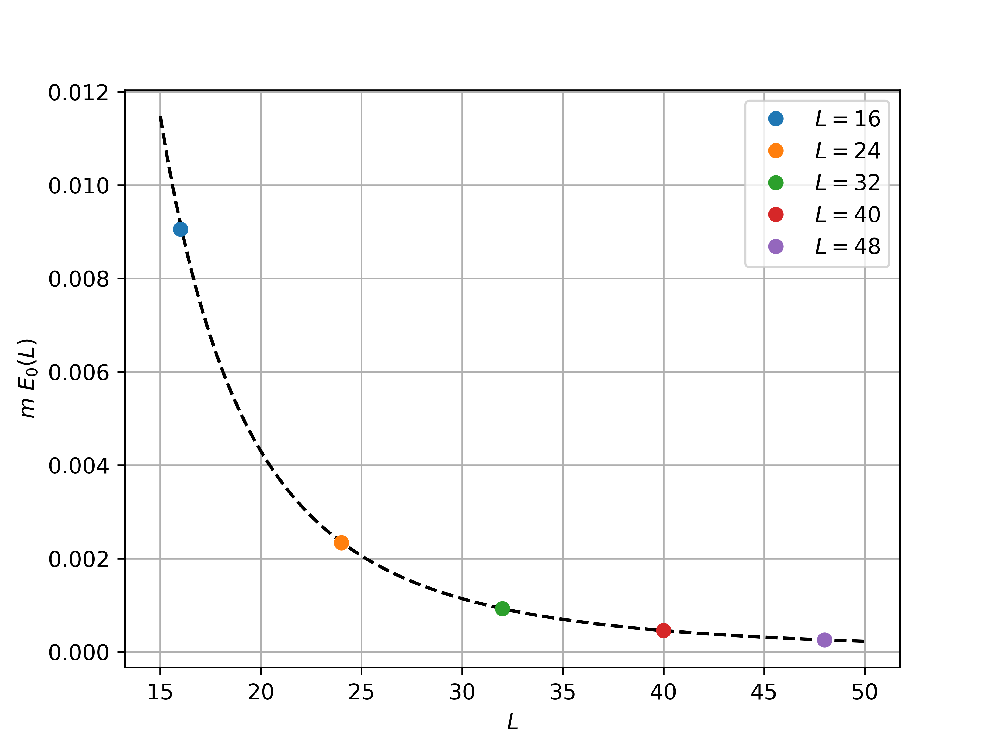{fig-align="center" width="100%"}

:::{.r-stack}
Finite-volume dependence of lowest scattering state
:::
:::
::::

## When does Lüscher's formula fail?

+ Lüscher's formula is derived assuming only short-ranged interactions ($\ll L$)
  - This results in power-law corrections ($1/L$) to on-shell scattering
  - Exponential corrections to bound states
+ $t$-channel exchange via one-pion exchange (long range, near on-shell) introduces a left-hand cut (lhc)
  - $DD^*$ scattering example:
$$
\big(p^{1\pi}_{\rm lhc}\big)^2 = -\frac{\mu^2}{4}, \qquad \mu^2 = m_\pi^2 - \Delta M^2, \qquad \Delta M = M_{D^*}-M_D
$$
{fig-align="center"}
+ When $m_\pi^2\sim \Delta M^2$ then lhc is near threshold and ERE breakes down$\implies$ Lüscher's formula no longer applicable

## Current strategies to deal with left-hand cuts

+ Keep the OPE explicit and apply Lüscher only to the short-range remainder
  + *Lüscher equation with long-range forces* [2402.12985](https://arxiv.org/abs/2402.12985)

+ Go full three-body, treating the pion as dynamical since it goes on-shell
  + *Incorporating $DD\pi$ effects and left-hand cuts in lattice QCD studies of the $T_{cc}(3875)^+$* [2401.06609](https://arxiv.org/abs/2401.06609)

+ Extend the formalism onto the cut itself
  + *Finite-volume scattering on the left-hand cut* [2311.18793](https://arxiv.org/abs/2311.18793)

+ Solve a finite-volume Schrödinger equation in a plane-wave basis with chiral EFT potentials, using half-off-shell potentials that stay analytic below threshold and dodging partial-wave truncation
  + *Left-hand cut problem in lattice QCD and an EFT-based solution* [2503.23944](https://arxiv.org/abs/2503.23944)

## Can we use separable potentials to include left-hand cuts?

:::{style='font-size:70%'}

+ I will only consider s-wave scattering to keep life as simple as possible.

+ The "long-range" part is modeled by one-pion exchange (OPE)^[$\mu\sim m_\pi$ is the pion mass and $g$ is the pion coupling constant.]

$$
V^{l=0}_{\pi}(p',p) = -\frac{g^2}{4p'p}\log\left(\frac{(p+p')^2+\mu^2}{(p-p')^2+\mu^2}\right)
$$

+ The branch cut can be seen by setting $p' = p$ and noting that the log's argument becomes negative for 

$$p^2 < -\mu^2/4$$

+ Assuming there is a way to do this, I want to expand this long-range potential in a separable basis, i.e.

$$
V^{l=0}_{\pi}(p',p) = \sum_{i,j}^{\infty} g_i(p') \lambda_{ij} g_j(p)\approx \sum_{i,j}^{N} g_i(p') \lambda_{ij} g_j(p)
$$

+ The question is then: what is a good choice of basis functions $g_i(p)$ (or *form factors*) that can reproduce the branch cut?

  - Typically, one would use a polynomial basis that is analytic in the complex plane (i.e. "entire"), but this will not reproduce the branch cut.

:::

## $V_{\rm cut}(p',p)$: a separable potential that reproduces (most of) the branch cut

:::{style='font-size:70%'}

+ So here's an idea: Consider the following expression:

$$
V_{\rm cut}(p',p)\equiv-\frac{g^2}{2\mu^2}\left[h(p')+h(p)\right]
$$
where
$$
h(p) = \frac{\mu^2}{4p^2} \log\left(\frac{4 p^2+\mu^2}{\mu^2}\right)
$$

:::{.columns}

:::{.column width="50%"}

:::{.callout-note}
## Properties of $V_{\rm cut}(p',p)$

  - $V_{\rm cut}(p'=p)$ has the same *on-shell* branch cut structure as $V^{l=0}_{\pi}(p'=p)$
  - symmetric in $p$ and $p'$
  - it is separable
:::

:::

:::{.column width="50%"}

:::{.callout-warning}
 - $V_{\rm cut}(p',p)$ does not reproduce the correct full *off-shell* singularity structure!!!
:::

:::

:::

+ So the idea is to use the following expression:

$$
V^{l=0}_{\pi}(p',p) = V_{\rm cut}(p',p) + \underbrace{V^{l=0}_{\pi}(p',p)-V_{\rm cut}(p',p)}_{\approx\sum_{i,j=2}^{N} g_i(p') \lambda_{ij} g_j(p)}
$$

+ The functions $g_i(p)$ are analytic in the complex plane

:::

## Let's add this potential to the $\delta$-term from before

:::{style='font-size:80%'}

\begin{align}
\hat V &= \hat V^{l=0}_\pi + \hat V_\delta \nonumber\\
&= \hat V_{\rm cut} + ( \hat V^{l=0}_\pi - \hat V_{\rm cut} ) + \hat V_\delta \nonumber\\
&= -\frac{g^2}{2\mu^2}\left[\hat h \hat\delta_\Lambda+ \hat\delta_\Lambda\hat h\right] + \sum_{i,j=2}^{N} \hat g_i \hat\delta_\Lambda \lambda_{ij}\hat g_j + \frac{4\pi a(\Lambda)}{m} \hat\delta_\Lambda\nonumber
\end{align}
:::

where $\hat\delta_\Lambda$ is the regulated delta function defined as $\langle p'| \hat\delta_\Lambda|p\rangle=\theta(\Lambda - p')\,\theta(\Lambda - p)$, and $\hat h$ and $\hat g_i$ are operators defined such that $\hat h|p\rangle = h(p)|p\rangle$ and $\hat g_i|p\rangle = g_i(p)|p\rangle$.

I can rexpress this potential in rank-$(N+1)$ form.  I first define the vector of form factors $\hat{\bf f} = (1,\hat h,\hat g_2,\ldots,\hat g_N)$.  The potential is then $\hat V = \hat{\bf f}^T {\hat\lambda} \hat{\bf f}$, where $\lambda$ is

:::{style='font-size:70%'}
$$
{\hat \lambda} = \begin{pmatrix}
\frac{4\pi a(\Lambda)}{m} & -\frac{g^2}{2\mu^2} & 0 & \cdots & 0 \\
-\frac{g^2}{2\mu^2} & 0 & 0 & \cdots & 0 \\
0 & 0 & \lambda_{22} & \cdots & \lambda_{2N} \\
\vdots & \vdots & \vdots & \ddots & \vdots \\
0 & 0 & \lambda_{N2} & \cdots & \lambda_{NN}
\end{pmatrix}\  \hat\delta_\Lambda \, .
$$
:::

---

### Now consider the $T$-matrix

$$
\hat T(E)=\hat V + \hat V \hat G_0(E) \hat T(E)
$$

Assume

$$
\hat T(E) = \hat{\bf f}^T \tau(E) \hat{\bf f}
$$

and the beauty of separability comes into play:

$$
\tau^{-1}(E) = \lambda^{-1} - \frac{1}{L^3}\sum_n^\Lambda f(p_n) G_0(p_n;E) f^T(p_n)
$$

:::{.callout-important}
## Quantization condition
$$
\begin{align}
\det\left[\lambda^{-1} - \frac{1}{L^3}\sum_n^\Lambda f(p_n) G_0(p_n;E) f^T(p_n)\right] &= 
\det\left[\lambda^{-1} - \frac{1}{L^3}\sum_n^\Lambda f\left(\frac{2\pi |n|}{L}\right) \frac{1}{E - \frac{4\pi^2 n^2}{mL^2} } f^T\left(\frac{2\pi |n|}{L}\right)\right]\nonumber\\
&=\det\left[\lambda^{-1} +\frac{m}{4\pi^2 L}\sum_n^\Lambda f\left(\frac{2\pi |n|}{L}\right) \frac{1}{n^2-\epsilon} f^T\left(\frac{2\pi |n|}{L}\right)\right]\nonumber
= 0
\end{align}
$$
:::

:::{style='font-size:60%'}
This expression recovers the contact Lüscher formula @eq-contact-luescher in the limit $N\to 1$, $h\to0$, and $g_i\to 0\ \forall\  i$.
:::

## Test case: $N=2$ with $g_i(p)=0\  \forall\ i$

In this case we have $f(p) = (1,h(p))$ and
$$
\lambda = \begin{pmatrix}
\frac{4\pi a(\Lambda)}{m} & -\frac{g^2}{2\mu^2} \\
-\frac{g^2}{2\mu^2} & 0
\end{pmatrix}
\implies
\lambda^{-1} = \begin{pmatrix}
0 & -\frac{2\mu^2}{g^2} \\
-\frac{2\mu^2}{g^2} & -\frac{4\mu^4}{g^4}\frac{4\pi a(\Lambda)}{m}
\end{pmatrix}
$$

and

:::{style='font-size:80%'}
$$
\frac{m}{4\pi^2 L}\sum_n^\Lambda f\left(\frac{2\pi |n|}{L}\right) \frac{1}{n^2-\epsilon} f^T\left(\frac{2\pi |n|}{L}\right)
=
\frac{m}{4\pi^2 L}\sum_n^\Lambda 
\begin{pmatrix}
\frac{1}{n^2-\epsilon} & \frac{h\left(2\pi |n|/L\right)}{n^2-\epsilon} \\
\frac{h\left(2\pi |n|/L\right)}{n^2-\epsilon} & \frac{h^2\left(2\pi |n|/L\right)}{n^2-\epsilon}
\end{pmatrix}
$$
:::

So the quantization condition is explicitly

$$
\det
\begin{pmatrix}
\frac{m}{4\pi^2 L}\sum_n^\Lambda \frac{1}{n^2-\epsilon} & -\frac{2\mu^2}{g^2} +\frac{m}{4\pi^2 L}\sum_n^\Lambda \frac{h\left(2\pi |n|/L\right)}{n^2-\epsilon} \\
-\frac{2\mu^2}{g^2} +\frac{m}{4\pi^2 L}\sum_n^\Lambda \frac{h\left(2\pi |n|/L\right)}{n^2-\epsilon}& -\frac{4\mu^4}{g^4}\frac{4\pi a(\Lambda)}{m}+\frac{m}{4\pi^2 L}\sum_n^\Lambda \frac{h^2\left(2\pi |n|/L\right)}{n^2-\epsilon}
\end{pmatrix}=0
$$

---

### . . . skipping many steps . . .

I find the following result

:::{style='font-size:80%'}
$$
-\frac{1}{a}=\frac{g^4 \Lambda ^2 (mL)^2 S_2(\epsilon )}{1024 \pi ^7 L}-\frac{g^4 \Lambda  (mL)^2 S_1(\epsilon ){}^2}{4096 \pi ^8 L}+\frac{g^4 \Lambda  (mL)^2 S_0(\epsilon ) S_2(\epsilon )}{4096 \pi ^8 L}+\frac{g^2 \Lambda  mL S_1(\epsilon )}{16 \pi^4 L}+\frac{S_0(\epsilon )}{\pi  L}+\mathcal{O}(1/\Lambda)
$$
:::

where

:::{style='font-size:80%'}
$$
\begin{align}
S_0(\epsilon)&= \sum_{\vec n}^{n < \Lambda}\frac{1}{n^2-\epsilon} - 4\pi\Lambda \nonumber\\
S_1(\epsilon)&= \sum_{\vec n}^{n < \Lambda}\frac{1}{n^2-\epsilon}\frac{1}{n^2}\log\left(1+\left(\frac{4\pi}{\mu L}\right)^2 n^2\right)\nonumber\\
S_2(\epsilon)&= \sum_{\vec n}^{n < \Lambda}\frac{1}{n^2-\epsilon}\frac{1}{n^4}\log^2\left(1+\left(\frac{4\pi}{\mu L}\right)^2 n^2\right)\nonumber
\end{align}
$$
:::

<!-- ## What do I mean by a potential of *rank* $N$?

:::{style='font-size:70%'}

+ Think of the kernel $V(p',p)=\langle \vec p\,'|\hat V|\vec p\rangle$ as a matrix with row index $p'$ and column index $p$. Its *rank* is the dimension of its range.

+ A rank-$N$ separable potential is one built from $N$ form factors $g_i(p)$,

$$
\hat V = \sum_{i,j=1}^{N} |g_i\rangle\, \lambda_{ij}\, \langle g_j |
\qquad\Longleftrightarrow\qquad
V(p',p) = \sum_{i,j=1}^{N} g_i(p')\, \lambda_{ij}\, g_j(p) \, ,
$$

  where $\lambda_{ij}$ is an $N\times N$ matrix of couplings.

+ My toy model is **rank 1**: $\hat V = \frac{2\pi C_0}{\mu}|f\rangle\langle f|$. The interaction couples to a *single* mode $|f\rangle$ — anything orthogonal to it passes through untouched.

+ Rank is the quantity that matters because for *any* finite rank the Lippmann-Schwinger equation collapses to finite-dimensional linear algebra,

$$
T(p',p) = \sum_{i,j} g_i(p')\, \tau_{ij}(E)\, g_j(p) \, ,
\qquad \tau^{-1} = \lambda^{-1} - G(E) \, ,
\qquad G_{ij}(E) = \int\!\frac{d^3q}{(2\pi)^3}\, \frac{g_i(q)\, g_j(q)}{E - q^2/m + i\varepsilon} \, .
$$

+ **The rank is the size of the matrix I have to invert.** Rank 1 is the scalar inversion that gave me the geometric bubble sum at the start of the talk.

:::

## $V_{\rm cut}$ is a *rank-2* separable potential

:::{style='font-size:70%'}

+ Take the two form factors $g_1(p) = 1$ and $g_2(p) = h(p)$, with an **off-diagonal** coupling matrix

$$
\lambda = \begin{pmatrix} 0 & \lambda_{12} \\ \lambda_{12} & 0 \end{pmatrix} \, ,
\qquad \lambda_{12} = -\frac{g^2}{2\mu^2} \, ,
\qquad \lambda^{-1} = \begin{pmatrix} 0 & 1/\lambda_{12} \\ 1/\lambda_{12} & 0 \end{pmatrix} \, .
$$

+ Then

$$
\hat V_{\rm cut} = \lambda_{12}\Big( |1\rangle\langle h| + |h\rangle\langle 1| \Big)
\qquad\Longrightarrow\qquad
V_{\rm cut}(p',p) = -\frac{g^2}{2\mu^2}\big[\, h(p') + h(p) \,\big] \, ,
$$

  which is exactly the expression from before.

+ It is rank **2**, not rank 1, because $h(p')+h(p)$ cannot be collapsed into a single product $F(p')G(p)$. It is a sum of two rank-1 pieces, and $|1\rangle$ and $|h\rangle$ are linearly independent.

+ Because $h$ enters **linearly** rather than squared, the logarithmic cut comes out correct in $p'$ at fixed $p$, and in $p$ at fixed $p'$.

+ On-shell it is *exact*:

$$
V_{\rm cut}(p,p) = 2\lambda_{12}\, h(p) = -\frac{g^2}{4p^2}\log\left(\frac{4p^2+\mu^2}{\mu^2}\right) = V^{l=0}_\pi(p,p) \, .
$$

:::

## This is just the contact expansion, resummed

:::{style='font-size:70%'}

+ The $C_2$ term of the model-independent potential is *already* rank 2:

$$
C_0 + C_2\frac{p'^2+p^2}{2}
= \begin{pmatrix} 1 & p'^2 \end{pmatrix}
\begin{pmatrix} C_0 & C_2/2 \\ C_2/2 & 0 \end{pmatrix}
\begin{pmatrix} 1 \\ p^2 \end{pmatrix} \, ,
$$

  i.e. form factors $\{1,\,p^2\}$ with $C_2$ sitting off-diagonal — the *same* structure as $V_{\rm cut}$, with $p^2$ in place of $h(p)$.

+ And the two are not unrelated. Expanding $h$,

$$
h(p) = \frac{\mu^2}{4p^2}\log\left(\frac{4p^2+\mu^2}{\mu^2}\right)
= 1 - \frac{2p^2}{\mu^2} + \frac{16}{3}\frac{p^4}{\mu^4} - \dots
$$

+ So $\{1,h\}$ spans the same space as $\{1,p^2\}$ at low momentum: $V_{\rm cut}$ *is* the contact theory, resummed to all orders rather than truncated.

+ The series converges only for $|p^2| < \mu^2/4$ — **the branch point is the radius of convergence**.

  - Truncating at order $p^2$ throws the cut away.
  - Keeping $h$ intact retains it, at no extra cost in rank.

:::

## What this does to the finite-volume condition

:::{style='font-size:70%'}

+ In a finite volume the integral becomes a discrete sum, and the quantization condition for a rank-$N$ potential is

$$
\det\left[\lambda^{-1} - G(E,L)\right] = 0 \, ,
\qquad
G_{ij}(E,L) = \frac{1}{L^3}\sum_{\vec n} \frac{g_i(p_n)\, g_j(p_n)}{E - E_n} \, ,
$$

  where $G_0 \to G_\delta$ once the contact term has been summed as above.

+ For $V_{\rm cut}$, with $\{g_1,g_2\}=\{1,h\}$, this needs only three sums:

$$
G_{11} = \frac{1}{L^3}\sum_{\vec n} \frac{1}{E-E_n} \, , \qquad
G_{12} = \frac{1}{L^3}\sum_{\vec n} \frac{h(p_n)}{E-E_n} \, , \qquad
G_{22} = \frac{1}{L^3}\sum_{\vec n} \frac{h(p_n)^2}{E-E_n} \, .
$$

+ $G_{11}$ is divergent and needs the $4\pi\Lambda$ subtraction — **it is nothing but $S(\epsilon)$ again**.

+ $G_{12}$ and $G_{22}$ converge on their own, since $h(p)\sim \log(p^2)/p^2$ at large $p$ beats the $n^2$ growth in the density of states.

+ So I still get a *single* transcendental equation — now a $2\times 2$ determinant instead of a scalar.

::: 

-->