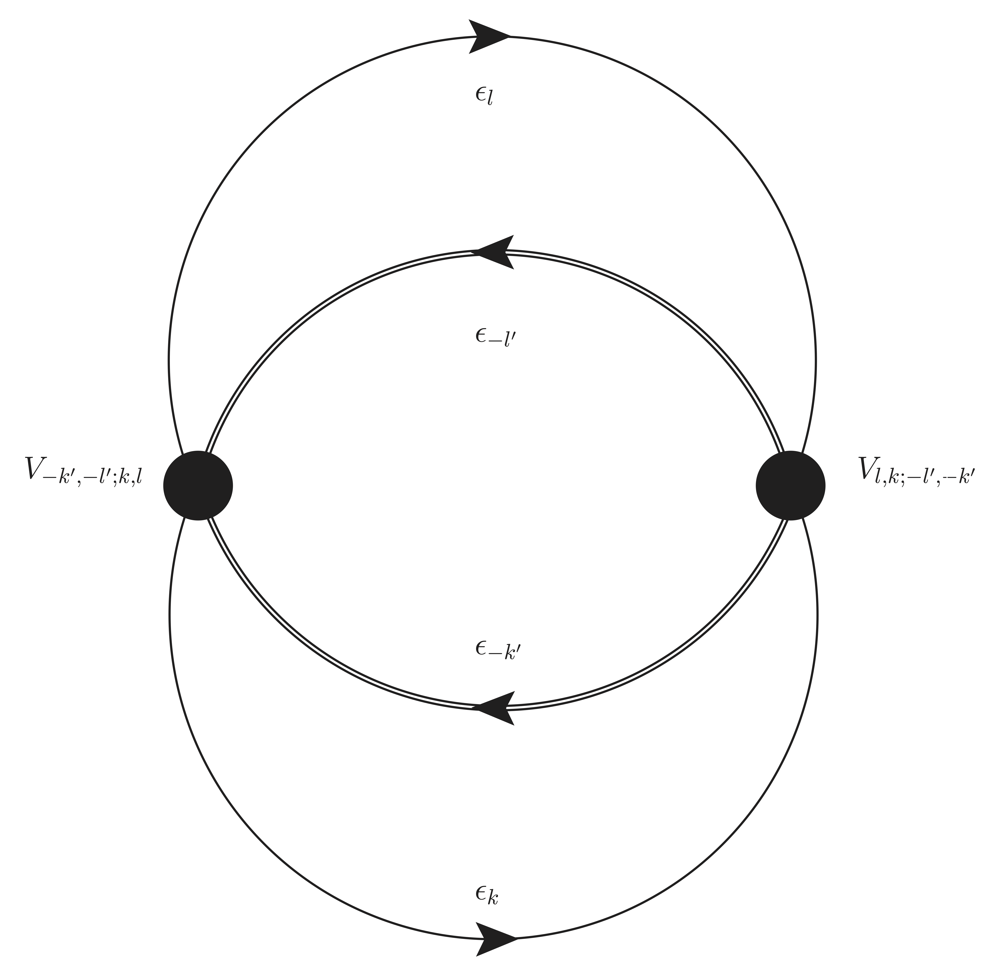
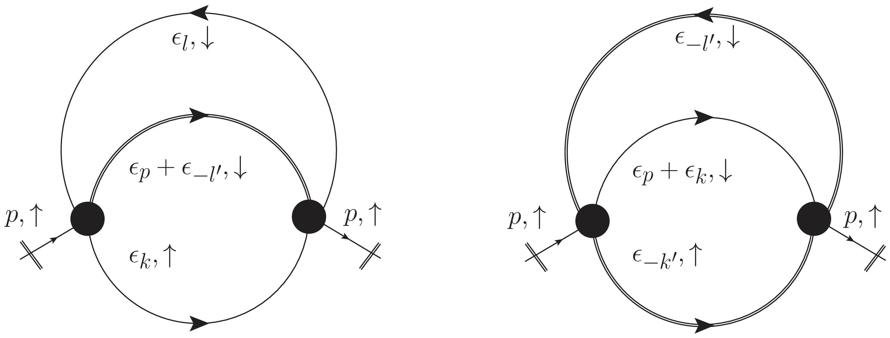

# Setup

## Hamiltonian

The Hamiltonian is

\begin{equation}\label{eqn:Hstart}
H = -\sum_{\langle x,y\rangle}\left(c^\dagger_{x,\uparrow}c^{}_{y,\uparrow}+c^\dagger_{x,\downarrow}c^{}_{y,\downarrow}\right)-\frac{U}{2}\sum_x\left(c^\dagger_{x,\uparrow}c^{}_{x,\uparrow}-c^\dagger_{x,\downarrow}c^{}_{x,\downarrow}\right)^2\ ,
\end{equation}

where $U$ is the (dimensionless) Hubbard ratio ($=U/\kappa$) and the operator $c^\dagger_{x,s}$ creates an electron at site $x$ with spin $s$.  The sum ${\langle x,y\rangle}$ is over nearest neighbor sites only (i.e. Tight-binding model).   I now expand the quadratic term in eq.~\eqref{eqn:Hstart}, giving

\begin{align}
H =&-\sum_{\langle x,y\rangle}\left(c^\dagger_{x,\uparrow}c^{}_{y,\uparrow}+c^\dagger_{x,\downarrow}c^{}_{y,\downarrow}\right)-\frac{U}{2}\sum_x\left(c^\dagger_{x,\uparrow}c^{}_{x,\uparrow}+c^\dagger_{x,\downarrow}c^{}_{x,\downarrow}-2c^\dagger_{x,\uparrow}c^{}_{x,\uparrow}c^\dagger_{x,\downarrow}c^{}_{x,\downarrow}\right)\\
=&-\sum_{\langle x,y\rangle}\left(c^\dagger_{x,\uparrow}c^{}_{y,\uparrow}+c^\dagger_{x,\downarrow}c^{}_{y,\downarrow}\right)-\frac{U}{2}\sum_x\left(c^\dagger_{x,\uparrow}c^{}_{x,\uparrow}+c^\dagger_{x,\downarrow}c^{}_{x,\downarrow}\right)+U\sum_xc^\dagger_{x,\uparrow}c^{}_{x,\uparrow}c^\dagger_{x,\downarrow}c^{}_{x,\downarrow}\\
=&-\sum_{\langle x,y\rangle}\left(c^\dagger_{x,\uparrow}c^{}_{y,\uparrow}+c^\dagger_{x,\downarrow}c^{}_{y,\downarrow}\right)-\frac{U}{2}\sum_x\left(c^\dagger_{x,\uparrow}c^{}_{x,\uparrow}+c^\dagger_{x,\downarrow}c^{}_{x,\downarrow}\right)+U\sum_xc^\dagger_{x,\downarrow}c^\dagger_{x,\uparrow}c^{}_{x,\uparrow}c^{}_{x,\downarrow}\\
=&H_0+H_1+H_2\ .
\end{align}

I cast the last "interaction" term ($H_2$) in normal order.

## "Momentum Space"

I rewrite the kinetic term as

\begin{equation}
H_0=-\sum_{\langle x,y\rangle,s}\left(c^\dagger_{x,s}c^{}_{y,s}\right)=-\sum_{x,y,s}\left(c^\dagger_{x,s}\kappa_{x,y}c^{}_{y,s}\right)
\end{equation}

where $\kappa$ is the "connectivity", or "adjacency" matrix and $s=\uparrow,\downarrow$.

To go to "momentum space", I first diagonalize $\kappa$ (I assume bi-partite and symmetric)

\begin{equation}
-\kappa\to O^{}.(-\kappa).O^{-1}={\rm diag}(\epsilon_{0},\epsilon_{1},\ldots, \epsilon_{k},\ldots )
\end{equation}

where $O^{}.O^{-1}=O^{-1}.O^{}=\mathbb{1}$ and $\epsilon_{k}$ is an (non-interacting) eigenenergie with "momentum $k$"^[The index $k$ represents multiple quantum numbers.  For example, for a ribbon, $k=(k_x,n,\sigma)$, where $k_x$ is the momentum in the $x$-direction, $n<W$ where $W$ is the width of the ribbon, and $\sigma=\pm 1$ is the band.].
The orthogonal matrix $O$ can be constructed from the eigenfunctions of $\kappa$.

I now have (I suppress summation symbols over $x,y,s$)

\begin{equation}
H_0=c^\dagger_{s}.(-\kappa).c^{}_{s}=c^\dagger_{s}.O^{-1}.O^{}.(-\kappa).O^{-1}.O^{}.c^{}_{s}=c^\dagger_{s}.O^{-1}.{\rm diag}(\ldots \epsilon_{k}\ldots).O^{}.c^{}_{s}
=\sum_{k,s}\epsilon_{k}c^{\dagger}_{k,s}c^{}_{k,s}
\end{equation}

This defines the diagonal momentum basis

\begin{equation}
c^{}_{k,s}=\sum_{x}O_{k;x}c^{}_{x,s}\quad;\quad c^{\dagger}_{k,s}=\sum_{x}c^{\dagger}_{x,s}O^{-1}_{x;k}
\end{equation}

## Non-Interacting Ground state $|\Omega\rangle$

The ground state $|\Omega\rangle$ is defined by filling all negative energy states^[$s.t.=$ "such that"]

\begin{equation}
|\Omega\rangle=\left(\prod_{k\ s.t.\ \epsilon_k<0,s}c^\dagger_{k,s}\right)|0\rangle
\end{equation}

where $|0\rangle$ is the vacuum state^[Definition of vacuum state is such that $c_{k,s}|0\rangle=0\ \forall\ k,s$] and

\begin{equation}
H_0|\Omega\rangle=\mathcal{E}_\Omega|\Omega\rangle
\end{equation}

with^[Factor of 2 comes from summing over $\uparrow$ and $\downarrow$ fermions.]

\begin{equation}
\mathcal{E}_{\Omega}=\sum_{k\ s.t.\  \epsilon_k<0,s}\epsilon_{k}=2\sum_{k\ s.t.\  \epsilon_k<0}\epsilon_{k}
\end{equation}

## Canonical Transformation to Fermi Surface

I introduce the following operators^[e.g. see~\cite{fetter2003quantum} eq.(7.34)]

$$
\begin{equation}
c_{k,s}=
\begin{cases}
a^{}_{k,s} & \forall\ k\ s.t.\ \epsilon_k>0 \quad{\rm "particles"}\\
b^{\dagger}_{-k,s}& \forall\ k\ s.t.\ \epsilon_k<0 \quad {\rm "holes"}\ .
\end{cases}
\end{equation}
$${#eq-CanTrans}

With this definition it is clear that

$$
\begin{equation}
a^{}_{k,s}|\Omega\rangle=b^{}_{k,s}|\Omega\rangle=0\ \forall\ k,s
\end{equation}
$${#eq-vanish}

### $H_0$

With this canonical transformation we have

\begin{align}
H_0=&\sum_{k,s}\epsilon_{k}\ c^{\dagger}_{k,s}c^{}_{k,s}\\
=&\sum_{k\ s.t.\ \epsilon_k>0,s}\epsilon_{k}a^{\dagger}_{k,s}a^{}_{k,s}-\sum_{k\ s.t.\ \epsilon_k<0,s}\epsilon_{k}b^{\dagger}_{-k,s}b^{}_{-k,s}+\mathcal{E}_{\Omega}\ .
\end{align}

---

### $H_1$
This term acts like a "mass term"

\begin{align}
H_1=&-\frac{U}{2}\left(\sum_{k\ s.t.\ \epsilon_k>0,s}a^{\dagger}_{k,s}a^{}_{k,s}+\sum_{k\ s.t.\ \epsilon_k<0,s}b^{}_{-k,s}b^{\dagger}_{-k,s}\right)\\
=&-\frac{U}{2}\left(\sum_{k\ s.t.\ \epsilon_k>0,s}a^{\dagger}_{k,s}a^{}_{k,s}-\sum_{k\ s.t.\ \epsilon_k<0,s}b^{\dagger}_{-k,s}b^{}_{-k,s}\right)-U\Lambda\ .
\end{align}

where $\Lambda=N_x/2$ and $N_x$ is the number of lattice points^[$\Lambda$ is also the number of hexagonal unit cells.].

The canonical transformation of $H_1$ results in an overall constant shift $-U\Lambda$ to the Hamiltonian, which is irrelevant.

### $H_2$
Now things get messy.  I have

\begin{align}
H_2&=U\sum_xc^\dagger_{x,\downarrow}c^\dagger_{x,\uparrow}c^{}_{x,\uparrow}c^{}_{x,\downarrow}
=U\sum_x\sum_{k',l',k,l}O^{}_{k',x}O^{}_{l',x}O^{-1}_{x,k}O^{-1}_{x,l}c^\dagger_{k',\downarrow}c^\dagger_{l',\uparrow}c^{}_{k,\uparrow}c^{}_{l,\downarrow}\\
&=\sum_{k',l',k,l}\underbrace{\left[U\sum_xO^{}_{k',x}O^{}_{l',x}O^{-1}_{x,k}O^{-1}_{x,l}\right]}_{V_{k',l';k,l}}c^\dagger_{k',\downarrow}c^\dagger_{l',\uparrow}c^{}_{k,\uparrow}c^{}_{l,\downarrow}
\equiv\sum_{k',l',k,l}V_{k',l';k,l}c^\dagger_{k',\downarrow}c^\dagger_{l',\uparrow}c^{}_{k,\uparrow}c^{}_{l,\downarrow}
\end{align}

---

I want express $H_2$ in the canonical basis of ``holes`` and ``particles``.
To do this, I need to simplify the notation, otherwise things get crazy.  I will assume that we have a bipartite lattice and the Fermi surface is defined such that $\epsilon_{{\rm fermi}}=0$^[This corresponds to half-filling.].
This implies the following things:

+ For each momentum index $k$ there exist $\epsilon_k\ge 0$ and $-\epsilon_k\le 0$ as eigenenergies

+ The positive energies are associated with ``particle`` operators $a^{}_k,a^\dagger_k$ 

+ The negative energies are associated with ``hole`` operators $b^{}_{-k},b^\dagger_{-k}$ (see @eq-CanTrans)

So to refer to the negative energy associated with a momentum index $k$ I add a minus sign to the index: $-k$.
This allows me to express $H_2$ as (switching to [Einstein summation convention](https://en.wikipedia.org/wiki/Einstein_notation))

$$
\begin{align}
H_2= &V_{k',l';k,l}a^\dagger_{k',\uparrow}a^\dagger_{l',\downarrow}a^{}_{k,\downarrow}a^{}_{l,\uparrow}+V_{k',l';k,-l}a^\dagger_{k',\uparrow}a^\dagger_{l',\downarrow}a^{}_{k,\downarrow}b^\dagger_{-l,\uparrow}\\
+&V_{k',l';-k,l}a^\dagger_{k',\uparrow}a^\dagger_{l',\downarrow}b^\dagger_{-k,\downarrow}a^{}_{l,\uparrow}+V_{k',-l';k,l}a^\dagger_{k',\uparrow}b^{}_{-l',\downarrow}a^{}_{k,\downarrow}a^{}_{l,\uparrow}\\
+&V_{-k',l';k,l}b^{}_{-k',\uparrow}a^\dagger_{l',\downarrow}a^{}_{k,\downarrow}a^{}_{l,\uparrow}+V_{k',l';-k,-l}a^\dagger_{k',\uparrow}a^\dagger_{l',\downarrow}b^\dagger_{-k,\downarrow}b^\dagger_{-l,\uparrow}\\
+&V_{k',-l';k,-l}a^\dagger_{k',\uparrow}b^{}_{-l',\downarrow}a^{}_{k,\downarrow}b^\dagger_{-l,\uparrow}+V_{-k',l';k,-l}b^{}_{-k',\uparrow}a^\dagger_{l',\downarrow}a^{}_{k,\downarrow}b^\dagger_{-l,\uparrow}\\
%
+&V_{k',-l';-k,l}a^\dagger_{k',\uparrow}b^{}_{-l',\downarrow}b^\dagger_{-k,\downarrow}a^{}_{l,\uparrow}+V_{-k',l';-k,l}b^{}_{-k',\uparrow}a^\dagger_{l',\downarrow}b^\dagger_{-k,\downarrow}a^{}_{l,\uparrow}\\
+&V_{-k',-l';k,l}b^{}_{-k',\uparrow}b^{}_{-l',\downarrow}a^{}_{k,\downarrow}a^{}_{l,\uparrow}+V_{k',-l';-k,-l}a^\dagger_{k',\uparrow}b^{}_{-l',\downarrow}b^\dagger_{-k,\downarrow}b^\dagger_{-l,\uparrow}\\
+&V_{-k',l';-k,-l}b^{}_{-k',\uparrow}a^\dagger_{l',\downarrow}b^\dagger_{-k,\downarrow}b^\dagger_{-l,\uparrow}+V_{-k',-l';k,-l}b^{}_{-k',\uparrow}b^{}_{-l',\downarrow}a^{}_{k,\downarrow}b^\dagger_{-l,\uparrow}\\
+&V_{-k',-l';-k,l}b^{}_{-k',\uparrow}b^{}_{-l',\downarrow}b^\dagger_{-k,\downarrow}a^{}_{l,\uparrow}+V_{-k',-l';-k,-l}b^{}_{-k',\uparrow}b^{}_{-l',\downarrow}b^\dagger_{-k,\downarrow}b^\dagger_{-l,\uparrow}\ .
\end{align}
$${#eq-H2_1}

---

#### Normal ordering $H_2$

Unfortunately I'm not done.  I also want to express $H_2$ in *normal ordered* form, as this greatly simplifies calculations later. Terms 1, 3, 4, 6, and 11 (on the RHS of @eq-H2_1) are already in normal-ordered form (in $\color{blue}{\rm blue}$ below).
Term 2, 5, 7, and 10 are simple to normal order, requiring only simple permutations and potential sign changes.  I'll do that now ($\color{red}{\rm red}$ terms)
$$
\begin{align}
H_2&=\color{blue}{ V_{k',l';k,l}a^\dagger_{k',\uparrow}a^\dagger_{l',\downarrow}a^{}_{k,\downarrow}a^{}_{l,\uparrow}}\color{red}{-V_{k',l';k,-l}a^\dagger_{k',\uparrow}a^\dagger_{l',\downarrow}b^\dagger_{-l,\uparrow}a^{}_{k,\downarrow}}\\
&\color{blue}{+V_{k',l';-k,l}a^\dagger_{k',\uparrow}a^\dagger_{l',\downarrow}b^\dagger_{-k,\downarrow}a^{}_{l,\uparrow}+V_{k',-l';k,l}a^\dagger_{k',\uparrow}b^{}_{-l',\downarrow}a^{}_{k,\downarrow}a^{}_{l,\uparrow}}\\
&\color{red}{-V_{-k',l';k,l}a^\dagger_{l',\downarrow}b^{}_{-k',\uparrow}a^{}_{k,\downarrow}a^{}_{l,\uparrow}}\color{blue}{+V_{k',l';-k,-l}a^\dagger_{k',\uparrow}a^\dagger_{l',\downarrow}b^\dagger_{-k,\downarrow}b^\dagger_{-l,\uparrow}}\\
&\color{red}{+V_{k',-l';k,-l}a^\dagger_{k',\uparrow}b^\dagger_{-l,\uparrow}b^{}_{-l',\downarrow}a^{}_{k,\downarrow}}+V_{-k',l';k,-l}b^{}_{-k',\uparrow}a^\dagger_{l',\downarrow}a^{}_{k,\downarrow}b^\dagger_{-l,\uparrow}\\
%
&+V_{k',-l';-k,l}a^\dagger_{k',\uparrow}b^{}_{-l',\downarrow}b^\dagger_{-k,\downarrow}a^{}_{l,\uparrow}\color{red}{+V_{-k',l';-k,l}a^\dagger_{l',\downarrow}b^\dagger_{-k,\downarrow}b^{}_{-k',\uparrow}a^{}_{l,\uparrow}}\\
&\color{blue}{+V_{-k',-l';k,l}b^{}_{-k',\uparrow}b^{}_{-l',\downarrow}a^{}_{k,\downarrow}a^{}_{l,\uparrow}}+V_{k',-l';-k,-l}a^\dagger_{k',\uparrow}b^{}_{-l',\downarrow}b^\dagger_{-k,\downarrow}b^\dagger_{-l,\uparrow}\\
&+V_{-k',l';-k,-l}b^{}_{-k',\uparrow}a^\dagger_{l',\downarrow}b^\dagger_{-k,\downarrow}b^\dagger_{-l,\uparrow}+V_{-k',-l';k,-l}b^{}_{-k',\uparrow}b^{}_{-l',\downarrow}a^{}_{k,\downarrow}b^\dagger_{-l,\uparrow}\\
&+V_{-k',-l';-k,l}b^{}_{-k',\uparrow}b^{}_{-l',\downarrow}b^\dagger_{-k,\downarrow}a^{}_{l,\uparrow}+V_{-k',-l';-k,-l}b^{}_{-k',\uparrow}b^{}_{-l',\downarrow}b^\dagger_{-k,\downarrow}b^\dagger_{-l,\uparrow}\ .
\end{align}
$${#eq-H2_2}

The remaining (black) terms require some work to normal order.

---

Let's look at term 8.

$$
\begin{align}
V_{-k',l';k,-l}b^{}_{-k',\uparrow}a^\dagger_{l',\downarrow}a^{}_{k,\downarrow}b^\dagger_{-l,\uparrow}&=V_{-k',l';k,-l}\left(\delta_{-k',-l}-b^\dagger_{-l,\uparrow}b^{}_{-k',\uparrow}\right)a^\dagger_{l',\downarrow}a^{}_{k,\downarrow}\\
&=\delta_{-k',-l}V_{-k',l';k,-l}a^\dagger_{l',\downarrow}a^{}_{k,\downarrow}-V_{-k',l';k,-l}a^\dagger_{l',\downarrow}b^\dagger_{-l,\uparrow}b^{}_{-k',\uparrow}a^{}_{k,\downarrow}
\end{align}
$$
We can simplify the first term (remember that there is a sum over all momentum indices)
$$
\delta_{-k',-l}V_{-k',l';k,-l}=V_{-l,l';k,-l}=U\sum_xO^{-1}_{x,-l}O^{-1}_{x,l'}O^{}_{k,x}O^{}_{-l,x}
$$
Now $\sum_{-l}O^{-1}_{x,-l}O^{}_{-l,x}=1/2$^[I have verified this numerically.] since we are only summing over the negative energies, which corresponds to only half of all possible states. This means we get
$$
U\sum_xO^{-1}_{x,-l}O^{-1}_{x,l'}O^{}_{k,x}O^{}_{-l,x}=\frac{U}{2}\sum_xO^{-1}_{x,l'}O^{}_{k,x}=\frac{U}{2}\delta_{l',k}
$$
Thus term 8 becomes
$$
V_{-k',l';k,-l}b^{}_{-k',\uparrow}a^\dagger_{l',\downarrow}a^{}_{k,\downarrow}b^\dagger_{-l,\uparrow}
=\frac{U}{2}a^\dagger_{k,\downarrow}a^{}_{k,\downarrow}-V_{-k',l';k,-l}a^\dagger_{l',\downarrow}b^\dagger_{-l,\uparrow}b^{}_{-k',\uparrow}a^{}_{k,\downarrow}\quad{\rm (term\ 8)}
$$

---

A similar calculation for term 9 gives

$$
V_{k',-l';-k,l}a^\dagger_{k',\uparrow}b^{}_{-l',\downarrow}b^\dagger_{-k,\downarrow}a^{}_{l,\uparrow}
=\frac{U}{2}a^\dagger_{k,\uparrow}a^{}_{k,\uparrow}-V_{k',-l';-k,l}a^\dagger_{k',\uparrow}b^\dagger_{-l,\downarrow}b^{}_{-k,\downarrow}a^{}_{l,\uparrow}\quad{\rm (term\ 9)}
$$

Now consider term 12

$$
\begin{align}
V_{k',-l';-k,-l}a^\dagger_{k',\uparrow}b^{}_{-l',\downarrow}b^\dagger_{-k,\downarrow}b^\dagger_{-l,\uparrow}=&V_{k',-l';-k,-l}\left(\delta_{-l',-k}a^\dagger_{k',\uparrow}b^\dagger_{-l,\uparrow}+a^\dagger_{k',\uparrow}b^\dagger_{-k,\downarrow}b^\dagger_{-l,\uparrow}b^{}_{-l',\downarrow}\right)\\
=&\underbrace{V_{k',-k;-k,-l}}_{=\frac{U}{2} \delta_{k',-l}=0}a^\dagger_{k',\uparrow}b^\dagger_{-l,\uparrow}+V_{k',-l';-k,-l}a^\dagger_{k',\uparrow}b^\dagger_{-k,\downarrow}b^\dagger_{-l,\uparrow}b^{}_{-l',\downarrow}\\
&=V_{k',-l';-k,-l}a^\dagger_{k',\uparrow}b^\dagger_{-k,\downarrow}b^\dagger_{-l,\uparrow}b^{}_{-l',\downarrow}\quad{\rm (term\ 12)}
\end{align}
$$
Similar thing happens for terms 13-15,
$$
\begin{align}
V_{-k',l';-k,-l}b^{}_{-k',\uparrow}a^\dagger_{l',\downarrow}b^\dagger_{-k,\downarrow}b^\dagger_{-l,\uparrow}&=-V_{-k',l';-k,-l}a^\dagger_{l',\downarrow}b^\dagger_{-k,\downarrow}b^\dagger_{-l,\uparrow}b^{}_{-k',\uparrow}&\quad{\rm (term\ 13)}\\
V_{-k',-l';k,-l}b^{}_{-k',\uparrow}b^{}_{-l',\downarrow}a^{}_{k,\downarrow}b^\dagger_{-l,\uparrow}&=-V_{-k',-l';k,-l}b^\dagger_{-l,\uparrow}b^{}_{-k',\uparrow}b^{}_{-l',\downarrow}a^{}_{k,\downarrow}&\quad{\rm (term\ 14)}\\
V_{-k',-l';-k,l}b^{}_{-k',\uparrow}b^{}_{-l',\downarrow}b^\dagger_{-k,\downarrow}a^{}_{l,\uparrow}&=+V_{-k',-l';-k,l}b^\dagger_{-k,\downarrow}b^{}_{-k',\uparrow}b^{}_{-l',\downarrow}a^{}_{l,\uparrow}&\quad{\rm (term\ 15)}
\end{align}
$$

---

Now we come to the final term 16, which is the most difficult to normal order

$$
V_{-k',-l';-k,-l}b^{}_{-k',\uparrow}b^{}_{-l',\downarrow}b^\dagger_{-k,\downarrow}b^\dagger_{-l,\uparrow}
$$

I will write this out in more detail shortly.  I just give the final result here

:::{style='font-size:80%'}
$$
\begin{align}
V_{-k',-l';-k,-l}b^{}_{-k',\uparrow}b^{}_{-l',\downarrow}b^\dagger_{-k,\downarrow}b^\dagger_{-l,\uparrow}
&= \underbrace{V_{-k',-k;-k,-k'}}_{=\frac{U}{2}\Lambda}-\underbrace{V_{-k',-l';-k,-k'}}_{=\frac{U}{2}\delta_{-l',-k}}b^\dagger_{-k\downarrow}b^{}_{-l',\downarrow}-\underbrace{V_{-k',-k;-k,-l}}_{=\frac{U}{2}\delta_{-k',-l}}b^\dagger_{-l\uparrow}b^{}_{-k',\uparrow}+V_{-k',-l';-k,-l}b^\dagger_{-k,\downarrow}b^\dagger_{-l,\uparrow}b^{}_{-k',\uparrow}b^{}_{-l',\downarrow}\\
&=\frac{U}{2}\Lambda-\frac{U}{2}\left(b^\dagger_{-k\downarrow}b^{}_{-k,\downarrow}+b^\dagger_{-k\uparrow}b^{}_{-k,\uparrow}\right)+V_{-k',-l';-k,-l}b^\dagger_{-k,\downarrow}b^\dagger_{-l,\uparrow}b^{}_{-k',\uparrow}b^{}_{-l',\downarrow}\quad{\rm (term\ 16)}
\end{align}
$$
:::

Note that the bilinear terms in this expression and those from terms 8 and 9 exactly cancel the bilinear terms in $H_1$. 

## The final expression for $H$

We finally come to the final expression for $H$.  Combining all terms, I get (repeated indices are summed)

$$
\begin{align}
H&=H_0+H_1+H_2\\
&=\epsilon_{k}a^{\dagger}_{k,s}a^{}_{k,s}-\epsilon_{-k}b^{\dagger}_{-k,s}b^{}_{-k,s}+\mathcal{E}_{\Omega}-\frac{U}{2}\Lambda\\
%
&+V_{k',l';k,l}a^\dagger_{k',\uparrow}a^\dagger_{l',\downarrow}a^{}_{k,\downarrow}a^{}_{l,\uparrow}-V_{k',l';k,-l}a^\dagger_{k',\uparrow}a^\dagger_{l',\downarrow}b^\dagger_{-l,\uparrow}a^{}_{k,\downarrow}\\
&+V_{k',l';-k,l}a^\dagger_{k',\uparrow}a^\dagger_{l',\downarrow}b^\dagger_{-k,\downarrow}a^{}_{l,\uparrow}+V_{k',-l';k,l}a^\dagger_{k',\uparrow}b^{}_{-l',\downarrow}a^{}_{k,\downarrow}a^{}_{l,\uparrow}\\
&-V_{-k',l';k,l}a^\dagger_{l',\downarrow}b^{}_{-k',\uparrow}a^{}_{k,\downarrow}a^{}_{l,\uparrow}+V_{k',l';-k,-l}a^\dagger_{k',\uparrow}a^\dagger_{l',\downarrow}b^\dagger_{-k,\downarrow}b^\dagger_{-l,\uparrow}\\
&+V_{k',-l';k,-l}a^\dagger_{k',\uparrow}b^\dagger_{-l,\uparrow}b^{}_{-l',\downarrow}a^{}_{k,\downarrow}-V_{-k',l';k,-l}a^\dagger_{l',\downarrow}b^\dagger_{-l,\uparrow}b^{}_{-k',\uparrow}a^{}_{k,\downarrow}\\
%
&-V_{k',-l';-k,l}a^\dagger_{k',\uparrow}b^\dagger_{-k,\downarrow}b^{}_{-l',\downarrow}a^{}_{l,\uparrow}+V_{-k',l';-k,l}a^\dagger_{l',\downarrow}b^\dagger_{-k,\downarrow}b^{}_{-k',\uparrow}a^{}_{l,\uparrow}\\
&+V_{-k',-l';k,l}b^{}_{-k',\uparrow}b^{}_{-l',\downarrow}a^{}_{k,\downarrow}a^{}_{l,\uparrow}+V_{k',-l';-k,-l}a^\dagger_{k',\uparrow}b^\dagger_{-k,\downarrow}b^\dagger_{-l,\uparrow}b^{}_{-l',\downarrow}\\
&-V_{-k',l';-k,-l}a^\dagger_{l',\downarrow}b^\dagger_{-k,\downarrow}b^\dagger_{-l,\uparrow}b^{}_{-k',\uparrow}-V_{-k',-l';k,-l}b^\dagger_{-l,\uparrow}b^{}_{-k',\uparrow}b^{}_{-l',\downarrow}a^{}_{k,\downarrow}\\
&+V_{-k',-l';-k,l}b^\dagger_{-k,\downarrow}b^{}_{-k',\uparrow}b^{}_{-l',\downarrow}a^{}_{l,\uparrow}+V_{-k',-l';-k,-l}b^\dagger_{-k,\downarrow}b^\dagger_{-l,\uparrow}b^{}_{-k',\uparrow}b^{}_{-l',\downarrow}\\
&\equiv \tilde H_0+\tilde V
\end{align}
$${#eq-tildeV}

where $\tilde H_0=\epsilon_{k}a^{\dagger}_{k,s}a^{}_{k,s}-\epsilon_{-k}b^{\dagger}_{-k,s}b^{}_{-k,s}+\mathcal{E}_{\Omega}-\frac{U}{2}\Lambda$ and $\tilde V$ is all terms with $V$.

# Perturbation theory

## Zeroth order in $\tilde V$

### Ground state $|\Omega\rangle$

The zeroth order term for the ground state is

$$
\langle \Omega|\tilde H_0|\Omega\rangle=\langle\Omega|\epsilon_{k}a^{\dagger}_{k,s}a^{}_{k,s}-\epsilon_{-k}b^{\dagger}_{-k,s}b^{}_{-k,s}+\mathcal{E}_{\Omega}-\frac{U}{2}\Lambda|\Omega\rangle=\mathcal{E}_{\Omega}-\frac{U}{2}\Lambda\equiv E^{(0)}_\Omega
$$

### Single-particle state $|p,s\rangle$

Now let me consider a single-particle state with momentum index $p$ above the fermi energy, $|p,s\rangle=a^\dagger_{p,s}|\Omega\rangle$.

The zeroth order energy for this state is

$$
\langle p,s|\tilde H_0|p,s\rangle=\langle p,s|\epsilon_{k}a^{\dagger}_{k,s}a^{}_{k,s}-\epsilon_{-k}b^{\dagger}_{-k,s}b^{}_{-k,s}+\mathcal{E}_{\Omega}-\frac{U}{2}\Lambda|p,s\rangle=\epsilon_p+\mathcal{E}_{\Omega}-\frac{U}{2}\Lambda\equiv E^{(0)}_{p,s}
$$

:::{.callout-note}
## Energy difference at $\mathcal{O}(V^0)$
$\therefore\quad$ the energy difference $E^{(0)}_{p,s}-E^{(0)}_\Omega=\epsilon_p$
:::

## First order in $\tilde V$

### Ground state $|\Omega\rangle$
Here having the the interaction term $\tilde V$ in normal order makes the calculation trivial
$$
\langle \Omega|\tilde V|\Omega\rangle=0
$$
due to @eq-vanish.

### Single-particle state $|p,s\rangle$
A less obvious case, but just as trivial due to @eq-vanish, is

$$
\langle p,s|\tilde V|p,s\rangle=0
$$

So to order $\tilde V$ ($\propto U$) there is no contribution to the energy shift for both ground state and single particle state (above the ground state).

:::{.callout-note}
## Energy difference at $\mathcal{O}(V)$
$\therefore\quad$ the energy difference $E^{(1)}_{p,s}-E^{(1)}_\Omega=\epsilon_p$
:::

## Second order in $\tilde V$

### Ground state $|\Omega\rangle$

The second order contribution is

$$
\sum_{n}\langle\Omega|\tilde V|n\rangle\frac{1}{\langle\Omega|\tilde H_0|\Omega\rangle-\langle n|\tilde H_0|n\rangle}\langle n|\tilde V|\Omega\rangle
$$
where the sum is over all possible states $|n\rangle$ in the Fock space.

Again the normal ordering of $\tilde V$ simplifies things.  The only terms in $\tilde V$ that can contribute are terms 6 and 11^[Repeated momentum indices are summed over.]
$$
\begin{multline}
\sum_{n}\langle\Omega|V_{-k',-l';k,l}b^{}_{-k',\uparrow}b^{}_{-l',\downarrow}a^{}_{k,\downarrow}a^{}_{l,\uparrow}|n\rangle\frac{1}{\langle\Omega|\tilde H_0|\Omega\rangle-\langle n|\tilde H_0|n\rangle}\langle n|V_{\tilde k',\tilde l';-\tilde k,-\tilde l}a^\dagger_{\tilde k',\uparrow}a^\dagger_{\tilde l',\downarrow}b^\dagger_{-\tilde k,\downarrow}b^\dagger_{-\tilde l,\uparrow}|\Omega\rangle\\
=
V_{-k',-l';k,l}V_{\tilde k',\tilde l';-\tilde k,-\tilde l}\sum_{n}\langle\Omega|b^{}_{-k',\uparrow}b^{}_{-l',\downarrow}a^{}_{k,\downarrow}a^{}_{l,\uparrow}|n\rangle\frac{1}{\langle\Omega|\tilde H_0|\Omega\rangle-\langle n|\tilde H_0|n\rangle}\langle n|a^\dagger_{\tilde k',\uparrow}a^\dagger_{\tilde l',\downarrow}b^\dagger_{-\tilde k,\downarrow}b^\dagger_{-\tilde l,\uparrow}|\Omega\rangle
\end{multline}
$$

Non-vanishing matrix elements implies that

$$
|n\rangle=|l,\uparrow;k,\downarrow;-l',\downarrow;-k',\uparrow\rangle=a^{\dagger}_{l,\uparrow}a^{\dagger}_{k,\downarrow}b^{\dagger}_{-l',\downarrow}b^{\dagger}_{-k',\uparrow}|\Omega\rangle
\quad;\quad \tilde k'=l,\tilde l'=k,\tilde k=l',\tilde l=k'
$$

---

:::{.columns}

:::{.column width="60%"}

It is straightforward to show that

$$
\langle n|\tilde H_0|n\rangle=\epsilon_l+\epsilon_k-\epsilon_{-l'}-\epsilon_{-k'}+\mathcal{E}_{\Omega}-\frac{U}{2}\Lambda
$$

So we have (sum over all momentum indices)

$$
\sum_{n}\langle\Omega|\tilde V|n\rangle\frac{1}{\langle\Omega|\tilde H_0|\Omega\rangle-\langle n|\tilde H_0|n\rangle}\langle n|\tilde V|\Omega\rangle=
-\frac{V_{-k',-l';k,l}V_{l,k;-l',-k'}}{\epsilon_l+\epsilon_k-\epsilon_{-l'}-\epsilon_{-k'}}\\
$${#eq-groundStateV2}

:::

:::{.column width="40%"}

{fig-align='right' width='65%'}

:::

:::

### Single-particle state $|p,\uparrow\rangle$

$$
\sum_{n}\langle p,\uparrow|\tilde V|n\rangle\frac{1}{\langle p,\uparrow|\tilde H_0|p,\uparrow\rangle-\langle n|\tilde H_0|n\rangle}\langle n|\tilde V|p,\uparrow\rangle
$$

There are two pairs of terms in this case that contribute: terms 3 and 4, and terms 6 and 11 (as for the ground state), but with restrictions

:::{style='font-size:70%'}
$$
\begin{multline}
\sum_{n}\langle p,\uparrow|V_{p,-l';k,l}a^\dagger_{p,\uparrow}b^{}_{-l',\downarrow}a^{}_{k,\downarrow}a^{}_{l,\uparrow}|n\rangle\frac{1}{\langle p,\uparrow|\tilde H_0|p,\uparrow\rangle-\langle n|\tilde H_0|n\rangle}\langle n|V_{k',l';-k,p}a^\dagger_{k',\uparrow}a^\dagger_{l',\downarrow}b^\dagger_{-k,\downarrow}a^{}_{p,\uparrow}|p,\uparrow\rangle\\
+
\sum_{n}\langle p,\uparrow|V_{-k',-l';k,l\ne p}b^{}_{-k',\uparrow}b^{}_{-l',\downarrow}a^{}_{k,\downarrow}a^{}_{l,\uparrow}|n\rangle\frac{1}{\langle p,\uparrow|\tilde H_0|p,\uparrow\rangle-\langle n|\tilde H_0|n\rangle}\langle n|V_{\tilde k'\ne p,\tilde l';-\tilde k,-\tilde l}a^\dagger_{\tilde k',\uparrow}a^\dagger_{\tilde l',\downarrow}b^\dagger_{-\tilde k,\downarrow}b^\dagger_{-\tilde l,\uparrow}|p,\uparrow\rangle
\end{multline}
$$
:::

---

The first term requires

$$
|n\rangle=|l,\uparrow;k,\downarrow;-l',\downarrow\rangle=a^{\dagger}_{l,\uparrow}a^{\dagger}_{k,\downarrow}b^{\dagger}_{-l',\downarrow}|\Omega\rangle
\quad;\quad \tilde k'=l,\tilde l'=k,\tilde k=l'
$$

The second term requires

$$
|n\rangle=|l\ne p,\uparrow;k,\downarrow;-l',\downarrow;-k',\uparrow;p,\uparrow\rangle=a^{\dagger}_{l\ne p,\uparrow}a^{\dagger}_{k,\downarrow}b^{\dagger}_{-l',\downarrow}b^{\dagger}_{-k',\uparrow}a^{\dagger}_{p,\uparrow}|\Omega\rangle
\quad;\quad \tilde k'=l\ne p,\tilde l'=k,\tilde k=l',\tilde l=k'
$$

:::{.columns}

:::{.column width="50%"}
When I apply these conditions I finally get

$$
\frac{V_{p,-l';k,l}V_{l,k;-l',p}}{\epsilon_p-\epsilon_k-\epsilon_l+\epsilon_{-l'}} -
\frac{V_{-k',-l';k,l\ne p}V_{l\ne p,k;-l',-k'}}{\epsilon_{l\ne p}+\epsilon_{k}-\epsilon_{-l'}-\epsilon_{-k'}}
$$
Notice that the second term is *almost* like the ground state shift at second order in @eq-groundStateV2.

:::

:::{.column width="50%"}

{fig-align='center' width='80%'}

:::

:::

:::{.callout-note}
## Energy difference at $\mathcal{O}(V^2)$
A little work shows that (I now add the explicit summation symbols)
$$
E^{(2)}_{p,s}-E^{(2)}_\Omega=\epsilon_p+\sum_{-l',k,l}\frac{V_{p,-l';k,l}V_{l,k;-l',p}}{\epsilon_p-\epsilon_k-\epsilon_l+\epsilon_{-l'}} +
\sum_{-k',-l',k}\frac{V_{-k',-l';k,p}V_{p,k;-l',-k'}}{\epsilon_{p}+\epsilon_{k}-\epsilon_{-l'}-\epsilon_{-k'}}
$$
:::

## Degenerate perturbation theory

Lin points out a very important fact that I have ignored up to now: the interesting systems have in the non-interacting limit single-particle degenerate zero-energy states.  If I want to do perturbation theory properly, I have to perform *degenerate* perturbation theory.  So let's do this now.

I assume there are degenerate single-particle states whose energy $\epsilon_d=0$.  The systems we are interested in (ie armchair ribbons), if they have a zero energy, will have a degeneracy of 4 (2 for spin, and 2 for band).  I label these single-particle degenerate states as
$$
c^\dagger_{d,s,+}|0\rangle \equiv a^\dagger_{+d,s}|0\rangle\quad;\quad c^\dagger_{d,s,-}|0\rangle\equiv b^{}_{-d,s}|0\rangle
$$
where $d$ denotes the degenerate state, $s=\uparrow,\downarrow$, and the $\pm$ index denotes the parity of the state^[Lin points out correctly that we have full control over the parity of these non-interacting states.].

With this definition I define the half-filled state as before

$$
\begin{equation}
|\Omega\rangle=\left(\prod_{-k,s}b_{-k,s}\right)|0\rangle\quad\forall\ \epsilon_{-k}\le 0\ .
\end{equation}
$${#eq-groundStateDeg}

Note that $|\Omega\rangle$ is a spin-singlet positive parity state.

---

Because of these single-particle degenerate states, we now have ***16*** *many*-body non-interacting degenerate states^[Recall that the creation of a hole with spin $s$, $b^\dagger_{-d,s}$, is equivalent to ***removing*** a particle with spin $s$, resulting in the system *gaining* spin $-s$.]

:::{style='font-size: 0.7em'}
$$
\begin{align}
 & b^\dagger_{-d,\uparrow}b^\dagger_{-d,\downarrow}|\Omega\rangle & & & S=0 &&  S_z=0 && Q=-2 && \Pi=+1\\
& b^\dagger_{-d,s}|\Omega\rangle &  & & S=\frac{1}{2} && S_z=\pm\frac{1}{2} && Q=-1 && \Pi=-1\\
& a^\dagger_{d,s}b^\dagger_{-d,\uparrow}b^\dagger_{-d,\downarrow}|\Omega\rangle &  & & S=\frac{1}{2} && S_z=\pm\frac{1}{2} && Q=-1 && \Pi=+1\\
|\Omega\rangle & & a^\dagger_{d,\uparrow}a^\dagger_{d,\downarrow}b^\dagger_{-d,\uparrow}b^\dagger_{-d,\downarrow}|\Omega\rangle & & S=0 && S_z=0 && Q=0 && \Pi=+1\\
a^\dagger_{d,\uparrow}b^\dagger_{-d,\uparrow}|\Omega\rangle & & a^\dagger_{d,\downarrow}b^\dagger_{-d,\downarrow}|\Omega\rangle  & & S=?? && S_z=0 && Q=0 && \Pi=-1\\
a^\dagger_{d,\uparrow}b^\dagger_{-d,\downarrow}|\Omega\rangle & & a^\dagger_{d,\downarrow}b^\dagger_{-d,\uparrow}|\Omega\rangle  & & S=1 && S_z=\pm1 && Q=0 && \Pi=-1\\
& b^\dagger_{-d,s}a^\dagger_{d,\uparrow}a^\dagger_{d,\downarrow}|\Omega\rangle &  & & S=\frac{1}{2} && S_z=\pm\frac{1}{2} && Q=+1 && \Pi=-1\\
& a^\dagger_{d,s}|\Omega\rangle &  & & S=\frac{1}{2} && S_z=\pm\frac{1}{2} && Q=+1 && \Pi=+1\\
& a^\dagger_{d,\uparrow}a^\dagger_{d,\downarrow}|\Omega\rangle & & & S=0 &&  S_z=0 && Q=+2 && \Pi=+1\\
\end{align}
$${#eq-states16}
:::

<!--
a^\dagger_{d,s}a^\dagger_{-d,\downarrow}a^\dagger_{-d,\uparrow}|\mathcal{V}\rangle & & a^\dagger_{d,\uparrow}a^\dagger_{d,\downarrow}a^\dagger_{-d,s}|\mathcal{V}\rangle & & S_z=\pm\frac{1}{2} && Q=+1 && \Pi=\pm 1 \\
a^\dagger_{d,\uparrow}a^\dagger_{d,\downarrow}a^\dagger_{-d,\downarrow}a^\dagger_{-d,\uparrow}|\mathcal{V}\rangle & & & &  S_z=0 && Q=2 && \Pi=+1
-->

All these states have eigenenergy $\mathcal{E}_\Omega-\frac{U}{2}\Lambda$, but they have different total spin $S$ (if known), spin projection $S_z$, charge $Q$, and parity $\Pi$ as labelled above. 
The interaction $\tilde V$ does not violate these quantum numbers. 

<!--
::::{.callout-note}
## Can $\tilde V$ couple the $Q=-2$ state to the $Q=2$ state?
As an example demonstrating that $\tilde V$ preserves $Q$ (which confused me until Lin clarified the issue for me), I consider the matrix element
$$
\langle Q=-2|\tilde V|Q=+2\rangle=\langle \mathcal{V}|\tilde V a^\dagger_{d,\uparrow}a^\dagger_{d,\downarrow}a^\dagger_{-d,\downarrow}a^\dagger_{-d,\uparrow}|\mathcal{V}\rangle
$$
A non-trivial result requires that $\tilde V$ has a term $a^{}_{-d,\uparrow}a^{}_{-d,\downarrow}a^{}_{d,\downarrow}a^{}_{d,\uparrow}$, but when one looks at the form of $\tilde V$ in @eq-tildeV, one immediately sees that there is no such term.  Thus this matrix element is zero.
::::
-->

---

### First order (degenerate) perturbation theory

To perform degenerate perturbation theory at leading order, I need to diagonalize within the different $Q,\ S_z$, and $\Pi$ subspaces. It is good to refer to @eq-tildeV.

:::{.callout-note icon=false}
## $Q=\pm2$

I start with both $Q=\pm2$ states because why not.
It is trivial to see that

\begin{align}
& \langle \Omega|b^{}_{-d,\downarrow}b^{}_{-d,\uparrow}\ \tilde V\ b^\dagger_{-d,\uparrow}b^\dagger_{-d,\downarrow}|\Omega\rangle =V_{-d,-d;-d,-d}\\
& \langle \Omega|a^{}_{d,\downarrow}a^{}_{d,\uparrow}\ \tilde V\ a^\dagger_{d,\uparrow}a^\dagger_{d,\downarrow}|\Omega\rangle =V_{d,d;d,d}
\end{align}

I'm willing to bet 5 cents that $V_{-d,-d;-d,-d}=V_{d,d;d,d}$, which would mean the shifts for $Q=\pm 2$ are the same, which is what we expect!
:::

:::{.callout-note icon=false}
## $Q=-1$

I will just consider $S_z=\frac{1}{2}$.  The $S_z=-\frac{1}{2}$ gives the same result.  Here is the basis and matrix

:::{style='font-size: 0.7em'}
\begin{equation}
\left\lvert Q=-1;S_z=\frac{1}{2}\right\rangle=
\begin{pmatrix}
b^\dagger_{-d,\downarrow}\\
a^\dagger_{d,\uparrow}b^\dagger_{-d,\uparrow}b^\dagger_{-d,\downarrow}
\end{pmatrix}
|\Omega\rangle
\quad;\quad \left\langle Q=-1;S_z=\frac{1}{2}\right\rvert\tilde V\left\lvert Q=-1;S_z=\frac{1}{2}\right\rangle=
\begin{bmatrix}
0 & V_{-d,-d;-d,d}\\
V_{d,-d;-d,-d} & V_{-d,-d;-d,-d}-V_{d,-d;-d,d}
\end{bmatrix}
\end{equation}
:::

Now I'm willing to bet 10 cents that $V_{-d,-d;-d,-d}=V_{d,-d;-d,d}$, which would mean the matrix becomes

\begin{equation}
\begin{bmatrix}
0 & V_{d,-d;-d,-d}\\
V_{-d,-d;-d,d} & 0
\end{bmatrix}
\end{equation}

If $V_{d,-d;-d,-d}=V_{-d,-d;-d,d}$ then the diagonalization of this matrix is trivial.  I will confirm this later.  Also note that parities are mixed in this case.  The same things happens for the $Q=+1$ sector.

**UPDATE:  I have numerically confirmed that $V_{d,-d;-d,-d}=V_{-d,-d;-d,d}=0$.  This means that the parities do NOT mix and there is no shift at LO.**
:::

<!--
#### $Q=0,\ S_z=\pm 1$
A quick look at @eq-tildeV shows that there is no term in $\tilde V$ that gives a non-trivial result.  In other words, I have 
$$
\langle S_z=\pm 1|\tilde V|S_z=\pm 1\rangle =
\langle \mathcal{V}|a^{}_{-d,s}a^{}_{d,s}\tilde V a^\dagger_{d,s}a^\dagger_{-d,s}|\mathcal{V}\rangle
= 0\ .
$$
-->

---

:::{.callout-note icon=false}
## $Q=0,\ S_z=0,\ \Pi=+1$

Here is the basis and matrix

:::{style='font-size: 0.7em'}
\begin{equation}
\left\lvert Q=0;S_z=0;\Pi=+1\right\rangle=
\begin{pmatrix}
1\\
a^\dagger_{d,\uparrow}a^\dagger_{d,\downarrow}b^\dagger_{-d,\uparrow}b^\dagger_{-d,\downarrow}
\end{pmatrix}
|\Omega\rangle
\quad;\quad \left\langle  Q=0;S_z=0;\Pi=+1\right\rvert\tilde V\left\lvert  Q=0;S_z=0;\Pi=+1\right\rangle=
\begin{bmatrix}
0 & V_{-d,-d;d,d}\\
V_{d,d;-d,-d} & V_{d,d;d,d}+V_{-d,-d;-d,-d}-V_{-d,d;d,-d}-V_{d,-d;-d,d}
\end{bmatrix}
\end{equation}
:::

Again I'm willing to bet 20 cents that $V_{d,d;d,d}=V_{-d,-d;-d,-d}=V_{-d,d;d,-d}=V_{d,-d;-d,d}$, which would mean the matrix becomes

\begin{equation}
\begin{bmatrix}
0 & V_{-d,-d;d,d}\\
V_{d,d;-d,-d} & 0
\end{bmatrix}
\end{equation}

If $V_{d,d;-d,-d}=V_{-d,-d;d,d}$ then the diagonalization of this matrix is trivial.  I will confirm this later.
:::

:::{.callout-note icon=false}
## $Q=0,\ S_z=0,\ \Pi=-1$

Here is the basis and matrix

:::{style='font-size: 0.7em'}
\begin{equation}
\left\lvert Q=0;S_z=0;\Pi=-1\right\rangle=
\begin{pmatrix}
a^\dagger_{d,\uparrow}b^\dagger_{-d,\uparrow}\\
a^\dagger_{d,\downarrow}b^\dagger_{-d,\downarrow}
\end{pmatrix}
|\Omega\rangle
\quad;\quad \left\langle  Q=0;S_z=0;\Pi=-1\right\rvert\tilde V\left\lvert  Q=0;S_z=0;\Pi=-1\right\rangle=
\begin{bmatrix}
0 & V_{-d,d;-d,d}\\
V_{d,-d;d,-d} & 0
\end{bmatrix}
\end{equation}
:::

Again, if $V_{-d,d;-d,d}=V_{d,-d;d,-d}$ then the diagonalization of this matrix is trivial.  I will confirm this later.
:::

:::{.callout-note icon=false}
## $Q=0,\ S_z=\pm 1$

Here is the basis and matrix

:::{style='font-size: 0.7em'}
\begin{equation}
\left\lvert Q=0;S_z=\pm 1;\right\rangle=
\begin{pmatrix}
a^\dagger_{d,\uparrow}b^\dagger_{-d,\downarrow}\\
a^\dagger_{d,\downarrow}b^\dagger_{-d,\uparrow}
\end{pmatrix}
|\Omega\rangle
\quad;\quad \left\langle  Q=0;S_z=\pm 1\right\rvert\tilde V\left\lvert  Q=0;S_z=\pm 1\right\rangle=
\begin{bmatrix}
-V_{d,-d;-d,d} & 0\\
0 & -V_{-d,d;d,-d}
\end{bmatrix}
\end{equation}
:::

I think things are starting to make sense. . .
:::

Refer to @eq-tildeV
<!--
#### $Q=0,\ S_z=0,\ \Pi=\pm 1$

I now consider $Q=0,\ S_z=0, \Pi=\pm 1$ cases.  Here is the subspace:

$$
|Q=0,S_z=0,\Pi=\pm 1\rangle=
\begin{pmatrix}
 a^\dagger_{d,\uparrow}a^\dagger_{d,\downarrow}|\mathcal{V}\rangle\\
 a^\dagger_{-d,\uparrow}a^\dagger_{-d,\downarrow}|\mathcal{V}\rangle\\
 a^\dagger_{d,\uparrow}a^\dagger_{-d,\downarrow}|\mathcal{V}\rangle\\
 a^\dagger_{-d,\uparrow}a^\dagger_{d,\downarrow}|\mathcal{V}\rangle \\
\end{pmatrix}
$$
Using $\tilde V$ from @eq-tildeV gives

$$
\langle Q=0,S_z=0,\Pi=\pm 1|\tilde V|Q=0,S_z=0,\Pi=\pm 1\rangle
=
\begin{pmatrix}
V_{ d, d; d, d} & V_{ d, d;-d,-d} & 0 & 0\\
V_{-d,-d; d, d} & V_{-d,-d;-d,-d} & 0 & 0\\
0 & 0 & V_{d,-d;-d,d} & V_{-d, d;-d, d}\\
0 & 0 & V_{ d,-d; d,-d} & V_{-d,d;d,-d}
\end{pmatrix}
$$

Eigenvalues of these two subspaces (assuming all matrix elements are the same (to be verified!!!)) are $0,\ 2V_{d,d;d,d}$.  This implies there are two zero-energy half-filled states of opposite parity (just as Lin predicted)

$$
\begin{align}
&|\Omega_+\rangle=\frac{1}{\sqrt{2}}\left(a^\dagger_{d,\uparrow}a^\dagger_{d,\downarrow}- a^\dagger_{-d,\uparrow}a^\dagger_{-d,\downarrow}\right)|\mathcal{V}\rangle\\
&|\Omega_-\rangle=\frac{1}{\sqrt{2}}\left(a^\dagger_{d,\uparrow}a^\dagger_{-d,\downarrow}- a^\dagger_{-d,\uparrow}a^\dagger_{d,\downarrow}\right)|\mathcal{V}\rangle\\
\end{align}
$$

-->

---

{fig-align=center}

:::{.callout-warning}
## Infinite volume limit $N_U\to\infty$
For an AGNR with width $N_W=3m+2$ and number of unit cells $N_U$ I have $\Lambda=N_x/2=N_U\cdot N_W$, where $N_x$ is the total number of sites and $2N_W$ is the number of sites per unit cell. I find that
\begin{equation}
V_{d,d;d,d}=V_{-d,-d;-d,-d}=V_{-d,-d;d,d}=V_{d,d;-d,-d}=V_{-d,d;d,-d}=V_{d,-d;-d,d}=V_{d,-d;d,-d}=V_{-d,d;-d,d}=\frac{1}{4(m+1)N_U}\implies\lim_{N_U\to\infty} V_{d,d;d,d}=0
\end{equation}
:::

---

### The new ground state

So LO perturbation theory shows us that in a finite volume, the ground state energy gets a shift

\begin{equation}
\mathcal{E}_\Omega-\frac{U\Lambda}{2}\to\mathcal{E}_\Omega-\frac{U\Lambda}{2}-\frac{U}{4(m+1)N_U}\ ,
\end{equation}

where the width of the ribbon is defined as $N_W=3m+2$.  

There are both spin singlet as well as spin triplet eigenstates

\begin{align}
|\Omega,S=0\rangle&=\frac{1}{\sqrt{2}}\left(1-a^\dagger_{d,\uparrow}a^\dagger_{d,\downarrow}b^\dagger_{-d,\uparrow}b^\dagger_{-d,\downarrow}\right)|\Omega\rangle\\
|\Omega,S=1\rangle&=
\begin{cases}
a^\dagger_{d,\uparrow}b^\dagger_{-d,\downarrow}|\Omega\rangle & (S_z=+1)\\
\frac{1}{\sqrt{2}}\left(a^\dagger_{d,\uparrow}b^\dagger_{-d,\uparrow}-a^\dagger_{d,\downarrow}b^\dagger_{-d,\downarrow}\right)|\Omega\rangle & (S_z=0)\\
a^\dagger_{d,\downarrow}b^\dagger_{-d,\uparrow}|\Omega\rangle & (S_z=-1)
\end{cases}
\end{align}

where $|\Omega\rangle$ is defined in @eq-groundStateDeg.
